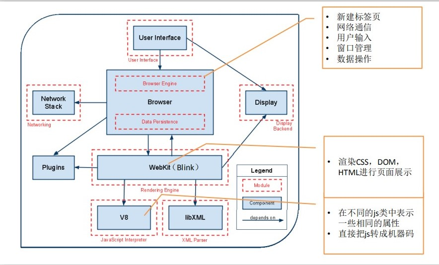
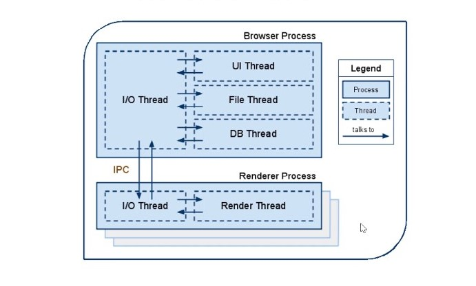
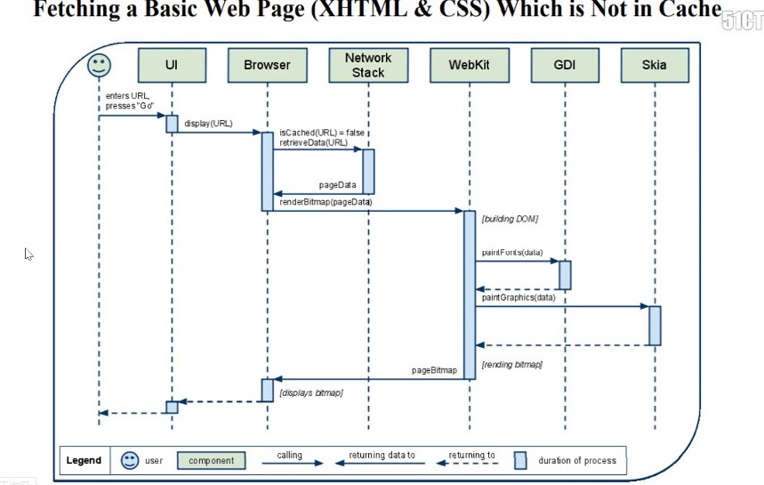
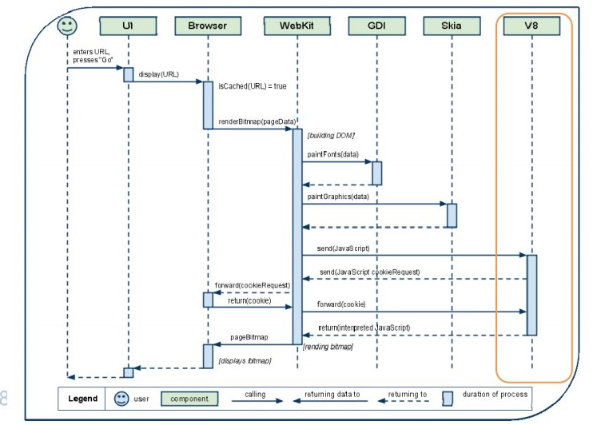
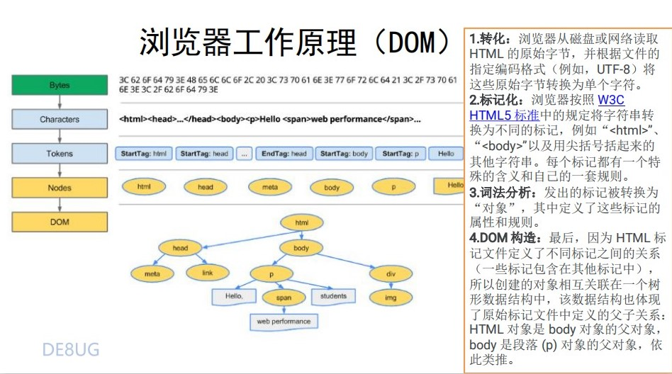
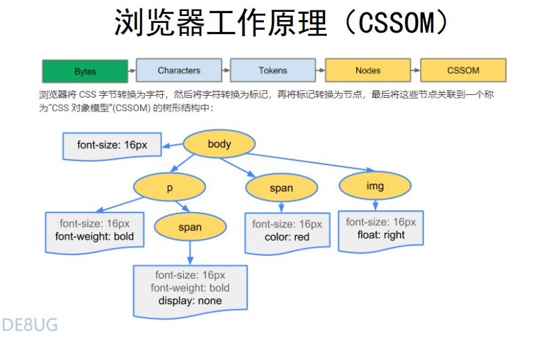
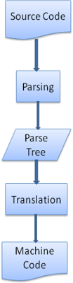

<!-- 浏览器.md -->
<!-- author:fudamai -->

# 资料

[原文链接](https://kb.cnblogs.com/page/129756/)

chrome资料出自谷歌官方文档

# 浏览器

不同的浏览器存在不同的架构模式，这里不存在标准。本文以chrome为例进行说明。

以下介绍浏览器加载HTML文件的流程及原理，不介绍如何从远端获取网页源码文件。

## 一、介绍

浏览器可以被认为是使用最广泛的软件，本文将介绍浏览器的工作原理，我们将看到，从你在地址栏输入输入google.com到google主页都发生了什么。

### 主流浏览器

今天市场上的主流浏览器有IE、Edge、Firefox、Chrome、Safari、Opera。在国内你还能见到如百度、QQ、傲游、搜狗、猎豹、360极速、360安全。

如果使用过程中需考虑兼容问题，在国内比较推荐360安全浏览器。

### 浏览器的主要功能

浏览器的主要功能是将用户选择的web资源呈现出来，它需要从服务器请求资源，并将其显示在浏览器窗口中，资源的格式通常是HTML，也包括PDF、image及其他格式。用户用URI（uniform resource identifier统一资源标识符）来指定请求资源的位置。

HTML和CSS规范中规定了浏览器解释HTML文档的方式，由W3C组织对这些规范进行维护，W3C是负责制定web标准的组织。

近年来，浏览器厂商纷纷开发自己的扩展，对规范的遵循并不完善，这为web开发者带来了严重的兼容性问题。

但是，浏览器的用户界面则差不多，常见的用户元素包括：

- 用来输入URI的地址栏
- 前进、后退按钮
- 书签选项
- 用于刷新及暂停当前加载文档的刷新、暂停按钮
- 用于到达主页的主页按钮

用户界面如此相似，是多年来各个浏览器厂商相互模仿和不断改进的结果。并没有一个统一的规范对用户界面做出规定。

### 浏览器主要构成

浏览器的主要组件包括：  
1.用户界面（User Interface）- 包括地址栏、后退/前进按钮、书签目录等，也就是你所看到的除了用来显示你所请求页面的主窗口之外的其他部分。  

2.浏览器引擎（Browser engine）- 用来查询及操作渲染引擎的接口。

3.渲染引擎（Rendering engine）- 用来显示请求的内容，例如，如果请求内容为HTML，它负责解析HTML及CSS，并将解析后的结果显示出来。在Chrome，就是Blink（forked from webkit）引擎。

4.网络（Networking）- 用来完成网络调用，例如HTTP请求，它具有平台无关的接口，可以在不同平台上工作。  

5.UI后端（UI Backend）- 用来绘制类似组合选择框及对话框等基本组件，具有不特定于某个平台的通用接口，底层使用操作系统的用户接口。  

6.JS解释器（JavaScript Interpreter）- 用来解释执行JS代码。 在Chrome中，就是V8引擎

7.数据存储（Data Persistence）- 属于持久层，浏览器需要在硬盘中保存类似cookie的各种数据，HTML5定义了web database技术，属于一种轻量级完整的客户端存储技术。

>注意：不同于大部分浏览器，Chrome为每个窗口分配了各自的渲染引擎实例，一个窗口就是一个独立的进程。

### 为什么使用Chrome

界面简洁，速度快，稳定性高，标签/配置同步，安全性高，隐私保护好，主题切换，插件系统，对web标准适配快，页面翻译好

### chrome的主要构成

### chrome多进程模型

## 二、渲染引擎

渲染引擎的职责就是渲染，即在浏览器窗口中显示所请求的内容。

默认情况下，渲染引擎可以显示HTML、XML文档及图片，它也可以借助插件（一种浏览器扩展）显示其他类型数据，例如使用PDF阅读器插件，可以显示PDF格式。这里只讨论渲染引擎最主要的用途——显示应用了CSS之后的HTML及图片。

### 渲染引擎简介

Firefox使用Geoko，Mozilla自主研发的渲染引擎，Safari和Chrome都使用webkit。

Webkit是一款开源渲染引擎，它本来是为Linux平台研发的，后来由Apple移植到Mac及Windows上，[相关内容参考](http://webkit.org)。

### 渲染主流程（The main flow）

渲染引擎首先通过网络获得所请求文档的内容，通常以8K分块的方式完成。

下面是渲染引擎在取得内容之后的基本流程：  
解析HTML以构建dom树 -> 构建render树 -> 布局render树 -> 绘制render树

渲染引擎开始解析HTML，并将标签转化为内容树中的dom节点。接着，它解析外部CSS文件及style标签中的样式信息。这些样式信息以及HTML中的可见性指令将被用来构建另一棵树——render树。

Render树由一些包含颜色和大小等属性的矩阵组成，它将确定每个节点在屏幕上的确切坐标。再下一步就是绘制，即遍历render树，并使用UI后端绘制每个节点。

需要注意的是，整个过程是逐步完成的，为了更好的用户体验，渲染引擎将会尽可能早的将内容呈现到屏幕上，并不会等到所有的HTML都解析完成之后再去构建和布局render树。它是解析完一部分内容就显示一部分内容，同时，可能还在通过网络下载其余内容。

  
### chrome渲染流程

## 三、解析与DOM树构建（Parsing and DOM tree construction)

### chromeDOM树创建

### chromeCSSOM树创建

### 解析（Parsing-general）

既然解析是渲染引擎中一个非常重要的过程，我们将稍微深入研究它。首先简要介绍一下解析。

解析一个文档即将其转换为具有一定意义的结构————编码可以理解的东西。解析结果通常是表达文档结构的节点树，称为解析树或语法树。

　例如，解析“2＋3－1”这个表达式，可能返回这样一棵树。

图5：数学表达式树节点

### 文法（Grammars）

解析基于文档依据的语法规则——文档的语言或格式。每种可被解析的格式必须具有由词汇及语法规则组成的特定的文法，称为<u>上下文无关文法</u>。人类语言不具有这一特性，因此不能被一般的解析技术所解析。

### 解析器－词法分析器（Parser－Lexer combination）

解析可以分为两个子过程——__语法分析及词法分析__

词法分析就是将输入分解为符号，符号是语言的词汇表——基本有效单元的集合。对于人类语言来说，它相当于我们字典中出现的所有单词。

语法分析指对语言应用语法规则。

解析器一般将工作分配给两个组件——*词法分析器（有时也叫分词器）负责将输入分解为合法的符号，解析器则根据语言的语法规则分析文档结构*，从而构建解析树，词法分析器知道怎么跳过空白和换行之类的无关字符。

  
图6：从源文档到解析树

　　解析过程是迭代的，解析器从词法分析器处取到一个新的符号，并试着用这个符号匹配一条语法规则，如果匹配了一条规则，这个符号对应的节点将被添加到解析树上，然后解析器请求另一个符号。如果没有匹配到规则，解析器将在内部保存该符号，并从词法分析器取下一个符号，直到所有内部保存的符号能够匹配一项语法规则。如果最终没有找到匹配的规则，解析器将抛出一个异常，这意味着文档无效或是包含语法错误。

### 转换（Translation）

很多时候，解析树并不是最终结果。解析一般在转换中使用——将输入文档转换为另一种格式。编译就是个例子，编译器在将一段源码编译为机器码的时候，先将源码解析为解析树，然后将该树转换为一个机器码文档。

图7：编译流程

#### 词汇表及语法的定义

词汇表通常利用正则表达式来定义。

语法通常用BNF格式定义

如果一个语言的文法是上下文无关的，则它可以用正则解析器来解析。对上下文无关文法的一个直观的定义是，该文法可以用BNF来完整的表达。可查看[维基百科](http://en.wikipedia.org/wiki/Context-free_grammar)。

#### 解析器类型

有两种基本的解析器——自上向下解析及自下向上解析。比较直观的解释是，自上向下解析，查看语法的最高层结构并试着匹配其中一个；自底向上解析则从输入开始，逐步将其转换为语法规则，从底层规则开始直到匹配高层规则。

#### HTML解析器（HTML Parser）

HTML解析器的工作是将html标识解析为解析树。

#### HTML文法定义（The HTML grammar definition）

W3C组织制定规范定义了HTML的词汇表和语法。

#### 非上下文无关文法（Not a context free grammar）
　　
正如在解析简介中提到的，上下文无关文法的语法可以用类似BNF的格式来定义。

不幸的是，所有的传统解析方式都不适用于html（当然我提出它们并不只是因为好玩，它们将用来解析css和js），html不能简单的用解析所需的上下文无关文法来定义。

Html有一个正式的格式定义——DTD（Document Type Definition文档类型定义）——但它并**不是上下文无关文法**，html更接近于xml，现在有很多可用的xml解析器，html有个xml的变体——xhtml，它们间的不同在于，html更宽容，它允许忽略一些特定标签，有时可以省略开始或结束标签。总的来说，它是一种soft语法，不像xml呆板、固执。

显然，这个看起来很小的差异却带来了很大的不同。一方面，这是html流行的原因——它的宽容使web开发人员的工作更加轻松，但另一方面，这也使很难去写一个格式化的文法。所以，html的解析并不简单，它既不能用传统的解析器解析，也不能用xml解析器解析。

#### HTML DTD

Html适用DTD格式进行定义，这一格式是用于定义SGML家族的语言，包括了对所有允许元素及它们的属性和层次关系的定义。正如前面提到的，html DTD并没有生成一种上下文无关文法。

DTD有一些变种，标准模式只遵守规范，而其他模式则包含了对浏览器过去所使用标签的支持，这么做是为了兼容以前内容。最新的标准DTD在[http://www.w3.org/TR/html4/strict.dtd](http://www.w3.org/TR/html4/strict.dtd)。

### DOM

输出的树，也就是解析树，是由DOM元素及属性节点组成的。DOM是文档对象模型的缩写，它是html文档的对象表示，作为html元素的外部接口供js等调用。

树的根是“document”对象。

DOM和标签基本是一一对应的关系。

和html一样，DOM的规范也是由W3C组织制定的。访问[http://www.w3.org/DOM/DOMTR](http://www.w3.org/DOM/DOMTR)，这是使用文档的一般规范。一个模型描述一种特定的html元素，可以在[http://www.w3.org/TR/2003/REC-DOM-Level-2-HTML-20030109/idl-definitions.htm](http://www.w3.org/TR/2003/REC-DOM-Level-2-HTML-20030109/idl-definitions.htm)查看html定义。

这里所谓的树包含了DOM节点是说树是由实现了DOM接口的元素构建而成的，浏览器使用已被浏览器内部使用的其他属性的具体实现。

#### 解析算法（The parsing algorithm）

#### 符号识别算法（The tokenization algorithm）

#### 树的构建算法（Tree construction algorithm）

#### 解析结束时的处理（Action when the parsing is finished）

#### 浏览器容错（Browsers error tolerance）

#### CSS解析（CSS parsing）

还记得简介中提到的解析的概念吗，不同于html，css属于**上下文无关文法**，可以用前面所描述的解析器来解析。Css规范定义了css的词法及语法文法。

一个规则集合具有一个或是可选个数的多个选择器，这些选择器以逗号和空格（S表示空格）进行分隔。每个规则集合包含大括号及大括号中的一条或多条以分号隔开的声明。声明和选择器在后面进行定义。