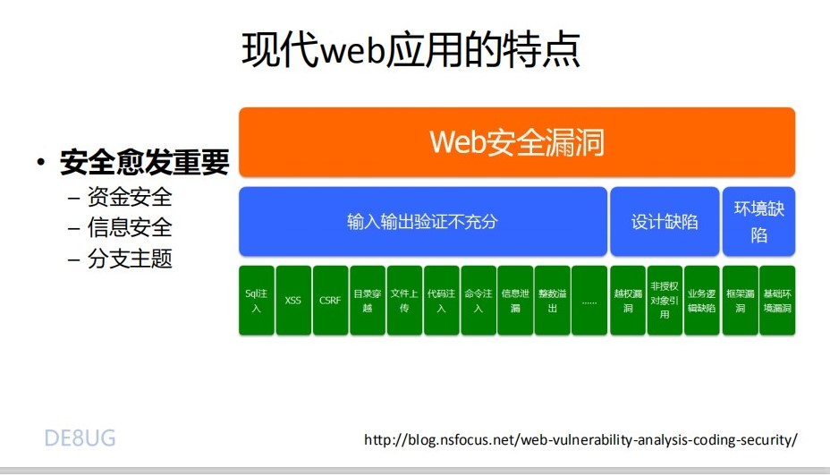

<!-- 浏览器的历史.md -->
<!-- author:fudamai -->

1990年，万维网诞生

1993年，Lynx浏览器诞生。这是一个纯文字网页浏览器

1994年，10月网景（Netscape）浏览器发布，11月欧朋（opera）浏览器发布

1995年，8月，IE浏览器发布在Windows端

1996年，Mac IE发布，IE进军Mac端

1999年，3月，火狐浏览器发布

2000年，3月，Mac IE停止支持

2003年，6月，Safari浏览器发布；12月，傲游（Maxthon）浏览器发布，国产的浏览器

2008年，2月，网景浏览器停止支持；9月，谷歌（Chrome）浏览器发布

10年代，更新较快的浏览器有：谷歌、火狐、欧朋

2015年，Edge发布

[主流浏览器发展轨迹图](http://evolutionofweb.appspot.com/#/evolution/day)

[网页浏览器时间线维基百科](https://zh.wikipedia.org/wiki/%E7%BD%91%E9%A1%B5%E6%B5%8F%E8%A7%88%E5%99%A8%E6%97%B6%E9%97%B4%E7%BA%BF)

《浪潮之巅》

## 现代web应用的特点

- 多端融合  
  - 桌面端
  - 移动端
- 开发简单
  - 框架
    - React
    - Vue
    - Angular
  - 语言
    - HTML5
    - CSS3
    - JS
    - CSSinJS
  - 开源
    - Github
- 工程化
  - 包管理
    - npm
    - yarm
  - 版本管理
    - git
  - 前后端分离  
一套后端代码，适应多个前端
  - 构建
    - webpack
    - gulp
  - 部署
    - docker
- 安全
  - 资金管理
  - 信息安全
  
- 功能强大
  - 购物
  - 社交
  - 娱乐
  - 博客
  - 邮件
  - 政务
  - 企业
- 人工智能
  - 自动生成页面（构建）
  - 数据可视化（展示）
  - 结合AR/VR（交互）
