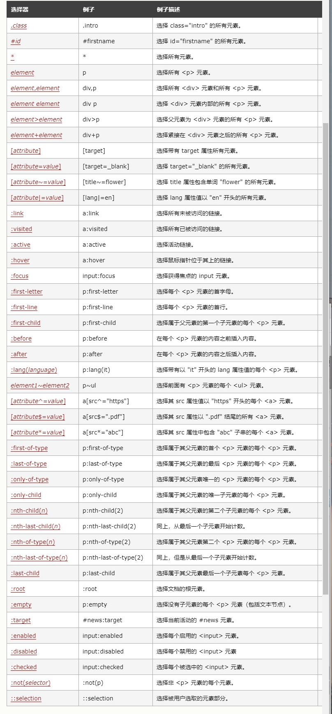

<!-- studynote.md -->
<!-- author:fudamai -->

# CSS学习笔记

和 HTML 类似，CSS 也不是真正的编程语言，甚至不是标记语言。它是一门样式表语言，这也就是说人们可以用它来选择性地为 HTML 元素添加样式。如网页的样式、布局、等等。

- 原理
- 如何构建、使用
- 盒模型
- 选择器
- 边框和背景
- 文本样式
- 各种布局

## 原理

CSS究竟是如何工作的？

需要知道的是，下面的步骤是浏览加载网页的简化版本，而且不同的浏览器在处理文件的时候会有不同的方式，但是下面的步骤基本都会出现。

1.浏览器载入HTML文件（比如从网络上获取）。

2.将HTML文件转化成一个DOM（Document Object Model），DOM是文件在计算机内存中的表现形式，下一节将更加详细的解释DOM。

3.接下来，浏览器会拉取该HTML相关的大部分资源，比如嵌入到页面的图片、视频和CSS样式。JavaScript则会稍后进行处理，简单起见，同时此节主讲CSS，所以这里对如何加载JavaScript不会展开叙述。

4.浏览器拉取到CSS之后会进行解析，根据选择器的不同类型（比如element、class、id等等）把他们分到不同的“桶”中。浏览器基于它找到的不同的选择器，将不同的规则（基于选择器的规则，如元素选择器、类选择器、id选择器等）应用在对应的DOM的节点中，并添加节点依赖的样式（这个中间步骤称为渲染树）。

5.上述的规则应用于渲染树之后，渲染树会依照应该出现的结构进行布局。

6.网页展示在屏幕上（这一步被称为着色）。
结合下面的图示更形象：


## 如何构建、使用

### CSS规则集

让我们来仔细看一看上述CSS：


整个结构称为 **规则集**（通常简称“规则”），各部分释义如下：

- **选择器（Selector）**  
HTML 元素的名称位于规则集开始。它选择了一个或多个需要添加样式的元素（在这个例子中就是 p 元素）。要给不同元素添加样式只需要更改选择器就行了。
- **声明（Declaration）**  
一个单独的规则，如 color: red; 用来指定添加样式元素的属性。
- **属性（Properties）**  
改变 HTML 元素样式的途径。（本例中 color 就是 `<p>` 元素的属性。）CSS 中，由编写人员决定修改哪个属性以改变规则。
- **属性的值（Property value）**  
在属性的右边，冒号后面即属性的值，它从指定属性的众多外观中选择一个值（我们除了 red 之外还有很多属性值可以用于 color ）。

注意其他重要的语法：

- 每个规则集（除了选择器的部分）都应该包含在成对的大括号里（{}）。
- 在每个声明里要用冒号（:）将属性与属性值分隔开。
- 在每个规则集里要用分号（;）将各个声明分隔开。

#### 多元素选择

也可以选择多种类型的元素并为它们添加一组相同的样式。将不同的选择器用逗号分开。例如：

```CSS
p, li, h1 {
  color: red;
}
```

#### 不同类型的选择器

选择器有许多不同的类型。上面只介绍了元素选择器，用来选择 HTML 文档中给定的元素。但是选择操作可以更加具体。后面做介绍。

**HTML文档链接CSS文档的几个基本套路**：外部样式表、内部样式表、内联样式

### 外部样式表

外部样式表是指将CSS编写在扩展名为.css 的单独文件中，并从HTML`<link>` 元素引用它的情况：

```CSS
<!DOCTYPE html>
<html>
  <head>
    ...
    <link rel="stylesheet" href="styles.css">
    <link rel="stylesheet" href="../styles/style.css">
  </head>
  <body>
    ...
  </body>
</html>
```

### 内部样式表

内部样式表是指不使用外部CSS文件，而是将CSS放在HTML文件`<head>`标签里的`<style>`标签之中。

```css
<!DOCTYPE html>
<html>
  <head>
    ...
    <style>
      p {
        color: red;
      }
    </style>
  </head>
  <body>
    <p>This is my first CSS example</p>
  </body>
</html>
```

### 内联样式

内联样式表存在于HTML元素的style属性之中。其特点是每个CSS表只影响一个元素：

```css
<!DOCTYPE html>
<html>
  <head>
    ...
  </head>
  <body>
    <p style="color:red;">This is my first CSS example</p>
  </body>
</html>
```

- **不建议使用**

## 盒模型

在 CSS 中，所有的元素都被一个个的“盒子（box）”包围着。完整的 CSS 盒模型应用于块级（block）盒子，内联（inline）盒子只使用盒模型中定义的部分内容。模型定义了盒的每个部分 —— margin, border, padding, and content —— 合在一起就可以创建我们在页面上看到的内容。

### 盒模型的各个部分

CSS中组成一个块级盒子需要:

- Content（内容） box: 这个区域是用来显示内容，大小可以通过设置 width 和 height.
- Padding（内边距） box: 包围在内容区域外部的空白区域； 大小通过 padding 相关属性设置。
- Border（边框） box: 边框盒包裹内容和内边距。大小通过 border 相关属性设置。
- Margin（外边距） box: 这是最外面的区域，是盒子和其他元素之间的空白区域。大小通过 margin 相关属性设置。
如下图：


### 盒模型的分类

- 标准盒模型
  - 在标准模型中，如果你给盒设置 width 和 height，实际设置的是 content box、padding 和 border 再加上设置的宽高一起决定整个盒子的大小。
- 替代（IE）盒模型
  - 使用这个模型，所有宽度都是可见宽度，所以内容宽度是该宽度减去边框和填充部分。

默认浏览器会使用标准模型。如果需要使用替代模型，您可以通过为其设置 box-sizing: border-box 来实现。

```CSS
.box {
  box-sizing: border-box;
}
```

```CSS
html {
  box-sizing: border-box;
}
*, *::before, *::after {
  box-sizing: inherit;
}
```

### 使用调试工具来查看盒模型

使用  浏览器开发者工具  可以帮助我们更好地理解盒模型，在开发者工具中，你可以看到元素的大小以及它的外边距、内边距和边框。这能帮助你更便捷准确的判断盒子的大小是否符合预期。


**必知的两个盒模型类型**：块级盒子（block box）、内联盒子（inline box）

### 块级盒子（block box）、内联盒子（inline box）

在 CSS 中我们广泛地使用两种“盒子” —— **块级盒子 (block box)** 和 **内联盒子 (inline box)**。这两种盒子会在**页面流（page flow）**和**元素之间的关系方面**表现出不同的行为:

一个被定义成块级的（block）盒子会表现出以下行为:

- 盒子会在内联的方向上扩展并占据父容器在该方向上的所有可用空间，在绝大数情况下意味着盒子会和父容器一样宽
- 每个盒子都会换行
- width 和 height 属性可以发挥作用
- 内边距（padding）, 外边距（margin） 和 边框（border） 会将其他元素从当前盒子周围“推开”
- 除非特殊指定，诸如标题(`<h1>`等)和段落(`<p>`)默认情况下都是块级的盒子。

如果一个盒子对外显示为 inline，那么他的行为如下:

- 盒子不会产生换行。
- width 和 height 属性将不起作用。
- 内边距、外边距以及边框会被应用但是不会把其他处于 inline 状态的盒子推开。
- 用做链接的 `<a>` 元素、 `<span>`、 `<em>` 以及 `<strong>` 都是默认处于 inline 状态的。

我们通过对盒子display 属性的设置，比如 <u>inline 或者 block ，来控制盒子的外部显示类型</u>。

>注意内部和外部显示类型。二者都使用display属性指定

### 使用display: inline-block

display有一个特殊的值，它在**内联和块之间提供了一个中间状态**。这对于以下情况非常有用:您不希望一个项切换到新行，但希望它可以设定宽度和高度，并避免上面看到的重叠。

一个元素使用 display: inline-block，实现我们需要的块级的部分效果：

- 设置width 和height 属性会生效。
- padding, margin, 以及border 会推开其他元素。
但是，它不会跳转到新行，如果显式添加width 和height 属性，它只会变得比其内容更大。

## 选择器

CSS选择器是CSS规则的第一部分。它是元素和其他项的一种组合形式，告诉了浏览器哪个HTML元素应当是被选为应用规则中的CSS属性值的那个。元素被选择器所选择的话，就被叫做“选择器的对象”。

### 选择器种类

#### 类型、类和ID选择器

这个选择器组包含的选择器，指向了例如一个`<h1>`的HTML元素

>h1 { }

它也包含了指向一个类的选择器：

>.box { }

或者，一个ID：

>#unique { }

#### 标签属性选择器

这组选择器给了你根据一个元素上的某个标签属性的存否以选择元素的不同方式：

>a[title] { }

或者甚至根据一个有特定值的标签属性是否存在，来做选择：

>a[href="https://example.com"] { }

#### 伪类与伪元素

这组选择器包含了伪类，用来样式化一个元素的特定状态。例如:hover伪类就只会在鼠标指针悬浮到一个元素上的时候选择这个元素：

>a:hover { }

它还包含了伪元素，选择一个元素的某个部分而不是元素自己。例如，::first-line总是会选择一个元素（下面的情况中是`<p>`）中的第一行，表现得就像是一个`<span>`包在了第一个被格式化的行外面，然后`<span>`被选中了。

>p::first-line { }

#### 运算符

最后一组选择器将其他选择器组合起来，以图指向我们的文档里的选择器。下面的示例用子元素运算符（>）选择了`<article>`元素的初代子元素。

>article > p { }



## 边框和背景

## 背景样式

### 背景颜色

background-color属性定义了CSS中任何元素的背景颜色。属性接受任何有效的`<color>`值。背景色扩展到元素的内容和内边距的下面。

### 背景图片

background-image属性允许在元素的背景中显示图像。

在单个属性值中指定多个background-image值时，用逗号分隔每个值。

#### 控制背景平铺

background-repeat属性用于控制图像的平铺行为。可用的值是:

- no-repeat — 不重复。
- repeat-x —水平重复。
- repeat-y —垂直重复。
- repeat — 在两个方向重复。

#### 调整背景图像的大小

我们可以使用 background-size属性，它可以设置长度或百分比值，来调整图像的大小以适应背景。

你也可以使用关键字:

- cover —浏览器将使图像足够大，使它完全覆盖了盒子区，同时仍然保持其高宽比。在这种情况下，有些图像可能会跳出盒子外
- contain — 浏览器将使图像的大小适合盒子内。在这种情况下，如果图像的长宽比与盒子的长宽比不同，则可能在图像的任何一边或顶部和底部出现间隙。

#### 背景图像定位

background-position属性允许您选择背景图像显示在其应用到的盒子中的位置。它使用的坐标系中，框的左上角是(0,0)，框沿着水平(x)和垂直(y)轴定位。

最常见的背景位置值有两个单独的值——一个*水平值后面跟着一个垂直值。*

你可以使用像top和right这样的关键字。。。。

### 渐变背景

渐变用于背景时，使用background-image属性设置。

### 背景附着

文本滚动时，背景如何滚动。这是由background-attachment属性控制的，它可以接受以下值:

- scroll: 使元素的背景在页面滚动时滚动。如果滚动了元素内容，则背景不会移动。实际上，背景被固定在页面的相同位置，所以它会随着页面的滚动而滚动。
- fixed: 使元素的背景固定在视图端口上，这样当页面或元素内容滚动时，它就不会滚动。它将始终保持在屏幕上相同的位置。
- local: 这个值是后来添加的(它只在Internet Explorer 9+中受支持，而其他的在IE4+中受支持)，因为滚动值相当混乱，在很多情况下并不能真正实现您想要的功能。局部值将背景固定在设置的元素上，因此当您滚动元素时，背景也随之滚动。

### 使用background简写

background 是一种 CSS 简写属性，可以在一次声明中定义一个或多个属性：background-clip、background-color、background-image、background-origin、background-position、background-repeat、background-size，和 background-attachment。

## 边框

CSS的border属性是一个用于设置各种单独的边界属性的简写属性。border可以用于设置一个或多个以下属性的值： border-width, border-style, border-color。

>border-bottom: 1em double rgb(24, 163, 78)

使用border-top,border-bottom,border-left,border-right，分别为顶部、底部、左侧、右侧的边框设置属性。

### Borders vs. outlines

边界border和轮廓outline很相似。然而轮廓在以下方面与边界不同

轮廓不占据空间，他们在元素内容之外绘制
根据规范，轮廓不必为矩形，尽管通常是矩形。

### 图像边框

border-image

### 圆角

通过使用border-radius属性和与方框的每个角相关的长边来实现方框的圆角。可以使用两个长度或百分比作为值，第一个值定义水平半径，第二个值定义垂直半径。在很多情况下，您将只传递一个值，这两个值都将使用。

例如，要使一个盒子的四个角都有10px的圆角半径：

```css
.box {
  border-radius: 10px;
}
```

该属性是一个 简写属性，是为了将这四个属性 border-top-left-radius、border-top-right-radius、border-bottom-right-radius，和 border-bottom-left-radius 简写为一个属性。

## 文本样式

元素中的文本是布置在元素的内容框中。以内容区域的左上角作为起点 (或者是右上角，是在 RTL 语言的情况下)，一直延续到行的结束部分。一旦达到行的尽头，它就会进到下一行，然后继续，再接着下一行，直到所有内容都放入了盒子中。

用于样式文本的 CSS 属性通常可以分为两类，我们将在本文中分别观察。

- 字体样式: 作用于字体的属性，会直接应用到文本中，比如使用哪种字体，字体的大小是怎样的，字体是粗体还是斜体，等等。
- 文本布局风格: 作用于文本的间距以及其他布局功能的属性，比如，允许操纵行与字之间的空间，以及在内容框中，文本如何对齐。

### 字体

样式字体的属性

#### 颜色

color 属性设置选中元素的 <u>*前景内容*</U>的颜色 (通常指文本，不过也包含一些其他东西，或者是使用 text-decoration 属性放置在文本下方或上方的线 (underline overline)。

color 也可以接受任何合法的 CSS 颜色单位

#### 字体种类

要在你的文本上设置一个不同的字体，你可以使用 font-family  属性

**网页安全字体**：Arial、Courier、Georgia、serif、Times、Trebuchet、Verdana

**默认字体**：CSS 定义了 5 个常用的字体名称:  serif, sans-serif, monospace, cursive,和 fantasy.

字体栈  
由于你无法保证你想在你的网页上使用的字体的可用性 (甚至一个网络字体可能由于某些原因而出错), 你可以提供一个字体栈 (font stack)，在这种情况下，浏览器从列表的第一个开始，然后查看在当前机器中，这个字体是否可用。如果可用，就把这个字体应用到选中的元素中。如果不可用，它就移到列表中的下一个字体，然后再检查。

#### 字体大小

通过font-size 属性设置，常用单位：

- px(像素): 将像素的值赋予给你的文本。**注意：指定的是长度值**
- em: 1em 等于我们设计的当前元素的父元素上设置的字体大小.因为em可以自动适应用户的字体，em是一个非常有用的CSS单位。
- rem: 这个单位的效果和 em 差不多，除了 1rem 等于 HTML 中的根元素的字体大小， (i.e. `<html>`) ，而不是父元素。

#### 字体样式、字体粗细、文本转换、文本装饰

- font-style：用来打开和关闭文本斜体（italic）。
- font-weight：设置文字的粗体程度。可为数字或指定属性
- text-transform：指定如何将元素的文本大写。full-width
这个关键字强制字符 — 主要是表意字符和拉丁文字 — 书写进一个方形里，并允许它们按照一般的东亚文字（比如中文或日文）对齐。
- text-decoration：用于设置文本的修饰线外观的（下划线、上划线、贯穿线/删除线  或 闪烁）它是 text-decoration-line, text-decoration-color, text-decoration-style, 和新出现的 text-decoration-thickness 属性的缩写。

#### 文字阴影

text-shadow为文字添加阴影。可以为文字与  text-decorations  添加多个阴影，阴影值之间用逗号隔开。每个阴影值由元素在X和Y方向的偏移量、模糊半径和颜色值组成。

可以通过包含以逗号分隔的多个阴影值，将多个阴影应用于同一文本，

### 文本布局

#### 文本对齐

 text-align 属性用来控制文本如何和它所在的内容盒子对齐。可用值如下，并且在与常规文字处理器应用程序中的工作方式几乎相同：

- left: 左对齐文本。
- right: 右对齐文本。
- center: 居中文字
- justify: 使文本展开，改变单词之间的差距，使所有文本行的宽度相同。

#### 行高

 line-height 属性设置文本每行之间的高，可以接受大多数单位 length and size units，不过也可以设置一个无单位的值，作为乘数，通常这种是比较好的做法。无单位的值乘以 font-size 来获得 line-height。

#### 字母和单词间距

letter-spacing 和 word-spacing 属性允许你设置你的文本中的字母与字母之间的间距、或是单词与单词之间的间距。它们可以接受大多数单位 length and size units.

### Font 简写

许多字体的属性也可以通过 font 的简写方式来设置 . 这些是按照以下顺序来写的：  font-style, font-variant, font-weight, font-stretch, font-size, line-height, and font-family.

如果你想要使用 font 的简写形式，在所有这些属性中，只有 font-size 和 font-family 是一定要指定的。

font-size 和 line-height 属性之间必须放一个正斜杠。

一个完整的例子如下所示：

>font: italic normal bold normal 3em/1.5 Helvetica, Arial, sans-serif;

## 各种布局

- 正常布局流(noraml flow)
- display属性
- 弹性盒子(Flexbox)
- 网格(Grid)
- 浮动(Floats)
- 定位(Positioning)
- CSS 表格布局(Table layout)
- 多列布局(Multiple-column layout)

### 正常布局流

正常布局流(normal flow)是指在不对页面进行任何布局控制时，浏览器默认的HTML布局方式。

注意，HTML元素完全按照源码中出现的先后次序显示——第一个段落、无序列表、第二个段落。

出现在  *另一个元素下面的元素被描述为块元素，与出现在另一个元素旁边的内联元素*  不同，内联元素就像段落中的单个单词一样。

避免离开正常流。

### display属性

在css中实现页面布局的主要方法是设定display属性的值。此属性允许我们更改默认的显示方式。

事实上，您可以更改任何元素的display值，这意味着您可以根据它们的语义选择html元素，而不必关心它们的外观。

### 弹性盒子

Flexbox 是CSS 弹性盒子布局模块（Flexible Box Layout Module）的缩写，它被专门设计出来用于创建横向或是纵向的一维页面布局。

#### 使用方法

声明方法：

~~~css
p {display=flex;}
~~~

属性：

- flex-direction：指定主轴的方向
- flex-wrap：指定换行的规则
- flex：指定动态尺寸
- align-items：交叉轴方向的对齐
- justify-content：主轴方向的对齐
- order：排序

### 网格

而Grid布局则被设计用于同时在两个维度上把元素按行和列排列整齐。

声明方法

~~~css
.wrapper {
    display: grid;
    grid-template-columns: 1fr 1fr 1fr;
    grid-template-rows: 100px 100px;
    grid-gap: 10px;
}
~~~

一旦你拥有了一个grid，你也可以显式地将元素摆放在里面，而不是依赖于浏览器进行自动排列。

```css
.box1 {
    grid-column: 2 / 4;
    grid-row: 1;
}
```

### 浮动

把一个元素“浮动”(float)起来，会改变该元素本身和在正常布局流（normal flow）中跟随它的其他元素的行为。这一元素会浮动到左侧或右侧，并且从正常布局流(normal flow)中移除，这时候其他的周围内容就会在这个被设置浮动(float)的元素周围**环绕**。

float 属性有四个可能的值：

- left — 将元素浮动到左侧。
- right — 将元素浮动到右侧。
- none — 默认值, 不浮动。
- inherit — 继承父元素的浮动属性。

### 定位

定位(positioning)并不是一种用来给你做主要页面布局的方式，它更像是让你去管理和微调页面中的一个特殊项的位置。

*有五种主要的定位类型需要我们了解*：

- **静态定位**(Static positioning)是每个元素默认的属性——它表示“将元素放在文档布局流的默认位置——没有什么特殊的地方”。
- **相对定位**(Relative positioning)允许我们相对于元素在**正常的文档流中的位置**移动它——包括将两个元素叠放在页面上。这对于微调和精准设计(design pinpointing)非常有用。
- **绝对定位**(Absolute positioning)将元素完全从页面的正常布局流(normal layout flow)中移出，类似将它**单独放在一个图层**中。我们可以将元素相对于页面的 `<html>` 元素边缘固定，或者相对于该元素的最近被定位祖先元素(nearest positioned ancestor element)。绝对定位在创建复杂布局效果时非常有用，例如通过标签显示和隐藏的内容面板或者通过按钮控制滑动到屏幕中的信息面板。
- **固定定位**(Fixed positioning)与绝对定位非常类似，但是它是将一个元素**相对浏览器视口固定**，而不是相对另外一个元素。 这在创建类似在整个页面滚动过程中总是处于屏幕的某个位置的导航菜单时非常有用。
- **粘性定位**(Sticky positioning)是一种新的定位方式，它会让元素先保持和position: static一样的定位，当它的相对视口位置(offset from the viewport)**达到某一个预设值时，他就会像position: fixed一样定位**。

声明方法

```css
.positioned {
  position: r/a/f/s;
  top: 30px;
  left: 30px;
}
```

#### 静态定位(Static positioning)
#### 相对定位(Relative positioning)

相对定位(relative positioning)让你能够把一个正常布局流(normal flow)中的元素从它的默认位置按坐标进行相对移动。

#### 绝对定位(Absolute positioning)

绝对定位用于将元素移出正常布局流(normal flow)，以坐标的形式相对于它的容器定位到web页面的任何位置，以创建复杂的布局。有趣的是，它经常被用于与相对定位和浮动的协同工作。

#### 固定定位(Fixed positioning)

固定定位(fixed positioning)同绝对定位(absolute positioning)一样，将元素从文档流(document flow)当中移出了。但是，定位的坐标不会应用于"容器"边框来计算元素的位置，而是会应用于**视口(viewport)边框**。利用这一特性，我们可以轻松搞出一个固定位置的菜单，而不受底下的页面滚动的影响。

#### 粘性定位(Sticky positioning)

将默认的静态定位(static positioning)和固定定位(fixed positioning)相混合。当一个元素被指定了position: sticky时，它会在正常布局流中滚动，直到它出现在了我们给它**设定的相对于容器的位置**，这时候它就会停止随滚动移动，就像它被应用了position: fixed一样。

### CSS 表格布局

在浏览器中支持基本的CSS之前——web开发人员过去也常常使用表格来完成整个网页布局——将它们的页眉、页脚、不同的列等等放在不同的表行和列中。

```css
form p {
  display: table-caption;
  display: table-cell;
  display: table;
  caption-side: bottom;
  width: 300px;
  color: #999;
  font-style: italic;
}
```

### 多列布局

要把一个块转变成多列容器(multicol container)，我们可以使用 column-count属性来告诉浏览器我们需要多少列，也可以使用column-width来告诉浏览器以至少某个宽度的尽可能多的列来填充容器。

```css
 .container {
        column-width: 200px;
    }
```

## 层叠与继承

**资源网站**
[CSS在线生成](https://html-css-js.com/)
[MDN web docs](https://developer.mozilla.org/zh-CN/)
