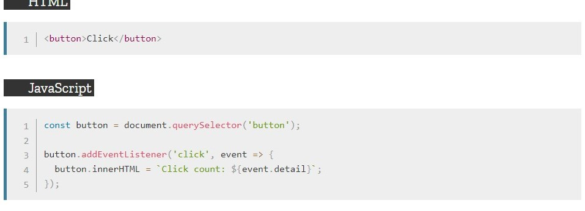

<!-- JS操作DOM -->
<!-- author：fudamai -->

# DOM概述

----

## 1.什么是DOM

DOM 是JavaScript 操作网页的接口，全称为“文档对象模型”（document object model）。它的作用是将网页转换为一个 JavaScript 对象，从而可以用脚本进行各种操作（如：增删内容）

浏览器会根究DOM模型，将结构化文档（如：HTML和XML）解析成一系列的节点，再由这些节点组成一个树状结构（DOM tree）。所有的节点和最终的树状结构，都有规范的对外接口。

DOM 只是一个接口规范，可以用各种语言实现。所以严格地说，DOM 不是 JavaScript 语法的一部分，但 DOM 操作时JavaScript 最常见的任务，离开了 DOM ，JavaScript 就无法控制网页。另一方面，JavaScript 也是最常见于 DOM 操作的语言。后面介绍的就是 JavaScript 对 DOM 标准的实现和用法。

----

## 2.Node节点

DOM 的最小组成单位叫做节点（node）。文档的树形结构（DOM 树），就是由各种不同类型的节点组成。每个节点可以看作是文档树的一片叶子。

**节点的类型**有七种。

- Document：整个文档树的顶层节点
- DocumentType：doctype标签（比如`<!DOCTYPE html>`）
- Element：网页的各种HTML标签（比如`<body>`、`<a>`等）
- Attr：网页元素的属性（比如class="right"）
- Text：*标签之间或标签包含*的文本
- Comment：注释
- DocumentFragment：文档的片段

浏览器提供一个原生的节点对象Node，**上面这七种节点都继承了Node**，因此具有一些共同的属性和方法。

----

## 3.节点树

一个文档的所有节点，按照所在的层级，可以抽象成一种树状结构。这种树状结构就是 DOM 树。它有一个顶层节点，下一层都是顶层节点的子节点，然后子节点又有自己的子节点，就这样层层衍生出一个金字塔结构，又像一棵树。

浏览器原生提供document节点，代表整个文档。

```text
document
// 整个文档树
```

文档的第一层有两个节点，第一个是文档类型节点（`<!doctype html>`），第二个是 HTML 网页的顶层容器标签`<html>`。后者构成了树结构的根节点（root node），其他 HTML 标签节点都是它的下级节点。

除了根节点，其他节点都有三种层级关系。

- 父节点关系（parentNode）：直接的那个上级节点
- 子节点关系（childNodes）：直接的下级节点
- 同级节点关系（sibling）：拥有同一个父节点的节点

DOM 提供操作接口，用来获取这三种关系的节点。比如，子节点接口包括firstChild（第一个子节点）和lastChild（最后一个子节点）等属性，同级节点接口包括nextSibling（紧邻在后的那个同级节点）和previousSibling（紧邻在前的那个同级节点）属性。

## NodeList 接口，HTMLCollection 接口

节点都是单个对象，有时需要一种数据结构，能够容纳多个节点。DOM 提供两种节点集合，用于容纳多个节点：NodeList和HTMLCollection。

这两种集合都属于接口规范。许多 DOM 属性和方法，返回的结果是NodeList实例或HTMLCollection实例。**主要区别是，NodeList可以包含各种类型的节点，HTMLCollection只能包含 HTML 元素节点。**

### NodeList 接口

- NodeList.prototype.length
- NodeList.prototype.forEach()
- NodeList.prototype.item()
- NodeList.prototype.keys()，NodeList.prototype.values(),NodeList.prototype.entries()

### HTMLCollection 接口

- HTMLCollection.prototype.length
- HTMLCollection.prototype.item()
- HTMLCollection.prototype.namedItem()

----

## ParentNode 接口，ChildNode 接口

节点对象除了继承 Node 接口以外，还拥有其他接口。ParentNode接口表示当前节点是一个父节点，提供一些处理子节点的方法。ChildNode接口表示当前节点是一个子节点，提供一些相关方法。

### ParentNode 接口

- ParentNode.children
- ParentNode.firstElementChild
- ParentNode.lastElementChild
- ParentNode.childElementCount
- ParentNode.append()，ParentNode.prepend()

### ChildNode 接口

- ChildNode.remove()
- ChildNode.before()，ChildNode.after()
- ChildNode.replaceWith()

----
----

# Node

Node（节点）：https://wangdoc.com/javascript/dom/node.html

此方法需先指定节点

>注意：对于一个节点来说，它的父节点只可能是三种类型：元素节点（element）、文档节点（document）和文档片段节点（documentfragment）。

>注意：元素与元素之间有空白字符，空白字符会被识别为文本节点（#text）。

|节点名称|属性值|对应类型值
|-|-|-
|文档节点（document）|#document|9，对应常量Node.DOCUMENT_NODE
|元素节点（element）|大写的标签名|1，对应常量Node.ELEMENT_NODE
|属性节点（attr）|属性的名称|2，对应常量Node.ATTRIBUTE_NODE
|文本节点（text）|#text|3，对应常量Node.TEXT_NODE
|文档片断节点（DocumentFragment）|#document-fragment|11，对应常量Node.DOCUMENT_FRAGMENT_NODE
|文档类型节点（DocumentType）|文档的类型|10，对应常量Node.DOCUMENT_TYPE_NODE
|注释节点（Comment）|#comment|8，对应常量Node.COMMENT_NODE
|||

### 属性

- Node.prototype.nodeName
  - 属性返回节点的  *名称*。
- Node.prototype.nodeValue
  - 属性返回一个  *字符串*，表示当前节点本身的文本值，该属性可读写。
- Node.prototype.textContent
  - 属性返回当前节点和它的所有后代节点的  *文本内容*。
  - 只有文本节点（text）、注释节点（comment）和属性节点（attr）有文本值。
- Node.prototype.nextSibling
  - Node.nextSibling属性返回紧跟在当前节点后面的第一个同级  *节点*。没有，则返回null。
- Node.prototype.previousSibling
  - previousSibling属性返回当前节点前面的、距离最近的一个同级  *节点*。没有，则返回null。
- Node.prototype.parentElement
  - parentElement属性返回当前节点的**父元素节点**。如果当前节点没有父节点，或者父节点类型不是元素节点，则返回null。
- Node.prototype.childNodes
  - childNodes属性返回一个类似数组的对象（**NodeList集合**），成员包括当前节点的  *所有子节点*。
  - NodeList对象是一个动态集合，一旦子节点发生变化，立刻会反映在返回结果之中。
- Node.prototype.ownerDocument
  - Node.ownerDocument属性返回当前节点所在的顶层文档对象，即document对象。

### 方法

- Node.prototype.appendChild()
  - appendChild()方法接受一个节点对象作为参数，将其作为最后一个子节点，  *插入*  当前节点。该方法的返回值就是插入文档的子节点。
  - 如果参数节点是 DOM  *已经存在的节点*，appendChild()方法会将其从原来的位置，  *移动*  到新位置。

  ```js
  element.appendChild(aChild)
  ```

- Node.prototype.hasChildNodes()
  - hasChildNodes方法返回一个布尔值，表示当前节点  *是否有*  子节点。
- Node.prototype.insertBefore()
  - 用于将某个节点  *插入*  父节点内部的指定位置。

  - insertBefore方法接受两个参数，第一个参数是所要插入的节点newNode，第二个参数是父节点parentNode内部的一个子节点referenceNode。newNode将插在referenceNode这个子节点的前面。返回值是插入的新节点newNode。

  ```js
  var insertedNode = parentNode.insertBefore(newNode, referenceNode);
  ```

  >注意，如果所要插入的节点是当前 DOM 现有的节点，则该节点将从原有的位置移除，插入新的位置。

- Node.prototype.removeChild()
  - removeChild方法接受一个子节点作为参数，用于从当前节点移除该子节点。返回值是  *移除*  的子节点。

  ```js
  var oldChild = node.removeChild(child);

  node.removeChild(child);
  ```

- Node.prototype.replaceChild()
  - replaceChild方法用于将一个新的节点，*替换*  当前节点的某一个子节点。

  ```js
  parentNode.replaceChild(newChild, oldChild);
  ```

- Node.prototype.contains()
  - contains方法返回一个布尔值，表示参数节点是否满足以下三个条件之一。
    - 参数节点为当前节点。
    - 参数节点为当前节点的子节点。
    - 参数节点为当前节点的后代节点。

  ```js
  node.contains( otherNode )
  ```

----
----

# document

document：https://wangdoc.com/javascript/dom/document.html 

## 概述

document节点对象代表整个文档，每张网页都有自己的document对象。window.document属性就指向这个对象。只要浏览器开始载入 HTML 文档，该对象就存在了，可以直接使用。

document对象有不同的办法可以获取。

- 正常的网页，**直接使用document**或window.document。
- iframe框架里面的网页，使用iframe节点的contentDocument属性。
- Ajax 操作返回的文档，使用XMLHttpRequest对象的responseXML属性。
- 内部节点的ownerDocument属性。
- document对象继承了EventTarget接口和Node接口，并且混入（mixin）了ParentNode接口。这意味着，这些接口的方法都可以在document对象上调用。除此之外，document对象还有很多自己的属性和方法。

### 节点集合属性

- document.links
  - 返回当前文档所有设定了href属性的`<a>`及`<area>`节点。

### 文档静态信息属性

- document.location
  - Location对象是浏览器提供的原生对象，提供 URL 相关的信息和操作方法。通过window.location和document.location属性，可以拿到这个对象。
- document.URL
  - 返回一个字符串，表示当前文档的网址。URL继承自HTMLDocument接口，只能用于 HTML 文档。
- document.title
  - document.title属性返回当前文档的标题。默认情况下，返回`<title>`节点的值。该属性是可写的

- document.cookie
  - document.cookie属性用来操作浏览器 Cookie

### 方法

- document.write(), document.writeln()
  - document.write方法用于向当前文档写入内容。document.write方法用于向当前文档写入内容。
  - document.write会当作 HTML 代码解析，不会转义。输入参数应是HTML代码。
  >除了某些特殊情况，应该尽量避免使用document.write这个方法。对innerHTML 属性赋值是个更好的方法。

- document.querySelector(), document.querySelectorAll()
  - document.querySelector方法接受一个  *CSS 选择器*  作为参数，返回匹配该选择器的**元素节点**。如果有多个节点满足匹配条件，则  *返回第一个*  匹配的节点。如果没有发现匹配的节点，则返回null。

  ```js
  var el1 = document.querySelector('.myclass');
  var el2 = document.querySelector('#myParent > [ng-click]');
  elementList = document.querySelectorAll('.myclass');
  ```

  - document.querySelectorAll方法与querySelector用法类似，区别是  *返回一个NodeList对象*，包含所有匹配给定选择器的节点。
- document.getElementByTagName()
  - 搜索  *HTML 标签名*，返回符合条件的元素。它的返回值是一个  **类似数组对象（HTMLCollection实例）**，可以**实时**反映 HTML 文档的变化。如果没有任何匹配的元素，就返回一个空集。
  - 可以在任何元素节点上调用。

  ```js
  var elements = document.getElementsByTagName(name);
  ```

- document.getElementByClassName()
  - 返回一个**类似数组的对象（HTMLCollection实例）**，包括了所有class名字符合指定条件的元素，元素的变化**实时**反映在返回结果中。
  - 可以在任何元素节点上调用。
  
  ```js
  var elements = document.getElementsByClassName(names); // or:
  var elements = rootElement.getElementsByClassName(names);
  ```

- document.getElementByName()
  - 用于选择拥有name属性的 HTML 元素（比如`<form>`、`<radio>`、``、`<frame>`、`<embed>`和`<object>`等），返回一个类似数组的的对象 **（NodeList实例）**，因为name属性相同的元素可能不止一个。元素的实时变化反映在结果中。
  - 参数是name属性的值

  ```js
  var elements = document.getElementsByName(name);
  ```

- document.getElementById()
  - document.getElementById方法返回匹配指定id属性的**元素节点**。

  ```js
  var element = document.getElementById(id);
  ```

- document.createElement()
  - 用来生成**元素节点**，并返回该节点。
  - 参数可以是自定义的标签名。

  ```js
  var element = document.createElement(tagName[, options]);
  ```

- document.createTextNode()
  - 生成**文本节点**（Text实例），并返回该节点。它的参数是文本节点的内容。

  ```js
  var text = document.createTextNode(data);
  ```

- document.createAttribute()
  - 生成一个新的**属性节点**（Attr实例），并返回它。

  ```js
  attribute = document.createAttribute(name) 
  ```

- document.addEventListener()
  - 添加事件监听

----
----

# Element

element：https://wangdoc.com/javascript/dom/element.html 

### 实例属性

- Element.attributes
  - Element.attributes属性返回一个类似数组的对象（ **NamedNodeMap**），成员是当前元素节点的所有属性节点
  
  ```js
  var attr = element.attributes;
  ```

- Element.className, Element.classList
  - className属性用来读写当前元素节点的  *class属性*。它的值是一个**字符串**，每个class之间用空格分割。

  - classList属性返回一个**类似数组的对象(DOMTokenList)**，当前元素节点的每个class就是这个对象的一个成员。
- Element.dateset
  - 网页元素可以自定义data-属性，用来添加数据。
- Element.innerHTML
  - Element.innerHTML属性返回一个字符串，等同于该元素包含的**所有 HTML 代码**，标签以内的内容。该属性可读写，常用来设置某个节点的内容。它能改写所有元素节点的内容，包括`<HTML>`和`<body>`元素。
  - 如果将innerHTML属性设为空，等于删除所有它包含的所有节点。
  
  ```js
  const content = element.innerHTML;
  element.innerHTML = htmlString;
  ```

- Element.style
  - 每个元素节点都有style用来读写该元素的行内  *样式信息*，具体介绍参见《CSS 操作》一章。
- Element.children
  - Element.children属性返回一个类似数组的对象（**HTMLCollection实例**），包括当前元素节点的所有子元素。如果当前元素没有子元素，则返回的对象包含零个成员。

### 实例方法

#### 属性相关方法

    - getAttribute()：读取某个属性的值
    - getAttributeNames()：返回当前元素的所有属性名
    - setAttribute()：写入属性值
    - hasAttribute()：某个属性是否存在
    - hasAttributes()：当前元素是否有属性
    - removeAttribute()：删除属性

- Element.querySelector()
  - Element.querySelector方法接受 *CSS 选择器*  作为参数，返回父元素的**第一个匹配的子元素**。如果没有找到匹配的子元素，就返回null。
  >需要注意的是，浏览器执行querySelector方法时，是先在全局范围内搜索给定的 CSS 选择器，然后过滤出哪些属于当前元素的子元素。也就是说，选择器实际上针对整个文档的。
- Element.querySelectorAll()
  - Element.querySelectorAll方法接受 *CSS 选择器*  作为参数，返回一个**NodeList实例**，包含所有匹配的子元素。
- Element.getElementsByClassName()
  - Element.getElementsByClassName方法返回一个**HTMLCollection实例**，成员是当前元素节点的所有具有指定 class(class为指定值) 的子元素节点。该方法与document.getElementsByClassName方法的用法类似，只是搜索范围不是整个文档，而是当前元素节点。

  ```js
  var elements = element.getElementsByClassName(names);
  ```

- Element.getElementsByTagName()
  - Element.getElementsByTagName方法返回一个**HTMLCollection实例**，成员是当前节点的所有匹配指定标签名的子元素节点。

  ```js
  elements = element.getElementsByTagName(tagName)
  ```

- Element.closest()
  - Element.closest方法接受一个 *CSS 选择器作为参数*，返回匹配该选择器的、最接近当前节点的一个祖先**节点**（包括当前节点本身）。如果没有任何节点匹配 CSS 选择器，则返回null。

  ```js
  var closestElement = targetElement.closest(selectors);
  ```

- Element.matches()
  - Element.matches方法返回一个**布尔值**，表示当前元素是否匹配给定的 CSS 选择器。

  ```js
  var result = element.matches(selectorString);
  ```

- Element.insertAdjacentHTML()，Element.insertAdjacentText()
  - Element.insertAdjacentHTML方法用于将一个 HTML 字符串，解析生成 DOM 结构，插入相对于当前节点的指定位置。

  ```js
  element.insertAdjacentHTML(position, text);
  element.insertAdjacentText(position, element);
  ```

  - Element.insertAdjacentText方法在相对于当前节点的指定位置，插入一个文本节点，用法与Element.insertAdjacentHTML方法完全一致。

### Element事件操作

- Element.focus(), Element.blur()
  - Element.focus方法用于将当前页面的焦点，转移到指定元素上。

  ```js
  document.getElementById('my-span').focus();
  ```

  该方法可以接受一个对象作为参数。参数对象的preventScroll属性是一个布尔值，指定是否将当前元素停留在原始位置，而不是**滚动到可见区域。**

  ```js
  function getFocus() {
  document.getElementById('btn').focus({preventScroll:false});
  }
  ```

  上面代码会让btn元素获得焦点，并滚动到可见区域。

  最后，从document.activeElement属性可以得到当前获得焦点的元素。

  Element.blur方法用于将焦点从当前元素移除。
- Element.click()
  - Element.click方法用于在当前元素上模拟一次鼠标点击，相当于触发了click事件。

  

----
----

# 属性Attribute

属性：https://wangdoc.com/javascript/dom/attributes.html 

HTML 元素包括标签名和若干个键值对，这个键值对就称为“属性”（attribute）。

属性本身是一个对象（Attr对象），但是实际上，这个对象极少使用。一般都是通过元素节点对象（HTMlElement对象）来操作属性。本章介绍如何操作这些属性。

- Element.attributes 属性
  - **元素对象**有一个attributes属性，返回一个类似数组的动态对象，成员是该元素标签的**所有属性节点对象**，属性的实时变化都会反映在这个节点对象上。属性节点对象有  *name和value属性*，对应该属性的属性名和属性值

  ```js
  var attr = element.attributes;
  attr.name
  attr.value
  ```

## 元素的标准属性

HTML 元素的标准属性（即在标准中定义的属性），会自动成为元素节点对象的属性。而且，这些属性都是可写的。

### 属性操作的标准方法

- 概述
- Element.getAttribute()
  - 返回当前元素节点的指定属性的**值**。如果指定属性不存在，则返回null。

  ```js
  let attribute = element.getAttribute(attributeName);
  ```

- Element.getAttributeNames()
  - 返回一个数组，成员是当前元素的**所有属性的名字**。如果当前元素没有任何属性，则返回一个空数组。使用Element.attributes属性，也可以拿到同样的结果，唯一的区别是它返回的是类似数组的对象。

  ```js
  let attributeNames = element.getAttributeNames();
  ```

- Element.setAttribute()
  - 用于为当前元素节点**新增属性**。如果同名属性已存在，则相当于编辑已存在的属性。该方法没有返回值。

  ```js
  Element.setAttribute(name, value);
  ```

- Element.hasAttribute()
  - 返回一个布尔值，表示当前元素节点是否**包含指定属性**。

  ```js
  var result = element.hasAttribute(name);
  ```

- Element.hasAttributes()
  - 返回一个布尔值，表示当前元素是否**有属性**，如果没有任何属性，就返回false，否则返回true。

  ```js
  var result = element.hasAttributes();
  ```

- Element.removeAttribute()
  - 移除指定属性,参数是属性名。该方法没有返回值。

  ```js
  element.removeAttribute(attrName);
  ```

**dataset 属性**

- data-*属性被称为  *自定义数据属性*。

使用data-*属性将数据依附在HTML元素上，供JavaScript脚本使用。

使用元素节点对象的dataset属性，它指向一个对象，可以用来操作 HTML 元素标签的data-*属性。

```js
var n = document.getElementById('mydiv');
n.dataset.foo // bar
n.dataset.foo = 'baz'
```

上面代码中，通过dataset.foo读写data-foo属性。

删除一个data-*属性，可以直接使用delete命令。

```js
delete document.getElementById('myDiv').dataset.foo;
```

除了dataset属性，也可以用getAttribute('data-foo')、removeAttribute('data-foo')、setAttribute('data-foo')、hasAttribute('data-foo')等方法操作data-*属性。

注意，data-后面的属性名有限制，只能包含字母、数字、连词线（-）、点（.）、冒号（:）和下划线（_)。而且，属性名不应该使用A到Z的大写字母，比如不能有data-helloWorld这样的属性名，而要写成data-hello-world。

转成dataset的键名时，连词线后面如果跟着一个小写字母，那么连词线会被移除，该小写字母转为大写字母，其他字符不变。反过来，dataset的键名转成属性名时，所有大写字母都会被转成连词线+该字母的小写形式，其他字符不变。比如， *dataset.helloWorld会转成data-hello-world*。

----
----

# CSS

CSS：https://wangdoc.com/javascript/dom/css.html 

CSS 与 JavaScript 是两个有着明确分工的领域，前者负责页面的视觉效果，后者负责与用户的行为互动。但是，它们毕竟同属网页开发的前端，因此不可避免有着交叉和互相配合。本章介绍如何通过 JavaScript 操作 CSS。

HTML 元素的 style 属性

- el.setAttribute('style', 'color:yellow; background:green;')
- el.getAttribute()
- el.removeAttribute()

### CSSStyleDeclaration 接口

简介：**CSSStyleDeclaration 接口**用来操作元素的样式。三个地方部署了这个接口。

- 元素节点的 style 属性（Element.style）
  - 返回的只是行内样式，并不是该元素的全部样式。通过样式表设置的样式，或者从父元素继承的样式，无法通过这个属性得到。

- CSSStyle实例的style属性

- window.getComputedStyle()的返回值
  - 元素的全部样式

### CSSStyleDeclaration 实例属性

- CSSStyleDeclaration.cssText
  - 当前声明块的文本内容。设置此属性会改变样式。
- CSSStyleDeclaration.length
  - 属性的数量。
- CSSStyleDeclaration.parentRule 
  - 属性返回当前规则所属的那个样式块（CSSRule 实例）。

### CSSStyleDeclaration 实例方法

- CSSStyleDeclaration.getPropertyValue
  - 接受 CSS 样式属性名作为参数，返回一个字符串，表示该属性的**属性值**。

  ```js
  var value = style.getPropertyValue(property);
  ```

- CSSStyleDeclaration.item
  - 接受一个整数值作为参数，返回该位置的 **CSS 属性名**。

  ```js
  var propertyName = style.item(index);
  <!-- 等同于 -->
  var propertyName = style[index];
  ```

- CSSStyleDeclaration.removeProperty
  - 接受一个属性名作为参数，在 CSS 规则里面**移除这个属性**，返回这个属性原来的值。

  ```js
  var oldValue = style.removeProperty(property);
  ```

  参数：property 是一个 DOMString ，代表要移除的属性名。注意由多个单词组成的属性要用连字符连接各个单词，不接收驼峰命名法的形式。

- CSSStyleDeclaration.setProperty
  - 用来设置新的 CSS 属性。该方法没有返回值。

  ```js
  style.setProperty(propertyName, value, priority);
  ```

  - 参数
    - propertyName 是一个 DOMString ，代表被更改的CSS属性。
    - value可选 是一个 DOMString ，含有新的属性值。如果没有指定, 则当作空字符串。
      - 注意: value 不能包含 "!important" --那个应该使用 priority 参数.
    - priority可选 是一个 DOMString 允许设置 "important" CSS 优先级。如果没有指定, 则当作空字符串。

### CSS 模块的侦测

判断当前浏览器是否支持某个模块，这就叫做“CSS模块的侦测”。

一个比较普遍适用的方法是，判断元素的style对象的某个属性值是否为字符串。

### CSS 对象

浏览器原生提供 CSS 对象，为 JavaScript 操作 CSS 提供一些工具方法。

- CSS.escape()
  - 用于转义 CSS 选择器里面的特殊字符。
- CSS.supports()
  - 返回一个布尔值，表示当前环境是否支持某一句 CSS 规则。

### window.getComputedStyle()

用来返回浏览器**计算后得到的最终规则**。

#### CSS 伪元素

CSS 伪元素是通过 CSS 向 DOM 添加的元素，主要是通过:before和:after选择器生成，然后用content属性指定伪元素的内容。

----

## StyleSheet 接口

StyleSheet接口代表网页的一张样式表，包括``<link>`元素加载的样式表和`<style>`元素内嵌的样式表。

----
----

## document.implementation

document.implementation属性返回一个DOMImplementation对象。该对象有三个方法，主要用于创建独立于当前文档的新的 Document 对象。

DOMImplementation.createDocument()：创建一个 XML 文档。
DOMImplementation.createHTMLDocument()：创建一个 HTML 文档。
DOMImplementation.createDocumentType()：创建一个 DocumentType 对象。
下面是创建 HTML 文档的例子。

```js
var doc = document.implementation.createHTMLDocument('Title');
var p = doc.createElement('p');
p.innerHTML = 'hello world';
doc.body.appendChild(p);

document.replaceChild(
  doc.documentElement,
  document.documentElement
);
```

上面代码中，第一步生成一个新的 HTML 文档doc，然后用它的根元素document.documentElement替换掉document.documentElement。这会使得当前文档的内容全部消失，变成hello world。
