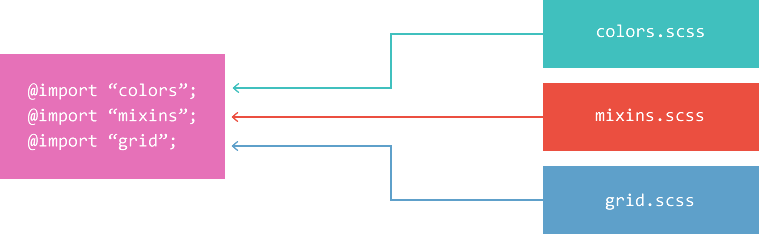

<!-- sass.md -->
<!-- author:fudamai -->

# SASS

[Sass 中文网](https://www.sass.hk/)

# What

世界上最成熟、最稳定、最强大的专业级**CSS 扩展语言**！

将 sass、scss 文件装换为 css 文件

# Why

- 兼容 CSS
- 特性丰富
- 成熟
  - 08 年发布
- 行业认可
- 社区庞大
- 框架

## 安装 SASS

安装 Ruby

- https://rubyinstaller.org/downloads/
- 下载 without devkit 的版本即可
- 图形界面安装，默认安装（注意，安装页面选择 UTF-8 为默认编码）

打开命令行控制台

- ruby -v ，查看安装版本

将 gem 源替换到国内

- gem sources --add https://gems.ruby-china.com/ --remove https://rubygems.org/

安装 sass

- gem install sass
- gem install compass

# How

- 编写**.scss**文件
- 编译为css文件
  - 文件转换命令
    - sass input.scss output.css
  - 持续监听，并转换目标文件
    - sass --watch input.scss:output.css

## 1.使用变量

使用 $ 符号声明变量

- 声明在CSS规则块{...}外
  - 本样式表内都可使用
- 声明在CSS规则块{...}内
  - 只能在规则块内使用

**SASS变量名不区分上下划线**

```scss
$size-200: 200px;
$highlight-color: #f90;
```

使用变量

```scss
.box {
    display: inline-block;
    margin: 30px;
    // SASS变量名不区分上下划线
    width: $size-200;
    height: $size_200;
    color: $highlight-color;
    border: 2px inset $highlight-color;
}
```

编译后的文件

```css
.box {
  display: inline-block;
  margin: 30px;
  width: 200px;
  height: 200px;
  color: #f90;
  border: 2px inset #f90; }
```

## 2.嵌套 CSS 规则

SASS支持嵌套规则块，避免重复写选择器。一个给定的规则块，既可以像普通的CSS那样包含属性，又可以嵌套其他规则块。使样式可读性更高

```scss
#content {
    aside {
        background-color: rgba(7, 65, 33, 0.452);
        li {
            display: flex;
            flex-direction: column;
            align-items: flex-end;
            justify-self: start;
            a {
                width: 30px;
            }
        }
    }
}
```

编译后

```css
#content aside {
  background-color: rgba(7, 65, 33, 0.452); }
  #content aside li {
    display: flex;
    flex-direction: column;
    align-items: flex-end;
    justify-self: start; }
    #content aside li a {
      width: 30px; }
```

**编译过程**

- sass用了两步，每一步都是像打开俄罗斯套娃那样把里边的嵌套规则块一个个打开。首先，把#content（父级）这个id放到aside选择器（子级）前边
- 然后，#content aside里边还有嵌套的规则，sass重复一遍上边的步骤，把新的选择器添加到内嵌的选择器前边。

### 父选择器标识符

引用父级选择器，使用& 操作符。

在使用嵌套规则时，父选择器能对于嵌套规则如何解开提供更好的控制。当包含父选择器标识符的嵌套规则被打开时，它不会像后代选择器那样进行拼接，而是&被父选择器直接替换：

```scss
article a {
  color: blue;
  &:hover { color: red }
}
```

```css
article a { color: blue }
article a:hover { color: red }
```

### 群组选择器

逗号“,”，选择给定的所有元素

```scss
.container {
  h1, h2, h3 {margin-bottom: .8em}
}
```

```css
.container h1, .container h2, .container h3 { margin-bottom: .8em }
```

空格“ ”，选择给定父元素的所有子元素

箭头“>”，子组合选择器
加号“+”，同层相邻组合选择器
省略号“~”，同层全体组合选择器

```scss
article {
  ~ article { border-top: 1px dashed #ccc }
  > section { background: #eee }
  dl > {
    dt { color: #333 }
    dd { color: #555 }
  }
  nav + & { margin-top: 0 }
}
```

编译后

```css
article ~ article { border-top: 1px dashed #ccc }
article > footer { background: #eee }
article dl > dt { color: #333 }
article dl > dd { color: #555 }
nav + article { margin-top: 0 }
```

## 3.导入 SASS 文件

导入操作符：@import。

允许在一个scss文件中导入其它scss文件

导入文件时，可以省略.sass、.scss后缀

用法


### 3.1使用SASS部分文件

局部文件

- 那些专门为@import命令而编写的sass文件，并不需要生成对应的独立css文件，这样的sass文件称为局部文件。
- 命名
  - sass局部文件的文件名以下划线开头。
- 引用
  - 省略文件名开头的下划线。
  - @import "themes/_night-sky.scss"
  - @import "themes/night-sky"

### 3.2默认变量值

使用!default标签。含义：如果这个变量被声明赋值了，那就用它声明的值，否则就用这个默认值。

>赋值要发生在引用之前。

### 3.3嵌套导入

跟原生的css不同，sass允许@import命令写在css规则内。

```scss
.blue-theme {@import "blue-theme"}

//生成的结果跟你直接在.blue-theme选择器内写_blue-theme.scss文件的内容完全一样。

.blue-theme {
  aside {
    background: blue;
    color: #fff;
  }
}
```

被导入的局部文件中定义的所有变量和混合器，也会在这个规则范围内生效。

### 3.4原生的CSS导入

由于sass兼容原生的css，所以它也支持原生的CSS@import。把原始的css文件改名为.scss后缀，即可直接导入了。

## 4.静默注释

使用双斜线（//）注释的内容，不会被转换到css文件中

```scss
body {
  color: #333; // 这种注释内容不会出现在生成的css文件中
  padding: 0; /* 这种注释内容会出现在生成的css文件中 */
}
```

## 5.混入

混合器使用@mixin标识符定义。这个标识符给一大段样式赋予一个名字，这样你就可以轻易地通过引用这个名字重用这段样式。

定义

```scss
@mixin rounded-corners {
  -moz-border-radius: 5px;
  -webkit-border-radius: 5px;
  border-radius: 5px;
}
```

在样式表中通过@include来使用这个混合器

```css
notice {
  background-color: green;
  border: 2px solid #00aa00;
  @include rounded-corners;
}

```

sass最终生成：

```scss
.notice {
  background-color: green;
  border: 2px solid #00aa00;
  -moz-border-radius: 5px;
  -webkit-border-radius: 5px;
  border-radius: 5px;
}
```
