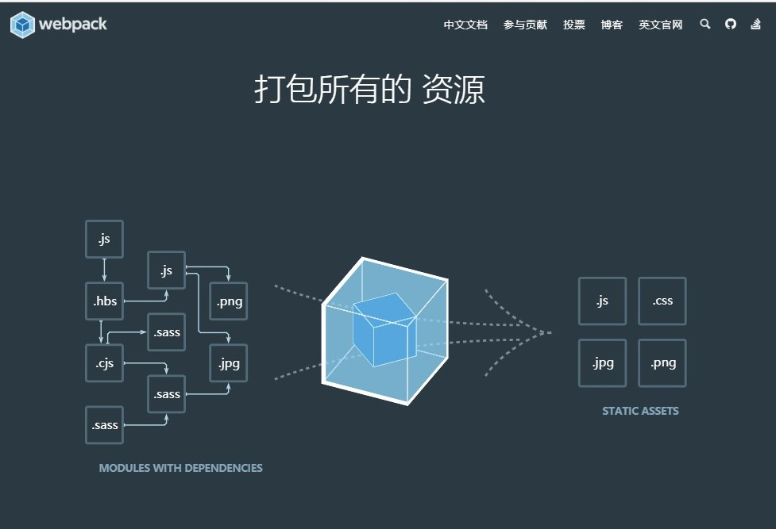

<!-- webpack.md -->
<!-- author:fudamai -->

# 一 webpack 简介

[中文webpack](https://www.webpackjs.com/guides/)  
[英文webpack](https://webpack.js.org/guides/)  
[360前端站](https://75team.com/)  
[淘宝前端站](http://taobaofed.org/)  
[凹凸实验室-京东](https://aotu.io/)  
[百度前端站](http://fex.baidu.com/)  
[云龙大佬的GitHub](https://github.com/fouber/blog/issues/10#)



# 二 作用

- 打包 JS、CSS、IMAGE 文件
- 优化和压缩代码
- 用户获取网站资源更快，体验更好
- 可以将 css 打包进 JS 中

# 三 Gulp 和 Webpack 的比较

- gulp 侧重于前端开发的整个过程的控制管理（类似于流水线）
- 给 gulp  配置不同的 task（通过 gulp 中的 gulp.task()方法配置，比如启动 server、sass/less 预编译、文件的合并压缩等）来让 gulp 实现不同的功能，从而构建整个前端开发流程。
- webpack 有人也称之为模块打包机，由此也可以看出 webpack 更侧重于**模块打包**，当然我们可以把开发中的所有资源（图片、js 文件、css 文件等）都可以看成模块
- 最初 webpack 本身就是为前端 JS 代码打包而设计的，后来被扩展到其他资源的打包处理。webpack 是通过 loader（加载器）和 plugins（插件）对资源进行处理的。

# 四 安装

前提：安装 Node.js

> 提示：安装插件时，保证所有插件都使用 nmp 或者 cnmp 安装，不建议混着用，否则可能会出现意想不到的后果，例如依赖包明明已经安装但是因为安装工具的不同却识别不出。

创建工程目录。初始化开发环境

```js
mkdir webpack-demo && cd webpack-demo
npm init -y
```

将 webpack、webpack-cli 安装在开发目录

```js
npm install webpack webpack-cli --save-dev
```

# 五 起步与打包 JS 文件

## 1.创建以下目录结构、文件和内容

project

```cwd
  webpack-demo
  |- package.json
+ |- index.html
+ |- /src
+   |- index.js
```

src/index.js

```js
function component() {
  var element = document.createElement("div");

  // Lodash（目前通过一个 script 脚本引入）对于执行这一行是必需的
  element.innerHTML = _.join(["Hello", "webpack"], " ");

  return element;
}

document.body.appendChild(component());
```

index.html

```html
<!DOCTYPE html>
<html>
  <head>
    <title>起步</title>
    <script src="https://unpkg.com/lodash@4.16.6"></script>
  </head>
  <body>
    <script src="./src/index.js"></script>
  </body>
</html>
```

我们还需要调整 package.json 文件，以便确保我们安装包是私有的(private)，并且移除 main 入口。这可以防止意外发布你的代码。

```json
  {
    "name": "webpack-demo",
    "version": "1.0.0",
    "description": "",
+   "private": true,
-   "main": "index.js",
    "scripts": {
      "test": "echo \"Error: no test specified\" && exit 1"
    },
    "keywords": [],
    "author": "",
    "license": "ISC",
    "devDependencies": {
      "webpack": "^4.0.1",
      "webpack-cli": "^2.0.9"
    },
    "dependencies": {}
  }
```

## 2.安装 lodash

要在 index.js 中打包 lodash 依赖，我们需要在**本地安装** library

> 在安装一个要打包到生产环境的安装包时，你应该使用 npm install --save，如果你在安装一个用于开发环境的安装包（例如，linter, 测试库等），你应该使用 npm install --save-dev。请在 npm 文档 中查找更多信息。

```cmd
npm install --save lodash
or
npm install --save-dev lodash
```

## 3.调整目录结构，创建一个 bundle 文件

将“源”代码(/src)从我们的“分发”代码(/dist)中分离出来。“源”代码是用于书写和编辑的代码。“分发”代码是构建过程产生的代码最小化和优化后的“输出”目录，最终将在浏览器中加载：

```cwd
  webpack-demo
  |- package.json
+ |- /dist
+   |- index.html
- |- index.html
  |- /src
    |- index.js
```

在脚本中 import lodash：

src/index.js

```js
+ import _ from 'lodash';
+
  function component() {
    var element = document.createElement('div');

-   // Lodash, currently included via a script, is required for this line to work
+   // Lodash, now imported by this script
    element.innerHTML = _.join(['Hello', 'webpack'], ' ');

    return element;
  }

  document.body.appendChild(component());
```

更新 HTML 文件

dist/index.html

```html
<!DOCTYPE html>
<html>
  <head>
    <title>起步</title>
-   <script src="https://unpkg.com/lodash@4.16.6"></script>
  </head>
  <body>
-   <script src="./src/index.js"></script>
+   <script src="main.js"></script>
  </body>
</html>
```

执行 npx webpack

执行 npx webpack，会将我们的**脚本作为入口起点**，然后 **输出 为 main.js**。Node 8.2+ 版本提供的 npx 命令，可以运行在初始安装的 webpack 包(package)的 webpack 二进制文件（./node_modules/.bin/webpack）：

```cmd
npx webpack
```

```cmdout
Hash: dabab1bac2b940c1462b
Version: webpack 4.0.1
Time: 3003ms
Built at: 2018-2-26 22:42:11
    Asset      Size  Chunks             Chunk Names
main.js  69.6 KiB       0  [emitted]  main
Entrypoint main = main.js
   [1] (webpack)/buildin/module.js 519 bytes {0} [built]
   [2] (webpack)/buildin/global.js 509 bytes {0} [built]
   [3] ./src/index.js 256 bytes {0} [built]
    + 1 hidden module

WARNING in configuration(配置警告)
The 'mode' option has not been set. Set 'mode' option to 'development' or 'production' to enable defaults for this environment.('mode' 选项还未设置。将 'mode' 选项设置为 'development' 或 'production'，来启用环境默认值。)
```

执行后目录结构如下

```cwd
  webpack-demo
  |- package.json
  |- /dist
    |- index.html
+   |- main.js
  |- /src
    |- index.js

```

未使用配置文件时，默认将 index.js 打包为 **main.js** 文件，推荐使用下面介绍配置文件方式，可以自定义打包参数，另外出现的警告警告稍后处理。

## 4.使用配置文件

在 webpack4 中，可以无须任何配置使用，然而大多数项目会需要很复杂的设置，这就是问什么 webpack 仍然要支持 配置文件。这比在终端（terminal）中手动输入大量命令要高效的多，所以让我们创建一个取代以上使用 CLI 选项方式的配置文件，那就是 webpack.config.js.

project

```cwd
  webpack-demo
  |- package.json
+ |- webpack.config.js
  |- /dist
    |- index.html
    |- main.js
  |- /src
    |- index.js

```

webpack.config.js

```js
const path = require("path");

module.exports = {
  entry: "./src/index.js",
  output: {
    filename: "bundle.js",
    path: path.resolve(__dirname, "dist"),
  },
};
```

通过新配置文件再次执行构建：

```cmd
npx webpack --config webpack.config.js
```

```cmdout
Hash: dabab1bac2b940c1462b
Version: webpack 4.0.1
Time: 328ms
Built at: 2018-2-26 22:47:43
    Asset      Size  Chunks             Chunk Names
bundle.js  69.6 KiB       0  [emitted]  main
Entrypoint main = bundle.js
   [1] (webpack)/buildin/module.js 519 bytes {0} [built]
   [2] (webpack)/buildin/global.js 509 bytes {0} [built]
   [3] ./src/index.js 256 bytes {0} [built]
    + 1 hidden module

WARNING in configuration(配置警告)
The 'mode' option has not been set. Set 'mode' option to 'development' or 'production' to enable defaults for this environment.('mode' 选项还未设置。将 'mode' 选项设置为 'development' 或 'production'，来启用环境默认值。)
```

执行后目录结构如下

```cwd
  webpack-demo
  |- package.json
  |- webpack.config.js
  |- /dist
    |- index.html
    |- main.js
+   |- bundle.js
  |- /src
    |- index.js
```

比起 CLI 这种简单直接的使用方式，配置文件具有更多的灵活性。我们可以通过配置方式指定 loader 规则(loader rules)、插件(plugins)、解析选项(resolve options)，以及许多其他增强功能。

## 5.去除警告

向配置文件中添加 mode 字段（development / production / none），即可消除警告。

webpack.config.js

```js
const path = require("path"); // 处理相关文件目录的操作

module.exports = {
  mode: "development",
  entry: "./src/index.js", // 入口
  output: {
    filename: "bundle.js", // 出口
    path: path.resolve(__dirname, "dist"),
  },
};
```

消除未指定模式警告

## 6.自定义 NPM 脚本

考虑到用 CLI 这种方式来运行本地的 webpack 不是特别方便，我们可以设置一个快捷方式。在 package.json 添加一个 npm 脚本(npm script)：

package.json

```json
  {
    "name": "webpack-demo",
    "version": "1.0.0",
    "description": "",
    "main": "index.js",
    "scripts": {
      "test": "echo \"Error: no test specified\" && exit 1",
+     "build": "npx webpack --config webpack.config.js"
    },
    "keywords": [],
    "author": "",
    "license": "ISC",
    "devDependencies": {
      "webpack": "^4.0.1",
      "webpack-cli": "^2.0.9",
      "lodash": "^4.17.5"
    }
  }
```

现在，可以使用 npm run build 命令，来替代我们之前使用的 npx 命令。

```cmd
npm run build
```

```cmdout
Hash: dabab1bac2b940c1462b
Version: webpack 4.0.1
Time: 323ms
Built at: 2018-2-26 22:50:25
    Asset      Size  Chunks             Chunk Names
bundle.js  69.6 KiB       0  [emitted]  main
Entrypoint main = bundle.js
   [1] (webpack)/buildin/module.js 519 bytes {0} [built]
   [2] (webpack)/buildin/global.js 509 bytes {0} [built]
   [3] ./src/index.js 256 bytes {0} [built]
    + 1 hidden module
```

执行后目录结构如下

```cwd
  webpack-demo
  |- package.json
  |- webpack.config.js
  |- /dist
    |- index.html
    |- main.js
+   |- bundle.js
  |- /src
    |- index.js
```

# 六 与 Sass 结合，打包 CSS

这里将 CSS 输出为独立的文件。在 HTML 文件中显示引用。

## 1.安装插件

css-loader

- css-loader 像 import/require()一样解释@import 和 url()，并解析它们。解析成 JS

```cmd
npm install --save-dev css-loader
```

style-loader

- 将 CSS 注入到 DOM 中。

```cmd
npm install --save-dev style-loader
```

sass-loader

- 加载 Sass/SCSS 文件并将其编译为 CSS。
- Sass -loader 要求您自己安装**Dart Sass**或 Node Sass

```cmd
npm install --save-dev sass-loader
```

Sass、Node Sass

```cmd
npm install --save-dev sass
npm install --save-dev node-sass
```

ExtractTextWebpackPlugin

- 将文本从一个或多个包(bundles)中提取到单独的文件中。
- 安装文本提取插件。演示版本必须要4.0以上

```cmd
npm install --save-dev extract-text-webpack-plugin
```

## 2.修改配置文件

修改配置文件，这里是将 sass 输出为 css 文件。

webpack.config.js

```js
const path = require("path"); // 处理相关文件目录的操作
const ExtractTextPlugin = require("extract-text-webpack-plugin"); // 从bundle中提取文件用的插件

module.exports = {
  mode: "development",
  entry: "./src/index.js", // 入口
  output: {
    // 出口
    filename: "bundle.js", // 输出的文件名
    path: path.resolve(__dirname, "dist"), // 输出路径
  },
  module: {
    // 定义规则处理scss文件
    rules: [
      {
        test: /\.scss$/,
        // 将样式嵌套到js中
        // 输出CSS时，需要使用提取插件。从JS中提取
        use: ExtractTextPlugin.extract({
          fallback:
            // Creates `style` nodes from JS strings
            "style-loader",
          use: [
            // Translates CSS into CommonJS
            "css-loader",
            // Compiles Sass to CSS
            "sass-loader",
          ],
        }),
      },
    ],
  },
  plugins: [
    // 定义输出文件的名字
    new ExtractTextPlugin("style.css"),
  ],
};
```

## 3.代码展示

sass、js、html、js、css

手动增加：src/index.scss

手动更改：src/index.js、dist/index.html

自动生成：dist/bundle.js、dist/style.css

src/index.scss

```scss
@charset 'UTF-8';

$para_color: rgba(42, 231, 121, 0.918);
$important_color: red;
$soso_color: blue;
$border: 2px solid gold;
$mb10: 10px;

h1 {
  color: $important_color;
}

.todo {
  border: $border;
  p {
    color: greenyellow;
    font-size: 30px;
    margin-bottom: $mb10;
  }
  li {
    color: $para_color;
    margin-bottom: $mb10;
    .important {
      color: $important_color;
    }
    .soso {
      color: $soso_color;
    }
  }
}
```

src/inex.js

index.js 中需要导入 index.scss 文件，因为在配置文件 webpack.config.js 中只设置了一入口，即该 js 文件，如想对 scss 文件进行操作（转换并打包），需要再 js 文件中导入 scss 文件。

```js
import _ from "lodash"; // 使用import导入包
import "./index.scss"; // 引入scss文件，以完成webpack打包

function component() {
  var element = document.createElement("div");

  // Lodash（目前通过一个 script 脚本引入）对于执行这一行是必需的
  element.innerHTML = _.join(["Hello", "webpack", "fudami", "中文测试"], " ");

  return element;
}

document.body.appendChild(component());
```

dist/index.html

需将打包完成后的 css 文件引入。_手动更改_

```html
<!DOCTYPE html>
<html lang="en">
  <head>
    <meta charset="UTF-8" />
    <meta name="viewport" content="width=device-width, initial-scale=1.0" />
+   <link rel="stylesheet" href="style.css" />
    <title>webpack</title>
  </head>

  <body>
    <h1>首页</h1>
    <div class="todo">
      <p>今天要做的事情</p>
      <li>今天学的webpack很好玩</li>
      <li>今天学的webpack很好玩</li>
      <li>今天学的webpack很好玩</li>
      <li class="important">1</li>
      <li class="important">2</li>
      <li class="soso">3</li>
      <li class="soso">4</li>
      <li class="important">5</li>
    </div>

    <script src="bundle.js"></script>
  </body>
</html>
```

dist/style.css

打包完成后的 css。_自动生成_

```css
h1 {
  color: red;
}

.todo {
  border: 2px solid gold;
}
.todo p {
  color: greenyellow;
  font-size: 30px;
  margin-bottom: 10px;
}
.todo li {
  color: rgba(42, 231, 121, 0.918);
  margin-bottom: 10px;
}
.todo li .important {
  color: red;
}
.todo li .soso {
  color: blue;
}
```

dist/bundle.js  
 过长，不展示。_自动生成_

## 4.运行结果

执行自定义的脚本命令

```cmd
npm run build
```

```cmd
> webpack-demo@1.0.0 build C:\Users\mengc\Desktop\课堂演示\06-WEB框架\工程化-fu\webpack-demo
> npx webpack --config webpack.config.js

Hash: 842a0c1fff6fb9fba204
Version: webpack 4.43.0
Time: 1084ms
Built at: 2020-07-12 21:04:03
    Asset       Size  Chunks             Chunk Names
bundle.js    553 KiB    main  [emitted]  main
style.css  277 bytes    main  [emitted]  main
Entrypoint main = bundle.js style.css
[./node_modules/css-loader/dist/cjs.js!./node_modules/sass-loader/dist/cjs.js!./src/index.scss] 530 bytes [built]
[./node_modules/webpack/buildin/global.js] (webpack)/buildin/global.js 472 bytes {main} [built]
[./node_modules/webpack/buildin/module.js] (webpack)/buildin/module.js 497 bytes {main} [built]
[./src/index.js] 446 bytes {main} [built]
[./src/index.scss] 41 bytes [built]
    + 3 hidden modules
Child extract-text-webpack-plugin node_modules/extract-text-webpack-plugin/dist node_modules/css-loader/dist/cjs.js!node_modules/sass-loader/dist/cjs.js!src/index.scss:
    Entrypoint undefined = extract-text-webpack-plugin-output-filename
    [./node_modules/css-loader/dist/cjs.js!./node_modules/sass-loader/dist/cjs.js!./src/index.scss] 530 bytes {0} [built]
        + 1 hidden module
```

本次操作文件系统变动如下

```cwd
  webpack-demo
  |- package.json
  |- webpack.config.js
  |- /dist
+   |- index.html
    |- main.js
+   |- style.css
+   |- bundle.js
  |- /src
    |- index.js
+   |- index.scss
```

# 七 将 CSS 文件打包至 JS 文件

使用 webpack 将 CSS 文件打包至 JS 文件中，在 HTML 文件中只需导入 JS 文件即可加载所有样式。

对于生产构建，建议从包（bundle）中提取 CSS，以便以后能够并行加载 CSS/JS 资源。从包（bundle）中提取 CSS，也就是将 CSS 输出为单独的文件，不将其打包进 JS 中。

## 1.插件需求

同上，ExtractTextWebpackPlugin 除外。

## 2.修改配置文件

将 CSS 文件打包进 bundle（JS 文件）中，不需要提取步骤。

webpack.config.js

```js
const path = require('path'); // 处理相关文件目录的操作
const ExtractTextPlugin = require('extract-text-webpack-plugin'); // 从bundle中提取文件用的插件

module.exports = {
    mode: "development",
    entry: './src/index.js',   // 入口
    output: { // 出口
        filename: 'bundle.js',// 输出的文件名
        path: path.resolve(__dirname, 'dist'), // 输出路径
    },
    module: {
        // 定义规则处理scss文件
        rules:[
            {
                // 匹配scss 文件
                test: /\.scss$/,
                // 将样式嵌套到js中
                // 输出CSS时，需要使用提取插件。从JS中提取
                use: [
                    // Translates CSS into CommonJS
                    'css-loader',
                    // Compiles Sass to CSS
                    'sass-loader',
                    // Creates `style` nodes from JS strings
                    'style-loader',
                    ]
                })
            }
        ]
    },
    plugins: [
        // 定义输出文件的名字
        new ExtractTextPlugin('style.css')
    ],
};
```

## 3.代码展示

除配置文件、index.html 需要更改外，其他文件照旧。

手动更改：src/index.js

自动生成：dist/bundle.js

src/index.html  
HTML 的样式文件引用注释掉。

```html
<!DOCTYPE html>
<html lang="en">
  <head>
    <meta charset="UTF-8" />
    <meta name="viewport" content="width=device-width, initial-scale=1.0" />
    <!-- <link rel="stylesheet" href="style.css"> -->
    <title>webpack</title>
  </head>

  <body>
    <h1>首页</h1>
    <div class="todo">
      <p>今天要做的事情</p>
      <li>今天学的webpack很好玩</li>
      <li>今天学的webpack很好玩</li>
      <li>今天学的webpack很好玩</li>
      <li class="important">1</li>
      <li class="important">2</li>
      <li class="soso">3</li>
      <li class="soso">4</li>
      <li class="important">5</li>
    </div>

    <script src="bundle.js"></script>
  </body>
</html>
```

dist/bundle.js

自动生成。文件过大，不予展示

## 4.运行结果

执行自定义脚本命令

```cmd
npm run build
```

```cmdout
> webpack-demo@1.0.0 build C:\Users\mengc\Desktop\课堂演示\06-WEB框架\工程化-fu\webpack-demo
> npx webpack --config webpack.config.js

Hash: 4f5f05a7f2182105f98d
Version: webpack 4.43.0
Time: 1188ms
Built at: 2020-07-12 23:31:58
    Asset     Size  Chunks             Chunk Names
bundle.js  565 KiB    main  [emitted]  main
Entrypoint main = bundle.js
[./node_modules/css-loader/dist/cjs.js!./node_modules/sass-loader/dist/cjs.js!./src/index.scss] 530 bytes {main} [built]
[./node_modules/webpack/buildin/global.js] (webpack)/buildin/global.js 472 bytes {main} [built]
[./node_modules/webpack/buildin/module.js] (webpack)/buildin/module.js 497 bytes {main} [built]
[./src/index.js] 446 bytes {main} [built]
[./src/index.scss] 560 bytes {main} [built]
    + 3 hidden modules
```

本次操作文件系统变动如下

```cwd
  webpack-demo
  |- package.json
+ |- webpack.config.js
  |- /dist
+   |- index.html
    |- main.js
    |- style.css
+   |- bundle.js
  |- /src
    |- index.js
    |- index.scss
```

# 八 打包多个 JS 文件

## 1.插件需求

同上

## 2.修改配置文件

webpack.config.js

```js
const path = require('path'); // 处理相关文件目录的操作
const ExtractTextPlugin = require('extract-text-webpack-plugin'); // 从bundle中提取文件用的插件

module.exports = {
    mode: "development",
    entry: {index: './src/index.js', about: './src/about.js'},
    output: {
        filename: '[name].bundle.js',// 多个entry文件时，使用[name]生成不同的文件名
        path: path.resolve(__dirname, 'dist')
    },
    module: {
        // 定义规则处理scss文件
        rules:[
            {
                test: /\.scss$/,
                // 将样式嵌套到js中
                // 输出CSS时，需要使用提取插件。从JS中提取
                use: [
                    // Creates `style` nodes from JS strings
                    'style-loader',
                    // Translates CSS into CommonJS
                    'css-loader',
                    // Compiles Sass to CSS
                    'sass-loader'
                    ]
                })
            }
        ]
    },
};
```

## 3.代码展示

手动添加演示文件：src/about.js、dist/about.html

手动更改文件：webpack.config.js、dist/index.html

自动生成文件：dist/index.bundle.js、dist/about.bundle.js

src/about.js

```js
alert('这里是about.js');
```

dist/about.html

```html
<!DOCTYPE html>
<html lang="en">
<head>
    <meta charset="UTF-8">
    <meta name="viewport" content="width=device-width, initial-scale=1.0">
    <title>about-webpack</title>
</head>
<body>
    <h1>about页面</h1>
    <div class="box">
        <h2>公司介绍哦   </h2>
        <p>大开红门迎四方客</p>
        <p>大开红门迎四方客</p>
        <hr>
        <h2>网站介绍</h2>
        <p>简约而不简单</p>
        <p>平凡而不平静</p>
    </div>
    <script src="about.bundle.js"></script>
</body>
</html>
```

dist/index.html

新增

```html
<a  href="about.html">关于</a>
```

修改

```html
-   <script src="bundle.js"></script>

+   <script src="home.bundle.js"></script>
```

dist/index.bundle.js、dist/about.bundle.js

自动生成。文件过大，不予展示

## 4.运行结果

执行自定义脚本命令

```cmd
npm run build
```

```cmdout
> webpack-demo@1.0.0 build C:\Users\mengc\Desktop\课堂演示\06-WEB框架\工程化-fu\webpack-demo
> npx webpack --config webpack.config.js

Hash: 9d3066d01a7694fd9d22
Version: webpack 4.43.0
Time: 1313ms
Built at: 2020-07-13 1:00:10
          Asset      Size  Chunks             Chunk Names
about.bundle.js  3.88 KiB   about  [emitted]  about
index.bundle.js   565 KiB   index  [emitted]  index
Entrypoint index = index.bundle.js
Entrypoint about = about.bundle.js
[./node_modules/css-loader/dist/cjs.js!./node_modules/sass-loader/dist/cjs.js!./src/index.scss] 530 bytes {index} [built]
[./node_modules/webpack/buildin/global.js] (webpack)/buildin/global.js 472 bytes {index} [built]
[./node_modules/webpack/buildin/module.js] (webpack)/buildin/module.js 497 bytes {index} [built]
[./src/about.js] 113 bytes {about} [built]
[./src/index.js] 446 bytes {index} [built]
[./src/index.scss] 560 bytes {index} [built]
    + 3 hidden modules
```

本次操作文件系统变动如下

```cwd
  webpack-demo
  |- package.json
+ |- webpack.config.js
  |- /dist
+   |- index.html
    |- main.js
    |- style.css
    |- bundle.js
+   |- about.html
+   |- index.bundle.js
+   |- about.bundle.js
  |- /src
    |- index.js
    |- index.scss
+   |- about.js
```

# 九 打包多个 SCSS（CSS）

此处时打包多个scss文件，并合并为对应的js文件中，如不想合并，则按照上面打包CSS文件，修改配置文件即可。

## 1.插件需求

同上

## 2.修改配置文件

若依然将CSS文件打包进JS文件，不需更改配置文件。

## 3.代码展示

添加about页面的样式文件，将样式文件导入到入口文件about.js

手动增加：src/about.scss

手动更改：src/about.js

自动生成：dist/index.bundle.js、dist/about.bundle.js

src/about.scss

```scss
@charset 'UTF-8'; // 声明编码

$size10: 10px;
$size20: 20px;
$title-color: red;
$para-color: rgb(89, 135, 228);
$border: 1px solid yellow;
$bg-color: rgb(190, 1, 8);

h1 {
    color: $title-color;
}
.box {
    width: 800px;
    h2 {
        font-size: $size20;
        background-color: $bg-color;
    }
    p {
        font-size: $size10;
        border: $border;
        color: $para-color;
    }
}
```

src/about.js

新增

```js
+   import './about.scss';// 引入scss文件，打包时自动添加到js文件中
```

dist/index.bundle.js、dist/about.bundle.js

自动生成。文件过大，不予展示

## 4.运行结果

执行自定义脚本

```cmd
npm run build
```

控制台输出

```cmdout
> webpack-demo@1.0.0 build C:\Users\mengc\Desktop\课堂演示\06-WEB框架\工程化-fu\webpack-demo
> npx webpack --config webpack.config.js

Hash: 70ecb106942254c69ca9
Version: webpack 4.43.0
Time: 936ms
Built at: 2020-07-13 1:31:57
          Asset      Size  Chunks             Chunk Names
about.bundle.js  16.8 KiB   about  [emitted]  about
index.bundle.js   565 KiB   index  [emitted]  index
Entrypoint index = index.bundle.js
Entrypoint about = about.bundle.js
[./node_modules/css-loader/dist/cjs.js!./node_modules/sass-loader/dist/cjs.js!./src/about.scss] 429 bytes {about} [built]
[./node_modules/css-loader/dist/cjs.js!./node_modules/sass-loader/dist/cjs.js!./src/index.scss] 530 bytes {index} [built]
[./node_modules/webpack/buildin/global.js] (webpack)/buildin/global.js 472 bytes {index} [built]
[./node_modules/webpack/buildin/module.js] (webpack)/buildin/module.js 497 bytes {index} [built]
[./src/about.js] 110 bytes {about} [built]
[./src/about.scss] 560 bytes {about} [built]
[./src/index.js] 446 bytes {index} [built]
[./src/index.scss] 560 bytes {index} [built]
    + 3 hidden modules
```

本次操作文件系统变动如下

```cwd
  webpack-demo
  |- package.json
+ |- webpack.config.js
  |- /dist
    |- index.html
    |- main.js
    |- style.css
    |- bundle.js
    |- about.html
+   |- index.bundle.js
+   |- about.bundle.js
  |- /src
    |- index.js
    |- index.scss
+   |- about.js
+   |- about.scss
```

# 十 设置监听状态

## 1.插件需求

同上，加上webpack-dev-server

- webpack-dev-server 为你提供了一个简单的 web server，并且具有 live reloading(实时重新加载) 功能。

```nodejs
npm install --save-dev webpack-dev-server
```

## 2.修改配置文件

修改配置文件，告知 dev server，从什么位置查找文件：

webpack.config.js

```js
const path = require('path'); // 处理相关文件目录的操作
const ExtractTextPlugin = require('extract-text-webpack-plugin'); // 从bundle中提取文件用的插件

module.exports = {
    mode: "development",
    entry: {index: './src/index.js', about: './src/about.js'},
    output: {
        filename: '[name].bundle.js',// 多个entry文件时，使用[name]生成不同的文件名
        path: path.resolve(__dirname, 'dist')
    },
    module: {
        // 定义规则处理scss文件
        rules:[
            {
                test: /\.scss$/,
                // 将样式嵌套到js中
                // 输出CSS时，需要使用提取插件。从JS中提取
                use: [
                    // Creates `style` nodes from JS strings
                    'style-loader',
                    // Translates CSS into CommonJS
                    'css-loader',
                    // Compiles Sass to CSS
                    'sass-loader'
                    ]
                })
            }
        ]
    },
    // 设置webpack服务器
    devServer: {
        // 设置监听路径
        contentBase: path.join(__dirname, 'dist'),
        // 主机
        host: 'localhost',
        // 端口
        port: 8888
    }
};
```

## 3.代码展示

值修改配置文件即可

## 4.运行结果

执行以下命令行中任意一条，即可启动web server

```nodejs
npx webpack-dev-server --open
npx webpack-dev-server --config webpack.config.js
npx webpack-dev-server --config webpack.config.js --color --progress --hot
```

>webpack-dev-server 在编译之后**不会写入到任何输出文件**。而是将 bundle 文件保留在内存中，然后将它们 serve 到 server 中，就好像它们是挂载在 server 根路径上的真实文件一样。如果你的页面希望在其他不同路径中找到 bundle 文件，则可以通过 dev server 配置中的 publicPath 选项进行修改。

控制台页面，使用命令：npx webpack-dev-server --open

```cmdout
> npx webpack-dev-server --open
i ｢wds｣: Project is running at http://localhost:8888/
i ｢wds｣: webpack output is served from /
i ｢wds｣: Content not from webpack is served from C:\Users\mengc\Desktop\课堂演示\06-WEB框架\工程化-fu\web
pack-demo\dist
i ｢wdm｣: wait until bundle finished: /
i ｢wdm｣: Hash: 6676a3156322f7f9537f
Version: webpack 4.43.0
Time: 2044ms
Built at: 2020-07-13 2:21:05
          Asset     Size  Chunks             Chunk Names
about.bundle.js  375 KiB   about  [emitted]  about
index.bundle.js  921 KiB   index  [emitted]  index
Entrypoint index = index.bundle.js
Entrypoint about = about.bundle.js
[0] multi (webpack)-dev-server/client?http://localhost:8888 ./src/index.js 40 bytes {index} [built]
[1] multi (webpack)-dev-server/client?http://localhost:8888 ./src/about.js 40 bytes {about} [built]
[./node_modules/lodash/lodash.js] 528 KiB {index} [built]
[./node_modules/webpack-dev-server/client/index.js?http://localhost:8888] (webpack)-dev-server/client?http://localhost:8888 4.29 KiB {index} {about} [built]
[./node_modules/webpack-dev-server/client/overlay.js] (webpack)-dev-server/client/overlay.js 3.51 KiB {index} {about} [built]
[./node_modules/webpack-dev-server/client/socket.js] (webpack)-dev-server/client/socket.js 1.53 KiB {index} {about} [built]
[./node_modules/webpack-dev-server/client/utils/createSocketUrl.js] (webpack)-dev-server/client/utils/createSocketUrl.js 2.91 KiB {index} {about} [built]
[./node_modules/webpack-dev-server/client/utils/log.js] (webpack)-dev-server/client/utils/log.js 964 bytes {index} {about} [built]
[./node_modules/webpack-dev-server/client/utils/reloadApp.js] (webpack)-dev-server/client/utils/reloadApp.js 1.59 KiB {index} {about} [built]
[./node_modules/webpack-dev-server/client/utils/sendMessage.js] (webpack)-dev-server/client/utils/sendMessage.js 402 bytes {index} {about} [built]
[./node_modules/webpack-dev-server/node_modules/strip-ansi/index.js] (webpack)-dev-server/node_modules/strip-ansi/index.js 161 bytes {index} {about} [built]
[./node_modules/webpack/hot sync ^\.\/log$] (webpack)/hot sync nonrecursive ^\.\/log$ 170 bytes {index} {about} [built]
[./src/about.js] 110 bytes {about} [built]
[./src/about.scss] 560 bytes {about} [built]
[./src/index.js] 446 bytes {index} [built]
    + 27 hidden modules
i ｢wdm｣: Compiled successfully.
i ｢wdm｣: Compiling...
i ｢wdm｣: Hash: c95a5659b0d0c91bba18
Version: webpack 4.43.0
Time: 74ms
Built at: 2020-07-13 2:22:00
          Asset     Size  Chunks             Chunk Names
about.bundle.js  375 KiB   about  [emitted]  about
 + 1 hidden asset
Entrypoint index = index.bundle.js
Entrypoint about = about.bundle.js
[./src/about.js] 112 bytes {about} [built]
    + 41 hidden modules
i ｢wdm｣: Compiled successfully.
i ｢wdm｣: Compiling...
```
