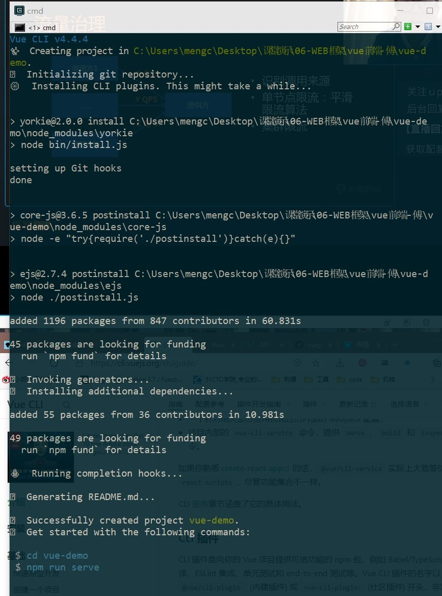

<!-- VueCLI.md -->
<!-- author:fudamai -->

# 介绍

Vue CLI 是一个基于 Vue.js 进行快速开发的完整系统，提供：

- 通过 @vue/cli 实现的交互式的项目脚手架。
- 通过 @vue/cli + @vue/cli-service-global 实现的零配置原型开发。
- 一个运行时依赖 (@vue/cli-service)，该依赖：
  - 可升级；
  - 基于 webpack 构建，并带有合理的默认配置；
  - 可以通过项目内的配置文件进行配置；
  - 可以通过插件进行扩展。
- 一个丰富的官方插件集合，集成了前端生态中最好的工具。
- 一套完全图形化的创建和管理 Vue.js 项目的用户界面。

Vue CLI 致力于将 Vue 生态中的工具基础标准化。它确保了各种构建工具能够基于智能的默认配置即可平稳衔接，这样你可以专注在撰写应用上，而**不必花好几天去纠结配置的问题**。与此同时，它也为每个工具提供了调整配置的灵活性，无需 eject。

## 该系统的组件

### CLI

CLI (@vue/cli) 是一个全局安装的 npm 包，提供了终端里的 vue 命令。它可以通过 `vue create` **快速搭建一个新项目**，或者直接通过 vue serve 构建新想法的原型。你也可以通过 vue ui 通过一套图形化界面管理你的所有项目。

### CLI服务

CLI 服务 (@vue/cli-service) 是一个开发环境依赖。它是一个 npm 包，局部安装在每个 @vue/cli 创建的项目中。

CLI 服务是构建于 webpack 和 webpack-dev-server 之上的。它包含了：

- 加载其它 CLI 插件的核心服务；
- 一个针对绝大部分应用优化过的内部的 webpack 配置；
- 项目内部的 vue-cli-service 命令，提供 serve、build 和 inspect 命令。

### CLI插件

CLI 插件是向你的 Vue 项目提供可选功能的 npm 包，例如 Babel/TypeScript 转译、ESLint 集成、单元测试和 end-to-end 测试等。Vue CLI 插件的名字以 @vue/cli-plugin- (内建插件) 或 vue-cli-plugin- (社区插件) 开头，非常容易使用。

当你在项目内部运行 vue-cli-service 命令时，它会自动解析并加载 package.json 中列出的所有 CLI 插件。

插件可以作为项目创建过程的一部分，或在后期加入到项目中。它们也可以被归成一组可复用的 preset。

## 安装

```cmd
npm install -g @vue/cli
// 课程版本为3.0，实际安装4.4
```

## 创建一个项目

进入工程目录，启动命令后自动创建目录

```cmd
vue create vue-demo
```


使用上下键选择配置，或自定义配置。输入 enter 键确认，开始自动生成项目脚手架。



完成后目录结构

```dir
|- vue-demo
  |- node_modules
  |- public
  |- src
    |- assets
      |- logo.png
    |- components
      |- HelloWorld.vue
    |- router
      |- index.js
    |- store
      |- index.js
    |- views
      |- About.vue
      |- Home.vue
    |- App.vue
    |- main.js
  |- .browserslistrc
  |- .eslintrc.js
  |- .gitignore
  |- babel.config.js
  |- package.json
  |- package-lock.json
  |- README.md
```

由于我们在配置中选择了 vuex、router ，CLI自动为我们生成了 router、store 文件。

入口文件：

```js
// main.js
import Vue from 'vue'
import App from './App.vue'
import router from './router'
import store from './store'

Vue.config.productionTip = false

new Vue({
  router,
  store,
  render: h => h(App)
}).$mount('#app')
```

render、mount 解释放在末尾。

## 启动项目

```cmd
npm run server
```

-------

# 开发

## HTML 和静态资源

### HTML

#### Index 文件

**public**/index.html 文件是一个会被 html-webpack-plugin 处理的模板。**在构建过程中，资源链接会被自动注入**。另外，Vue CLI 也会自动注入 resource hint (preload/prefetch、manifest 和图标链接 (当用到 PWA 插件时) 以及构建过程中处理的 JavaScript 和 CSS 文件的资源链接。

# API

## render

- 分类：选项/DOM
- 类型：(createElement: () => VNode) => VNode
- 详细：
  字符串模板的代替方案，允许你发挥 JavaScript 最大的编程能力。

  **渲染函数**，一个vue 实例中的 *DOM 选项* 。该渲染函数接收一个 createElement 方法作为第一个参数用来创建 `VNode(虚拟节点)`。

>Vue 选项中的 render 函数若存在，则 Vue 构造函数不会从 template 选项或通过 el 选项指定的挂载元素中提取出的 HTML 模板编译渲染函数。

>将 `h` 作为 `createElement` 的别名是 Vue 生态系统中的一个通用惯例，实际上也是 JSX 所要求的。从 Vue 的 Babel 插件的 3.4.0 版本开始。

## vm.$mount( [elementOrSelector] )

- 分类：实例方法/ 声明周期
- 参数：
  - {Element | string} [elementOrSelector]
  - {boolean} [hydrating]
- 返回值：vm - 实例自身
- 用法：
  如果 Vue 实例在实例化时没有收到 el 选项，则它处于“未挂载”状态，没有关联的 DOM 元素。可以**使用 `vm.$mount()` 手动地挂载一个未挂载的实例**。

  如果没有提供 elementOrSelector 参数，模板将被渲染为文档之外的的元素，并且你必须使用原生 DOM API 把它插入文档中。

  这个方法返回实例自身，因而可以链式调用其它实例方法。
