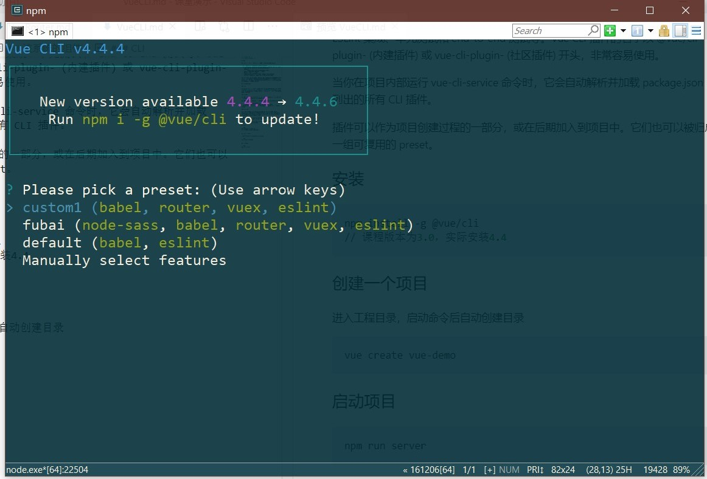

<!-- Vuex.md -->
<!-- author:fudamai -->

# Vuex

## 安装

在工程目录下执行命令安装。

```cmd
npm install vuex --save-dev
```

在一个模块化的打包系统中，您必须显式地通过 `Vue.use()` 来安装 Vuex：

```js
import Vue from 'vue'
import Vuex from 'vuex'

Vue.use(Vuex)
```

## 使用

- 使用 CLI 直接生成工程文件时直接配置

  ```cmd
    vue create vuex-demo
  ```
  


- 向已存在工程文件直接添加

  ```cmd
  vue add vuex
  ```

-------

# Vuex 是什么

Vuex 是一个专为 Vue.js 应用程序开发的**状态管理模式**。它采用集中式存储管理应用的所有组件的状态，并以相应的规则保证状态以一种可预测的方式发生变化。

当应用存在多个组件且多个组件存在**共享状态时**，我们将共享状态抽取出来，以一个全局单例模式管理。在这种模式下，我们的组件树构成了一个巨大的“视图”，不管在树的哪个位置，任何组件都能获取状态或者触发行为！

通过定义和隔离状态管理中的各种概念并通过强制规则维持视图和状态间的独立性，我们的代码将会变得更结构化且易维护。


# 开始

每一个 Vuex 应用的核心就是 store（仓库）。“store”基本上就是一个容器，它包含着你的应用中大部分的状态 (state)。Vuex 和单纯的全局对象有以下两点不同：

- Vuex 的状态存储是**响应式**的。当 Vue 组件从 store 中读取状态的时候，若 store 中的状态发生变化，那么相应的组件也会相应地得到高效更新。
- 你不能直接改变 store 中的状态。**改变 store 中的状态的唯一途径就是显式地提交 (commit) mutation**。这样使得我们可以方便地跟踪每一个状态的变化，从而让我们能够实现一些工具帮助我们更好地了解我们的应用。

为了在 Vue 组件中访问 this.$store property，你需要**为 Vue 实例提供创建好的 store**。Vuex 提供了一个从根组件向所有子组件，以 store 选项的方式“注入”该 store 的机制：

```js
new Vue({
  el: '#app',
  store: store,
})
```

>提示:  如果使用 ES6，你也可以以 ES6 对象的 property 简写 (用在对象某个 property 的 key 和被传入的变量同名时)：```new Vue({el: '#app', store})```

# 核心概念

## State

### 单一状态树

Vuex 使用单一状态树——是的，用一个对象就包含了全部的应用层级状态。每个应用将仅仅包含一个 store 实例。单一状态树让我们能够直接地定位任一特定的状态片段，在调试的过程中也能轻易地取得整个当前应用状态的快照。

存储在 Vuex 中的数据和 Vue 实例中的 data 遵循相同的规则。

### 在 Vue 组件中获得 Vuex 状态

Vuex 通过 **`store` 选项，提供了一种机制将状态从根组件“注入”到每一个子组件中**（需调用 Vue.use(Vuex)）：

```js
const app = new Vue({
  el: '#app',
  // 把 store 对象提供给 “store” 选项，这可以把 store 的实例注入所有的子组件
  store,
  components: { Counter },
  template: `
    <div class="app">
      <counter></counter>
    </div>
  `
})
```

通过在根实例中注册 store 选项，该 store 实例会注入到根组件下的所有子组件中，且 **子组件能通过 `this.$store` 访问到**。让我们更新下 Counter 的实现：

```js
// 子组件
const Counter = {
  template: `<div>{{ count }}</div>`,
  computed: {
    count () {
      return this.$store.state.count
    }
  }
}
```

### mapState 辅助函数

当一个**组件**需要获取多个状态的时候，我们可以使用 mapState 辅助函数帮助我们生成计算属性。

### 组件仍然保有局部状态

使用 Vuex 并不意味着你需要将所有的状态放入 Vuex。如果有些状态严格属于单个组件，最好还是作为组件的局部状态。组件的 data 选项依然保留。

## Getter

Vuex 允许我们在 store 中定义“getter”（可以认为是 store 的计算属性）。就像计算属性一样，getter 的返回值会根据它的依赖被缓存起来，且只有当它的依赖值发生了改变才会被重新计算。

Getter 接受 state 作为其第一个参数：

```js
const store = new Vuex.Store({
  state: {
    todos: [
      { id: 1, text: '...', done: true },
      { id: 2, text: '...', done: false }
    ]
  },
  getters: {
    doneTodos: state => {
      return state.todos.filter(todo => todo.done)
    }
  }
})
```

### mapGetters 辅助函数

mapGetters 辅助函数仅仅是**将 store 中的 getter 映射到局部计算属性**：

```js
// 子组件
import { mapGetters } from 'vuex'

export default {
  // ...
  computed: {
  // 使用对象展开运算符将 getter 混入 computed 对象中
  // 映射 doneTodosCount 为 this.$store.getters.doneTodosCount
    ...mapGetters([
      'doneTodosCount',
      'anotherGetter',
      // ...
    ])
  }
}
```

如果你想将一个 getter 属性另取一个名字，使用对象形式：

```js
...mapGetters({
  // 把 `this.doneCount` 映射为 `this.$store.getters.doneTodosCount`
  doneCount: 'doneTodosCount'
})
```

## Mutation

更改 Vuex 的 store 中的状态的唯一方法是提交 mutation。

Vuex 中的 mutation 非常类似于事件：每个 mutation 都有一个字符串的 **事件类型 (type)** 和 一个 **回调函数 (handler)**。这个回调函数就是我们实际进行**状态更改的地方**，并且它会接受 _`state` 作为第一个参数_：

```js
const store = new Vuex.Store({
  state: {
    count: 1
  },
  mutations: {
    increment (state) {
      // 变更状态
      state.count++
    }
  }
})
```

>type 这里可以理解为函数名。

你不能直接调用一个 mutation handler。这个选项更像是事件注册：“当触发一个类型为 increment 的 mutation 时，调用此函数。”**要唤醒一个 mutation handler，你需要以相应的 type 调用 store.commit 方法**：

```js
store.commit('increment')
```

### 提交载荷（Payload）

你可以向 store.commit 传入额外的参数，即 mutation 的 载荷（payload）：

```js
// ...
mutations: {
  increment (state, n) {
    state.count += n
  }
}
```

```js
store.commit('increment', 10)
```

在大多数情况下，载荷应该是一个对象，这样可以包含多个字段并且记录的 mutation 会更易读。

### Mutation 需遵守 Vue 的响应规则

既然 Vuex 的 store 中的状态是响应式的，那么当我们变更状态时，监视状态的 Vue 组件也会自动更新。这也意味着 Vuex 中的 mutation 也需要与使用 Vue 一样遵守一些注意事项：

- 最好提前在你的 store 中初始化好所有所需属性。
- 当需要在对象上添加新属性时，你应该
  - 使用 Vue.set(obj, 'newProp', 123), 或者
  - 以新对象替换老对象。

### 在组件中提交 Mutation

你可以**在组件中使用 `this.$store.commit('xxx')` 提交 mutation**，或者使用 mapMutations 辅助函数将组件中的 methods 映射为 store.commit 调用（需要在根节点注入 store）。

### Mutation 必须是同步函数

一条重要的原则就是要记住 **mutation 必须是同步函数**。

为了处理异步操作，我们需要 **Action**。

## Action

Action 类似于 mutation，不同在于：

- Action **提交的是 mutation**，而不是直接变更状态。
- Action 可以包含任意**异步操作**。

让我们来注册一个简单的 action：

```js
const store = new Vuex.Store({
  state: {
    count: 0
  },
  mutations: {
    increment (state) {
      state.count++
    }
  },
  actions: {
    increment (context) {
      context.commit('increment')
    }
  }
})
```

Action 函数接受一个与 store 实例具有相同方法和属性的 context 对象，因此你可以调用 **context.commit 提交一个 mutation**，或者通过 context.state 和 context.getters 来获取 state 和 getters。当我们在之后介绍到 Modules 时，你就知道 context 对象为什么不是 store 实例本身了。

- 实践中，我们会经常用到 ES2015 的 **参数解构** 来简化代码（特别是我们需要调用 commit 很多次的时候）：

```js
actions: {
  increment ({ commit }) {
    commit('increment')
  }
}
```

### 在组件中分发 Action

Action 通过 `store.dispatch` 方法触发。先分发，使用时触发。

你**在组件中使用 `this.$store.dispatch('xxx')` 分发 action**，或者使用 mapActions 辅助函数将组件的 methods 映射为 store.dispatch 调用（_需要先在根节点注入 store_）：

```js
import { mapActions } from 'vuex'

export default {
  // ...
  methods: {
    ...mapActions([
      'increment', // 将 `this.increment()` 映射为 `this.$store.dispatch('increment')`

      // `mapActions` 也支持载荷：
      'incrementBy' // 将 `this.incrementBy(amount)` 映射为 `this.$store.dispatch('incrementBy', amount)`
    ]),
    ...mapActions({
      add: 'increment' // 将 `this.add()` 映射为 `this.$store.dispatch('increment')`
    })
  }
}
```

## Module

# ES6

## 一

提示:  如果使用 ES6，你也可以以 ES6 对象的 property 简写 (用在对象某个 property 的 key 和被传入的变量同名时)：```new Vue({el: '#app', store})```

## 二

实践中，我们会经常用到 ES2015 的 **参数解构** 来简化代码（特别是我们需要调用 commit 很多次的时候）：

```js
actions: {
  increment ({ commit }) {
    commit('increment')
  }
}
```
