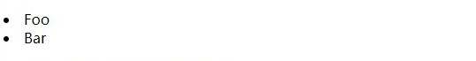
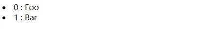
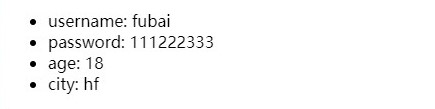
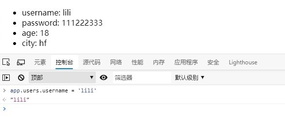
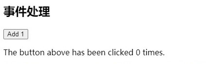
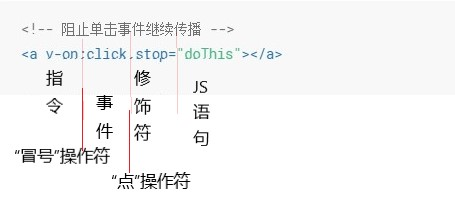

<!-- vue.md -->
<!-- author:fudamai -->

# vue

[vue.js官网](https://vuejs.org/)

<!-- 指令、插值、组件的属性

vue-cli,vue-router,component,mock.js

$store,$route

vue实例、组件

create与computed有什么区别

computed只作用于插值的属性 -->

Vue (读音 /vjuː/，类似于 view) 是一套用于构建用户界面的**渐进式框架**。与其它大型框架不同的是，Vue 被设计为可以自底向上逐层应用。Vue 的核心库只关注视图层，不仅易于上手，还便于与第三方库或既有项目整合。另一方面，当与现代化的工具链以及各种支持类库结合使用时，Vue 也完全能够为复杂的**单页应用**提供驱动。

Vue.js的优点

- 体积小
  - 压缩后只有33K
- 更高的运行效率
  - 基于虚拟DOM（是一种可以预先通过JavaScript进行各种计算，把最终的DOM操作计算出来并优化的技术，由于这个DOM操作属于预处理操作，并没有真实的操作DOM，所以叫做虚拟DOM。）
- 双向数据绑定
  - 让开发者不用再去操作DOM对象，把更多精力投入到业务逻辑上。
- 生态丰富、学习成本低
  - 市场上拥有大量成熟、稳定的基于 Vue.js 的 UI 框架、常用组件！拿来即可实现快速开发！

# 安装

## 直接用 `<script>` 引入

直接下载并用 `<script>` 标签引入，Vue 会被注册为一个全局变量。

从官网下载即可，建议下载开发版本。[地址](https://cn.vuejs.org/v2/guide/installation.html)

## CDN

对于制作原型或学习，你可以这样使用最新版本：

```html
<script src="https://cdn.jsdelivr.net/npm/vue/dist/vue.js"></script>
```

对于生产环境，我们推荐链接到一个明确的版本号和构建文件，以避免新版本造成的不可预期的破坏：

```html
<script src="https://cdn.jsdelivr.net/npm/vue@2.6.11"></script>
```

## NPM

在用 Vue 构建大型应用时推荐使用 NPM 安装[1]。NPM 能很好地和诸如 webpack 或 Browserify 模块打包器配合使用。同时 Vue 也提供配套工具来开发单文件组件。

使用webpack4+ vue-loader 打包vue代码

```shell
# 最新稳定版
$ npm install vue
```

# Vue.js的简单使用

## 声明式渲染

Vue.js 的核心是一个允许采用简洁的模板语法来声明式地将数据渲染进 DOM 的系统：

```html
<div id="app">
  {{ message }}
</div>
```

```js
var app = new Vue({
  el: '#app',
  data: {
    message: 'Hello Vue!'
  }
})
```

现在数据和 DOM 已经被建立了关联，所有东西都是**响应式**的。我们要怎么确认呢？打开你的浏览器的 JavaScript 控制台，并修改 `app.message` 的值，你将看到上例相应地更新。

注意我们 *不再和 HTML 直接交互了* 。一个 Vue 应用会将其挂载到一个 DOM 元素上 (对于这个例子是 #app) 然后对其进行完全控制。那个 HTML 是我们的入口，但其余都会发生在新创建的 Vue 实例内部。

除了文本**插值**，我们还可以像这样来绑定元素 attribute：

```html
<div id="app-2">
  <span v-bind:title="message">
    鼠标悬停几秒钟查看此处动态绑定的提示信息！
  </span>
</div>
```

```js
var app2 = new Vue({
  el: '#app-2',
  data: {
    message: '页面加载于 ' + new Date().toLocaleString()
  }
})
```

你看到的 v-bind attribute 被称为指令。**指令带有前缀 v-，以表示它们是 Vue 提供的特殊 attribute**。它们会在渲染的 DOM 上应用特殊的响应式行为。在这里，该指令的意思是：“将这个元素节点的 title attribute 和 Vue 实例的 message property 保持一致”。

## 条件与循环

- 使用 v-if 控制切换一个元素是否显示：

```html
<div id="app-3">
  <p v-if="seen">现在你看到我了</p>
</div>
```

```js
var app3 = new Vue({
  el: '#app-3',
  data: {
    seen: true
  }
})
```

继续在控制台输入 app3.seen = false，你会发现之前显示的消息消失了。

这个例子演示了我们不仅可以把数据绑定到 DOM 结构。此外，Vue 也提供一个强大的**过渡效果**系统，可以在 Vue 插入/更新/移除元素时自动应用过渡效果。

## 处理用户输入

v-on监听动作。v-model 监听表单输入。

- 为了让用户和你的应用进行交互，我们可以用 v-on 指令添加一个事件监听器，通过它调用在 Vue 实例中定义的方法：

```html
<div id="app-5">
  <p>{{ message }}</p>
  <button v-on:click="reverseMessage">反转消息</button>
</div>
```

```js
var app5 = new Vue({
  el: '#app-5',
  data: {
    message: 'Hello Vue.js!'
  },
  methods: {
    reverseMessage: function () {
      this.message = this.message.split('').reverse().join('')
    }
  }
})
```

- Vue 还提供了 v-model 指令，它能轻松实现表单输入和应用状态之间的双向绑定。

```html
<div id="app-6">
  <p>{{ message }}</p>
  <input v-model="message">
</div>
```

```js
var app6 = new Vue({
  el: '#app-6',
  data: {
    message: 'Hello Vue!'
  }
})
```

## 组件化应用构建

组件系统是 Vue 的另一个重要概念，因为它是一种抽象，允许我们使用小型、独立和通常可复用的组件构建大型应用。仔细想想，几乎任意类型的应用界面都可以抽象为一个组件树：


在 Vue 里，一个组件本质上是一个拥有**预定义选项的一个 Vue 实例**。
为了能从父作用域将数据传到子组件，让我们来修改一下组件的定义，使之能够接受一个 prop。在 Vue 中注册组件很简单：

```html
<div id="app-7">
  <ol>
    <!-- 创建一个 todo-item 组件的实例 -->
    <!--
      现在我们为每个 todo-item 提供 todo 对象
      todo 对象是变量，即其内容可以是动态的。
      我们也需要为每个组件提供一个“key”，稍后再
      作详细解释。
    -->
    <todo-item
      v-for="item in groceryList"
      v-bind:todo="item"
      v-bind:key="item.id"
    ></todo-item>
  </ol>
</div>
```

```js
// 定义名为 todo-item 的新组件
Vue.component('todo-item', {
  // todo-item 组件现在接受一个
  // "prop"，类似于一个自定义 attribute。
  // 这个 prop 名为 todo。
  props: ['todo'],
  template: '<li>{{ todo.text }}</li>'
})

var app7 = new Vue({
  el: '#app-7',
  data: {
    groceryList: [
      { id: 0, text: '蔬菜' },
      { id: 1, text: '奶酪' },
      { id: 2, text: '随便其它什么人吃的东西' }
    ]
  }
})
```

使用 v-bind 指令将待办项传到循环输出的每个组件中。

尽管这只是一个刻意设计的例子，但是我们已经设法将应用分割成了两个更小的单元。*子单元通过 `prop` 接口与父单元进行了良好的解耦* 。我们现在可以进一步改进 `<todo-item>` 组件，提供更为复杂的模板和逻辑，而不会影响到父单元。

在一个大型应用中，有必要将整个应用程序划分为组件，以使开发更易管理。在后续教程中我们将详述组件，不过这里有一个 (假想的) 例子，以展示使用了组件的应用模板是什么样的：

```html
<div id="app">
  <app-nav></app-nav>
  <app-view>
    <app-sidebar></app-sidebar>
    <app-content></app-content>
  </app-view>
</div>
```

# Vue实例

## 创建一个Vue 实例

每个 Vue 应用都是通过用 Vue 函数创建一个新的 Vue 实例开始的：

```js
var vm = new Vue({
  // 选项
})
```

在文档中经常会使用 vm (ViewModel 的缩写) 这个变量名表示 Vue 实例。

当创建一个 Vue 实例时，你可以传入一个**选项对象**（如：el、data、method、created）。在 [API 文档](https://cn.vuejs.org/v2/api)中浏览完整的选项列表。

一个 Vue 应用由一个通过 new Vue 创建的**根 Vue 实例**，以及可选的嵌套的、可复用的组件树组成。

我们会在稍后的组件系统章节具体展开。**所有的 Vue 组件都是 Vue 实例，并且接受相同的选项对象 (一些根实例特有的选项除外)**。

## 数据与方法

当一个 Vue 实例被创建时，它将 data 对象中的所有的 property 加入到 Vue 的**响应式系统**中。当这些 property 的值发生改变时，视图将会产生“响应”，即匹配更新为新的值。

```js
// 我们的数据对象
var data = { a: 1 }

// 该对象被加入到一个 Vue 实例中
var vm = new Vue({
  data: data
})

// 获得这个实例上的 property
// 返回源数据中对应的字段
vm.a == data.a // => true

// 设置 property 也会影响到原始数据
vm.a = 2
data.a // => 2

// ……反之亦然
data.a = 3
vm.a // => 3
```

当这些数据改变时，视图会进行重渲染。

注意：只有当 **实例被创建时就已经存在于 data 中的 property 才是响应式的**。如果你知道你会在晚些时候需要一个 property，但是一开始它为空或不存在，那么你仅需要*设置一些初始值*。比如：

```js
data: {
  newTodoText: '',
  visitCount: 0,
  hideCompletedTodos: false,
  todos: [],
  error: null
}
```

除了数据 property，Vue 实例还暴露了一些有用的实例 property 与方法。它们都有前缀 `$`，以便与用户定义的 property 区分开来。如：`$data, $store, $route`。你可以在 [API 参考](https://cn.vuejs.org/v2/api/#%E5%AE%9E%E4%BE%8B-property)中查阅到完整的实例 property 和方法的列表。

## 实例生命周期钩子

每个 Vue 实例在被创建时都要经过一系列的初始化过程——例如，需要设置数据监听、编译模板、将实例挂载到 DOM 并在数据变化时更新 DOM 等。同时在这个过程中也会运行一些叫做**生命周期钩子**的函数，这给了用户在不同阶段添加自己的代码的机会。

比如 created 钩子可以用来在一个实例被创建之后执行代码：

```js
new Vue({
  data: {
    a: 1
  },
  created: function () {
    // `this` 指向 vm 实例
    console.log('a is: ' + this.a)
  }
})
// => "a is: 1"
```

也有一些其它的钩子，在实例生命周期的不同阶段被调用，如 mounted、updated 和 destroyed。生命周期钩子的 this 上下文指向调用它的 Vue 实例。

## 生命周期图示


-------

# 模板语法

Vue.js 使用了**基于 HTML 的模板语法**，允许开发者声明式地将 DOM 绑定至底层 Vue 实例的数据。

在底层的实现上，Vue 将模板编译成虚拟 DOM 渲染函数。结合响应系统，*Vue 能够智能地计算出最少需要重新渲染多少组件*，并把 DOM 操作次数减到最少。

## 插值

往DOM中插入不同类型的数据

### 文本

数据绑定最常见的形式就是使用“Mustache”语法 (双大括号) 的文本插值：

```html
<span>Message: {{ msg }}</span>
```

Mustache 标签将会被替代为对应数据对象上 msg property 的值。无论何时，绑定的数据对象上 msg property 发生了改变，插值处的内容都会更新。这就是数据绑定。

### 原始HTML

双大括号会将数据解释为普通文本，而非 HTML 代码。为了输出真正的 HTML，你需要使用 `v-html` 指令：

```html
<p>Using mustaches: {{ rawHtml }}</p>
<p>Using v-html directive: <span v-html="rawHtml"></span></p>
```

```js
var app = new Vue({
    el: '#app',
    data: {rawHtml: '<p style="color:red">这里是纯HTML</p>'}
})
```

这个 span 的内容将会被替换成为 property 值 rawHtml，直接作为 HTML——**会忽略解析 property 值中的数据绑定**。注意，你不能使用 v-html 来复合局部模板，因为 Vue 不是基于字符串的模板引擎。反之，对于用户界面 (UI)，组件更适合作为可重用和可组合的基本单位。

>你的站点上动态渲染的任意 HTML 可能会非常危险，因为它很容易导致 XSS 攻击。请只对可信内容使用 HTML 插值，**绝不要**对用户提供的内容使用插值。

## 属性attribute

对HTML属性进行插值，使用 `v-bind` 指令：

```html
<div v-bind:id="dynamicId"></div>
<div v-bind:class="{ active: isActive }"></div>
```

## 使用 JavaScript 表达式

对于所有的数据绑定，Vue.js 都提供了完全的 JavaScript 表达式支持。

```html
{{ number + 1 }} //二元操作符

{{ ok ? 'YES' : 'NO' }} // 三元操作符

{{ message.split('').reverse().join('') }} // 字符串操作

<div v-bind:id="'list-' + id"></div> // 在HTML代码中操作需绑定的字符串
```

这些表达式会在所属 Vue 实例的数据作用域下作为 JavaScript 被解析。有个限制就是，**每个绑定都只能包含单个表达式**，所以下面的例子都不会生效。

## 指令

指令 (Directives) 是带有 v- 前缀的特殊 attribute。指令 attribute 的值预期是单个 JavaScript 表达式 (v-for 是例外情况，稍后我们再讨论)。指令的职责是，当表达式的值改变时，将其产生的连带影响，响应式地作用于 DOM。

常见指令

- v-bind:href
- v-on:click
- v-html="rawHtml"
- v-if
- v-show
- v-for

### 参数

*一些指令* 能够接收一个“参数”，在指令名称之后以冒号表示。例如，v-bind 指令可以用于响应式地更新 HTML attribute：

```html
<a v-bind:href="url">...</a>
```

在这里 href 是参数，告知 v-bind 指令将该元素的 href 属性 与表达式 url 的值绑定。

### 动态参数

从 2.6.0 开始，可以用方括号括起来的 JavaScript 表达式作为一个指令的参数：

```html
<!--
注意，参数表达式的写法存在一些约束，如之后的“对动态参数表达式的约束”章节所述。
-->
<a v-bind:[attributeName]="url"> ... </a>
```

这里的 attributeName 会被作为一个 JavaScript 表达式进行动态求值，求得的值将会作为最终的参数来使用。

### 修饰符

修饰符 (modifier) 是以半角句号 . 指明的特殊后缀，用于指出一个指令应该以特殊方式绑定。例如，.prevent 修饰符告诉 v-on 指令对于触发的事件调用 event.preventDefault()：

```html
<form v-on:submit.prevent="onSubmit">...</form>
```

## 缩写

v-bind的缩写

- 使用冒号 : 声明

v-on的缩写

- 使用and符号 @ 声明

-------

# 计算属性和监听器

## 计算属性

**computed**，用于处理复杂逻辑

### 基础例子

```html
<div id="example">
  <p>Original message: "{{ message }}"</p>
  <p>Computed reversed message: "{{ reversedMessage }}"</p>
</div>
```

```js
var vm = new Vue({
  el: '#example',
  data: {
    message: 'Hello'
  },
  computed: {
    // 计算属性的 getter
    reversedMessage: function () {
      // `this` 指向 vm 实例
      return this.message.split('').reverse().join('')
    }
  }
})
```

结果：

```windows
Original message: "Hello"

Computed reversed message: "olleH"
```

vm.reversedMessage 的值始终取决于 vm.message 的值。

### 计算属性缓存 vs 方法

计算属性是基于它们的响应式依赖进行缓存的。只在相关**响应式依赖发生改变时它们才会重新求值。**

相比之下，每当触发重新渲染时，调用方法将总会再次执行函数。

使用计算属性，可以节省CPU资源，但占用内存

### 计算属性的 setter

计算属性默认只有 getter，不过在需要时你也可以提供一个 setter：

```js
// ...
computed: {
  fullName: {
    // getter
    get: function () {
      return this.firstName + ' ' + this.lastName
    },
    // setter
    set: function (newValue) {
      var names = newValue.split(' ')
      this.firstName = names[0]
      this.lastName = names[names.length - 1]
    }
  }
}
// ...
```

现在再运行 vm.fullName = 'John Doe' 时，setter 会被调用，vm.firstName 和 vm.lastName 也会相应地被更新。

## 监听器

**watch**选项，当需要在数据变化时执行异步或开销较大的操作时，这个方式是最有用的。在这个[示例](https://cn.vuejs.org/v2/guide/computed.html#%E4%BE%A6%E5%90%AC%E5%99%A8)中，使用 watch 选项允许我们执行异步操作 (访问一个 API)，限制我们执行该操作的频率，并在我们得到最终结果前，设置中间状态。这些都是计算属性无法做到的。

-------

# Class与 Style 绑定

property 命名建议使用驼峰式 (camelCase) 命名：

## 绑定 HTML Class

`v-bind:class`

>注意：绑定class 时，自定义的属性要用引号 '' 包裹

### 对象语法

**数据对象定义在模板里**

```html
<div v-bind:class="{ active: isActive }"></div>
```

我们可以传给 v-bind:class 一个**对象**，以**动态地切换 class**。上面的语法表示 active 这个 class 存在与否将取决于数据（data） property isActive 的 truthiness（值是否为真）。

```html
<div
  class="static"
  v-bind:class="{ active: isActive, 'text-danger': hasError }"
></div>
```

```js
data: {
  isActive: true,
  hasError: false
}
```

结果渲染为：

```html
<div class="static active"></div>
```

你可以在对象中传入更多字段来动态切换多个 class。此外，v-bind:class 指令也可以与普通的 class attribute 共存。渲染完成后只有一个 class 属性。

**数据对象不内联定义在模板里**

HTML代码

```html
<div v-bind:class="classObject"></div>
```

JS代码

```js
data: {
  classObject: {
    active: true,
    'text-danger': false
  }
}
```

class 还可以绑定成一个返回对象的计算（computed）属性。

```html
<div v-bind:class="classObject"></div>
```

JS代码

```js
data: {
  isActive: true,
  error: null
},
computed: {
  classObject: function () {
    return {
      active: this.isActive && !this.error,
      'text-danger': this.error && this.error.type === 'fatal'
    }
  }
}
```

### 数组语法

我们可以把一个数组传给 v-bind:class，以应用一个 **class 列表**：

```html
<div v-bind:class="[activeClass, errorClass]"></div>
```

```js
data: {
  activeClass: 'active',
  errorClass: 'text-danger'
}
```

渲染为：

```html
<div class="active text-danger"></div>
```

在绑定的数组中使用三元表达式：

```html
<div v-bind:class="[isActive ? activeClass : '', errorClass]"></div>
```

这样写将始终添加 errorClass，但是只有在 isActive 是 truthy[1] 时才添加 activeClass。

在数组语法中也可以使用对象语法：

```html
<div v-bind:class="[{ active: isActive }, errorClass]"></div>
```

### 用在组件上

当在一个自定义组件上使用 class property 时，这些 class 将被添加到该组件的根元素上面。这个元素上已经存在的 class 不会被覆盖。

## 绑定内联样式

### 对象语法

`v-bind:style`

#### 数据对象定义在模板里

```html
<div v-bind:style="{ color: activeColor, fontSize: fontSize + 'px' }"></div>
```

```js
data: {
  activeColor: 'red',
  fontSize: 30
}
```

渲染结果

```html
<div style="color: red; font-size: 30px;">绑定样式</div>
```

#### 数据对象不内联定义在模板里

直接绑定到一个样式对象通常更好，这会让模板更清晰：

```html
<div v-bind:style="styleObject"></div>
```

```js
data: {
  styleObject: {
    color: 'red',
    fontSize: '13px'
  }
}
```

同样的，对象语法常常结合返回对象的**计算属性**使用。

### 数组语法

v-bind:style 的数组语法可以将多个样式对象应用到同一个元素上：

```html
<div v-bind:style="[baseStyles, overridingStyles]"></div>
```

### 自动添加前缀

### 多重值

从 2.3.0 起你可以为 style 绑定中的 property 提供一个包含多个值的数组，常用于提供多个带前缀的值，例如：

```html
<div :style="{ display: ['-webkit-box', '-ms-flexbox', 'flex'] }"></div>
```

这样写只会渲染数组中最后一个被浏览器支持的值。在本例中，如果浏览器支持不带浏览器前缀的 flexbox，那么就只会渲染 display: flex。

-------

# 条件渲染

## v-if

v-if、v-else-if、v-else 的配合使用。

v-if 指令用于条件性地渲染一块内容。这块内容只会**在指令的表达式返回 值真性（truthy） 值的时候被渲染**。

示例：

```html
<div v-if="type === 'A'">
  A
</div>
<div v-else-if="type === 'B'">
  B
</div>
<div v-else-if="type === 'C'">
  C
</div>
<div v-else>
  Not A/B/C
</div>
```

v-else 元素必须紧跟在带 v-if 或者 v-else-if 的元素的后面，否则它将不会被识别。v-else-if 也必须紧跟在带 v-if 或者 v-else-if 的元素之后。

### 用 key 管理可复用的元素

Vue 会尽可能高效地渲染元素，通常会**复用已有元素而不是从头开始渲染**。这么做除了使 Vue 变得非常快之外，还有其它一些好处。例如，如果你允许用户在不同的登录方式之间切换：

```html
<template v-if="loginType === 'username'">
  <label>Username</label>
  <input placeholder="Enter your username">
</template>
<template v-else>
  <label>Email</label>
  <input placeholder="Enter your email address">
</template>
```

那么在上面的代码中切换 loginType 将不会清除用户已经输入的内容。因为 **两个模板使用了相同的元素**，```<input>```  不会被替换掉——仅仅是替换了它的 placeholder。

这样也不总是符合实际需求，所以 Vue 为你提供了一种方式来表达“这两个元素是完全独立的，不要复用它们”。只需**添加一个具有唯一值的 key attribute** 即可：

```html
<template v-if="loginType === 'username'">
  <label>Username</label>
  <input placeholder="Enter your username" key="username-input">
</template>
<template v-else>
  <label>Email</label>
  <input placeholder="Enter your email address" key="email-input">
</template>
```

现在，每次切换时，输入框都将被重新渲染。请看：

注意，`<label>` 元素仍然会被高效地复用，因为它们没有添加 key attribute。

## v-show

另一个用于根据条件展示元素的选项是 v-show 指令。用法大致一样：

```html
<h1 v-show="ok">Hello!</h1>
```

不同的是带有 **v-show 的元素始终会被渲染并保留在 DOM 中**。v-show 只是简单地切换元素的 CSS property display。

>注意，v-show 不支持 `<template>` 元素，也不支持 v-else。

## v-if vs v-show

**v-if 是“真正”的条件渲染**，因为它会确保在切换过程中条件块内的事件监听器和子组件适当地被销毁和重建。

v-if 也是惰性的：如果在初始渲染时条件为假，则什么也不做——直到条件第一次变为真时，才会开始渲染条件块。

相比之下，**v-show 就简单得多——不管初始条件是什么，元素总是会被渲染，并且只是简单地基于 CSS 进行切换**。

一般来说，v-if 有更高的切换开销，而 v-show 有更高的初始渲染开销。因此，如果需要非常频繁地切换，则使用 v-show 较好；如果在运行时条件很少改变，则使用 v-if 较好。

# 列表渲染

**v-for**

>当 v-if 与 v-for 一起使用时，v-for 具有比 v-if 更高的优先级。

两个参数时，第二个参数时对象的 索引值（index）。三个参数时，第二个参数是对象的键名

## 渲染数组

用 v-for 指令基于一个 *数组* 来渲染一个列表。v-for 指令需要使用 *item in items* 形式的特殊语法，其中 `items` 是源数据数组，而 `item` 则是被迭代的数组元素的别名。

>在 Vue.js中，v-for指令下，in 与 of 含义相同。

```html
<ul id="example-1">
  <li v-for="item in items" :key="item.message">
    {{ item.message }}
  </li>
</ul>
```

```js
var example1 = new Vue({
  el: '#example-1',
  data: {
    items: [
      { message: 'Foo' },
      { message: 'Bar' }
    ]
  }
})
```

结果：



v-for 还支持一个可选的第二个参数，即当前项的索引。渲染数组时，只能有两个参数。

```html
<li v-for="(item, index) in items">{{ index }} : {{ item.message }}</li>
```

结果：



## 渲染对象

用 v-for 来遍历一个对象的 property。

两个参数时，第二个参数时对象的 索引值（index）。三个参数时，第二个参数是对象的键名

```html
<ul>
  <li v-for='(value, key, index) in users' :key='todo.id'>
    {{ key }}: {{ value }}
  </li>
</ul>
```

```js
new Vue({
  el: '#v-for-object',
  data: {
    users: {
      username: 'fubai',
      password: '111222333',
      age: 18,
      city: 'hf'
    },
  }
})
```

结果：



## 维护状态

当 Vue 正在更新使用 v-for 渲染的元素列表时，它默认使用“就地更新”的策略。如果数据项的顺序被改变，Vue 将不会移动 DOM 元素来匹配数据项的顺序，而是就地更新每个元素，并且确保它们在每个索引位置正确渲染。

这个默认的模式是高效的，但是**只适用于不依赖子组件状态或临时 DOM 状态 (例如：表单输入值) 的列表渲染输出**。

为了给 Vue 一个提示，以便它能跟踪每个节点的身份，从而重用和重新排序现有元素，你需要为每项提供一个唯一 key attribute：

```html
<div v-for="item in items" v-bind:key="item.id">
  <!-- 内容 -->
</div>
```

图示：



> v-for 的 key。请用字符串或数值类型的值。

## 数组更新检测

### 变更方法

Vue 将被侦听的数组的变更方法进行了包裹，所以它们也将会触发视图更新。这些被包裹过的方法包括：

- push()
- pop()
- shift()
- unshift()
- splice()
- sort()
- reverse()

### 替换数组

变更方法，顾名思义，会变更调用了这些方法的原始数组。相比之下，也有非变更方法，例如：

- filter()
- concat()
- slice()

它们不会变更原始数组，而总是返回一个新数组。

>注意事项：由于 JavaScript 的限制，Vue 不能检测数组和对象的变化。为实现响应式， property 必须在 data 对象上存在。

## 显示过滤/排序后的结果

有时，我们想要显示一个数组经过过滤或排序后的版本，而不实际变更或重置原始数据。在这种情况下，可以创建一个**计算属性(computed)**，来返回过滤或排序后的数组。

在计算属性不适用的情况下 (例如，在嵌套 v-for 循环中) 你可以使用一个**方法**：

解嵌套，然后调用在 v-for 中调用一个方法。

```html
<ul v-for="set in sets">
  <li v-for="n in even(set)">{{ n }}</li>
</ul>
```

```js
data: {
  sets: [[ 1, 2, 3, 4, 5 ], [6, 7, 8, 9, 10]]
},
methods: {
  even: function (numbers) {
    return numbers.filter(function (number) {
      return number % 2 === 0
    })
  }
}
```

## 在 v-for 里使用值范围

v-for 也可以接受整数。在这种情况下，它会把模板重复对应次数。

## 在组件上使用 v-for

>2.2.0+ 的版本里，当在组件上使用 v-for 时，key 现在是必须的。

在自定义组件上，你可以像在任何普通元素上一样使用 v-for。

然而，任何数据都不会被自动传递到组件里，因为组件有自己独立的作用域。**为了把迭代数据传递到组件里，我们要使用 prop**。

不自动将 item 注入到组件里的原因是，这会使得组件与 v-for 的运作紧密耦合。明确组件数据的来源能够使组件在其他场合重复使用。

下面是一个简单的 todo 列表的完整例子：

```html
<div id="todo-list-example">
  <form v-on:submit.prevent="addNewTodo">
    <label for="new-todo">Add a todo</label>
    <input
      v-model="newTodoText"
      id="new-todo"
      placeholder="E.g. Feed the cat"
    >
    <button>Add</button>
  </form>
  <ul>
    <li
      is="todo-item"
      v-for="(todo, index) in todos"
      v-bind:key="todo.id"
      v-bind:title="todo.title"
      v-on:remove="todos.splice(index, 1)"
    ></li>
  </ul>
</div>
```

>注意这里的 is="todo-item" attribute。这种做是因为在 `<ul>` 元素内只有 `<li>` 元素会被看作有效内容。这样做实现的效果与 `<todo-item>` 相同。

```js
Vue.component('todo-item', {
  template: '\
    <li>\
      {{ title }}\
      <button v-on:click="$emit(\'remove\')">Remove</button>\
    </li>\
  ',
  props: ['title']
})

new Vue({
  el: '#todo-list-example',
  data: {
    newTodoText: '',
    todos: [
      {
        id: 1,
        title: 'Do the dishes',
      },
      {
        id: 2,
        title: 'Take out the trash',
      },
      {
        id: 3,
        title: 'Mow the lawn'
      }
    ],
    nextTodoId: 4
  },
  methods: {
    addNewTodo: function () {
      this.todos.push({
        id: this.nextTodoId++,
        title: this.newTodoText
      })
      this.newTodoText = ''
    }
  }
})
```

-------

# 事件处理

## 监听事件

使用 `v-on` 指令**监听** DOM 事件，并在**触发**时运行一些 JavaScript 代码。

示例：

```html
<div id="example-1">
  <button v-on:click="counter += 1">Add 1</button>
  <p>The button above has been clicked {{ counter }} times.</p>
</div>
```

```js
var example1 = new Vue({
  el: '#example-1',
  data: {
    counter: 0
  }
})
```

结果：



## 事件处理方法

v-on 还可以接收一个需要调用的方法名称。

使用methods对象添加复杂逻辑，封装函数

- 无参数：v-on:click="函数名"
- 有参数：v-on:click="函数名 (参数)"

示例：

```html
<div id="example-2">
  <!-- `greet` 是在下面定义的方法名 -->
  <button v-on:click="greet">Greet</button>
</div>
```

```js
var example2 = new Vue({
  el: '#example-2',
  data: {
    name: 'Vue.js'
  },
  // 在 `methods` 对象中定义方法
  methods: {
    greet: function (event) {
      // `this` 在方法里指向当前 Vue 实例
      alert('Hello ' + this.name + '!')
      // `event` 是原生 DOM 事件
      if (event) {
        alert(event.target.tagName)
      }
    }
  }
})

// 也可以用 JavaScript 直接调用方法
example2.greet() // => 'Hello Vue.js!'
```

结果：


## 内联处理器中的方法

除了直接绑定到一个方法，也可以在内联 JavaScript 语句中调用方法：

有时也需要在内联语句处理器中访问原始的 DOM 事件。可以用特殊变量 $event 把它传入方法：

```html
<button v-on:click="warn('Form cannot be submitted yet.', $event)">
  Submit
</button>
```

```js
// ...
methods: {
  warn: function (message, event) {
    // 现在我们可以访问原生事件对象
    if (event) {
      event.preventDefault()
    }
    alert(message)
  }
}
```

使用 event.preventDefault() 抑制默认动作。

## 事件修饰符

方法只有纯粹的数据逻辑，而不是去处理 DOM 事件细节。为了实现这一点，Vue.js 为 v-on 提供了**事件修饰符**。之前提过，修饰符是由点开头的指令后缀来表示的。

- .stop
  - 阻止单击事件继续传播。用来抑制冒泡传播
- .prevent
  - 阻止默认行为
- .capture
- .self
- .once
  - 点击事件将只会触发一次
- .passive
  - 用于改善滚动行为。滚动事件的默认行为 (即滚动行为) 将会立即触发，而不会等待 `onScroll` 完成。这其中包含 `event.preventDefault()` 的情况。

用法：



## 按键修饰符

监听键盘事件使用v-on:keyup。

Vue 允许为 v-on 在监听键盘事件时添加按键修饰符：

```html
<!-- 只有在 `key` 是 `Enter` 时调用 `vm.submit()` -->
<input v-on:keyup.enter="submit">
<input v-on:keyup.page-down="onPageDown">
```

## 系统修饰符

鼠标按钮修饰符

- .left
- .right
- .middle

这些修饰符会限制处理函数仅响应特定的鼠标按钮。

-------

# 表单输入绑定

## 基础用法

你可以用 **`v-model`** 指令在表单 `<input>`、`<textarea>` 及 `<select>` 元素上创建双向数据绑定。它会根据控件类型自动选取正确的方法来更新元素。

>v-model 会忽略所有表单元素的 value、checked、selected 属性的初始值而总是**将 Vue 实例的数据作为数据来源**。你应该通过 JavaScript **在组件的 data 选项中声明初始值**。

v-model 在内部为不同的输入元素使用不同的 property 并抛出不同的事件：

- text 和 textarea 元素使用 value property 和 input 事件；
- checkbox 和 radio 使用 checked property 和 change 事件；
- select 字段将 value 作为 prop 并将 change 作为事件。

### 文本

示例代码：

```html
<input v-model="message" placeholder="edit me">
<p>Message is: {{ message }}</p>
```

```js
var app = new Vue({
  el = '#app',
  data: {
    message: 'hello vue'
  }
})
```

绑定的数据要在 data 选项中声明一个 property 。若这个property 不为空，将替代 placeholder 显示在表单输入框中。

### 多行文本

```html
<span>Multiline message is:</span>
<p style="white-space: pre-line;">{{ message }}</p>
<br>
<textarea v-model="message" placeholder="add multiple lines"></textarea>
```

```js
var app = new Vue({
  el = '#app',
  data: {
    message: ''
  }
})
```

### 复选框

单个复选框，绑定到布尔值：

```html
<input type="checkbox" id="checkbox" v-model="checked">
<label for="checkbox">{{ checked }}</label>
```

多个复选框，绑定到同一个数组：

```html
<input type="checkbox" id="jack" value="Jack" v-model="checkedNames">
<label for="jack">Jack</label>
<input type="checkbox" id="john" value="John" v-model="checkedNames">
<label for="john">John</label>
<input type="checkbox" id="mike" value="Mike" v-model="checkedNames">
<label for="mike">Mike</label>
<br>
<span>Checked names: {{ checkedNames }}</span>
```

```js
new Vue({
  el: '...',
  data: {
    checkedNames: []
  }
})
```

>注意：value 给定时，v-model 绑定的 property（财产）将 value 的值作为自己的值。

### 单选框

```html
<div id="example-4">
  <input type="radio" id="one" value="One" v-model="picked">
  <label for="one">One</label>
  <br>
  <input type="radio" id="two" value="Two" v-model="picked">
  <label for="two">Two</label>
  <br>
  <span>Picked: {{ picked }}</span>
</div>
```

```js
new Vue({
  el: '#example-4',
  data: {
    picked: ''
  }
})
```

### 下拉列表

单选时：

```html
<div id="example-5">
  <select v-model="selected">
    <option disabled value="">请选择</option>
    <option>A</option>
    <option>B</option>
    <option>C</option>
  </select>
  <span>Selected: {{ selected }}</span>
</div>
```

```js
new Vue({
  el: '...',
  data: {
    selected: ''
  }
})
```

>在 iOS 中，第一个选项提供一个值为空的禁用选项。

多选时：

代码更改：

HTML代码，在select 标签中添加 multiple 属性。

```html
<select v-model="selected" multiple style="width: 50px;">
```

JS代码，将 selected property 设为一个数组。

```js
selected: []
```

option 选项可以使用 v-for 指令渲染。

```html
<select v-model="selected">
  <option v-for="option in options" v-bind:value="option.value">
    {{ option.text }}
  </option>
</select>
<span>Selected: {{ selected }}</span>
```

```js
new Vue({
  el: '...',
  data: {
    selected: 'A',
    options: [
      { text: 'One', value: 'A' },
      { text: 'Two', value: 'B' },
      { text: 'Three', value: 'C' }
    ]
  }
})
```

## 值绑定

html 标签内的 value 给定时，v-model 绑定的 property（财产）将 value 的值作为自己的值。

对于单选按钮，复选框及选择框的选项，v-model 绑定的值通常是静态字符串 (对于复选框也可以是布尔值)：

```html
<!-- 当选中时，`picked` 为字符串 "a" -->
<input type="radio" v-model="picked" value="a">

<!-- `toggle` 为 true 或 false -->
<input type="checkbox" v-model="toggle">

<!-- 当选中第一个选项时，`selected` 为字符串 "abc" -->
<select v-model="selected">
  <option value="abc">ABC</option>
</select>
```

但是有时我们可能想把值绑定到 Vue 实例的一个动态 property 上，这时可以用 **`v-bind`** 实现，并且这个 property 的值可以不是字符串。

```html
<input
  type="checkbox" v-model="toggle" true-value="yes" false-value="no"
>
<input type="radio" v-model="pick" v-bind:value="a">
<select v-model="selected">
    <!-- 内联对象字面量 -->
  <option v-bind:value="{ number: 123 }">123</option>
</select>
```

## 修饰符

### .lazy

在默认情况下，v-model 在每次 input 事件触发后将输入框的值与数据进行同步 (除了中日韩输入法组合文字时)。你可以添加 lazy 修饰符，从而转为在 change 事件_之后_进行同步。即输入 enter 键后，进行动作

```html
<!-- 在“change”时而非“input”时更新 -->
<input v-model.lazy="msg">
```

### .number

如果想自动将用户的输入值转为数值类型，可以给 v-model 添加 number 修饰符：

```html
<input v-model.number="age" type="number">
```

规避JavaScript 将输入字符转为字符串的特性。

### .trim

如果要自动过滤用户输入的首尾空白字符，可以给 v-model 添加 trim 修饰符：

```html
<input v-model.trim="msg">
```

-------

# Vue组件

## 基本示例

这里有一个 Vue 组件的示例：

```js
// 定义一个名为 button-counter 的新组件
Vue.component('button-counter', {
  data: function () {
    return {
      count: 0
    }
  },
  template: '<button v-on:click="count++">You clicked me {{ count }} times.</button>'
})
```

**组件是可复用的 Vue 实例**，且带有一个名字：在这个例子中是 `<button-counter>`。我们可以在一个通过 `new Vue` 创建的 Vue 根实例中，把这个组件作为 *自定义元素* 来使用：

```html
<div id="components-demo">
  <button-counter></button-counter>
</div>
```

```js
new Vue({ el: '#components-demo' })
```

因为组件是可复用的 Vue 实例，所以它们与 new Vue 接收相同的选项，例如 `data`、`computed`、`watch`、`methods` 以及 `生命周期钩子`等。仅有的例外是像 `el` 这样根实例特有的选项。

## 组件的复用

你可以将组件进行 **任意次数的复用**：

```html
<div id="components-demo">
  <button-counter></button-counter>
  <button-counter></button-counter>
  <button-counter></button-counter>
</div>
```

注意当点击按钮时，每个组件都会各自独立维护它的 count。因为你每用一次组件，就会有一个它的新**实例**被创建。

**一个组件的 data 选项必须是一个函数**，这样每个实例可以维护一份被返回对象的独立的拷贝

## 组件的组织

通常一个应用会以一棵嵌套的**组件树**的形式来组织：


例如，你可能会有页头、侧边栏、内容区等组件，每个组件又包含了其它的像导航链接、博文之类的组件。

为了能在模板中使用，这些组件必须先 *注册以便 Vue 能够识别* 。这里有两种组件的注册类型：**全局注册** 和 **局部注册**。

- 至此，我们的组件都只是通过 Vue.component 全局注册的：

```js
Vue.component('my-component-name', {
  // ... options ...
})
```

全局注册的组件可以**用在**其被注册之后的任何 (通过 new Vue) 新创建的 **Vue 根实例**，也包括其组件树中的所有**子组件**的模板中。

## 通过 Prop 向子组件传递数据

Prop 是你可以在组件上注册的一些自定义 attribute。当一个值传递给一个 prop attribute 的时候，它就变成了那个组件实例的一个 property。为了给博文组件传递一个标题，我们可以用一个 props 选项将其包含在该组件可接受的 prop 列表中：

```js
Vue.component('blog-post', {
  props: ['title'],
  template: '<h3>{{ title }}</h3>'
})
```

一个组件默认可以拥有任意数量的 prop，任何值都可以传递给任何 prop。在上述模板中，你会发现我们能够在组件实例中访问这个值，就像访问 data 中的值一样。

一个 prop 被注册之后，你就可以像这样把数据作为一个自定义 attribute 传递进来：

```html
<blog-post title="My journey with Vue"></blog-post>
<blog-post title="Blogging with Vue"></blog-post>
<blog-post title="Why Vue is so fun"></blog-post>
```

然而在一个典型的应用中，你可能在 data 里有一个博文的数组：

```js
new Vue({
  el: '#blog-post-demo',
  data: {
    posts: [
      { id: 1, title: 'My journey with Vue' },
      { id: 2, title: 'Blogging with Vue' },
      { id: 3, title: 'Why Vue is so fun' }
    ]
  }
})
```

并想要为每篇博文渲染一个组件：

```html
<blog-post
  v-for="post in posts"
  v-bind:key="post.id"
  v-bind:title="post.title"
></blog-post>
```

如上所示，我们可以使用 **`v-for` 迭代一个列表，`v-bind` 来动态传递 prop**。这在你一开始不清楚要渲染的具体内容，比如从一个 API 获取博文列表的时候，是非常有用的。

## 单个根元素

Vue 中 **every component must have a single root element (每个组件必须只有一个根元素)**。你必须将模板的内容包裹在一个父元素内。

看起来当组件变得越来越复杂的时候，我们的博文不只需要标题和内容，还需要发布日期、评论等等。为每个相关的信息定义一个 prop 会变得很麻烦，我们可以重构一下这个 `<blog-post>` 组件了，让它变成接受一个单独的 post prop：

先从实例中接收数组中的 post 对象，再在组件的模板中处理 post 对象中的数据。

```html
<blog-post
  v-for="post in posts"
  v-bind:key="post.id"
  v-bind:post="post"
></blog-post>
```

```js
Vue.component('blog-post', {
  props: ['post'],
  template: `
    <div class="blog-post">
      <h3>{{ post.title }}</h3>
      <div v-html="post.content"></div>
    </div>
  `
})
```

现在，不论何时为 post 对象添加一个新的 property，它都会自动地在 `<blog-post>` 内可用。

## 监听子组件事件

在我们开发 `<blog-post>` 组件时，它的一些功能可能要求我们 *和父级组件进行沟通*。例如我们可能会引入一个辅助功能来放大博文的字号，同时让页面的其它部分保持默认的字号。

在其父组件中，我们可以通过添加一个 postFontSize 数据 property 来支持这个功能：

```js
new Vue({
  el: '#blog-posts-events-demo',
  data: {
    posts: [/* ... */],
    postFontSize: 1
  }
})
```

它可以在模板中用来控制所有博文的字号：

```html
<div id="blog-posts-events-demo">
  <div :style="{ fontSize: postFontSize + 'em' }">
    <blog-post
      v-for="post in posts"
      v-bind:key="post.id"
      v-bind:post="post"
      v-on:enlarge-text="postFontSize += 0.1"
    ></blog-post>
  </div>
</div>
```

现在我们在每篇博文正文之前添加一个按钮来放大字号：

```js
Vue.component('blog-post', {
  props: ['post'],
  template: `
    <div class="blog-post">
      <h3>{{ post.title }}</h3>
      // click 事件发生时，将 enlarge-text 事件传给监听器，监听器执行回调
      <button v-on:click="$emit('enlarge-text')">
        Enlarge text
      </button>
      <div v-html="post.content"></div>
    </div>
 `
})
```

父级组件可以像处理 native DOM 事件一样通过 `v-on` 监听子组件实例的任意事件。同时子组件可以通过调用内建的 `$emit` 方法并传入事件名称来触发一个事件。

## 通过插槽分发内容

## 动态组件

通过 Vue 的 `<component>` 元素加一个特殊的 `is` attribute 来实现一个 Tab 页。

```html
<!DOCTYPE html>
<html>
  <head>
    <title>Dynamic Components Example</title>
    <script src="https://unpkg.com/vue"></script>
    <style>
      .tab-button {
        padding: 6px 10px;
        border-top-left-radius: 3px;
        border-top-right-radius: 3px;
        border: 1px solid #ccc;
        cursor: pointer;
        background: #f0f0f0;
        margin-bottom: -1px;
        margin-right: -1px;
      }
      .tab-button:hover {
        background: #e0e0e0;
      }
      .tab-button.active {
        background: #e0e0e0;
      }
      .tab {
        border: 1px solid #ccc;
        padding: 10px;
      }
    </style>
  </head>
  <body>
    <div id="dynamic-component-demo" class="demo">
      <button
        v-for="tab in tabs"
        v-bind:key="tab"
        v-bind:class="['tab-button', { active: currentTab === tab }]"
        v-on:click="currentTab = tab"
      >
        {{ tab }}
      </button>
      <!-- 组件会在 `currentTabComponent` 改变时改变 -->
      <component v-bind:is="currentTabComponent" class="tab"></component>
    </div>

    <script>
      Vue.component("tab-home", {
        template: "<div>Home component</div>"
      });
      Vue.component("tab-posts", {
        template: "<div>Posts component</div>"
      });
      Vue.component("tab-archive", {
        template: "<div>Archive component</div>"
      });

      new Vue({
        el: "#dynamic-component-demo",
        data: {
          currentTab: "Home",
          tabs: ["Home", "Posts", "Archive"]
        },
        computed: {
          currentTabComponent: function() {
            return "tab-" + this.currentTab.toLowerCase();
          }
        }
      });
    </script>
  </body>
</html>
```

在上述示例中，currentTabComponent 可以包括

- 已注册组件的名字，或
- 一个组件的选项对象

## 解析 DOM 模板时的注意事项

html中存在一些标签内部只能使用特殊标签。全局注册的自定义组件在这些标签内部使用，需使用 `is` 属性。

```html
<table>
  <tr is="blog-post-row"></tr>
</table>
```

一些严格配合使用的HTML标签：

- ul、ol
  - 配合标签：li
- table
  - 配合标签：tr
- select
  - 配合标签：option

需要注意的是如果我们从以下来源使用模板的话，这条限制是不存在的：

- 字符串 (例如：template: '...')
- 单文件组件 (.vue)
- `<script type="text/x-template">`

-------

# 命令行工具（Vue CLI）

Vue 提供了一个官方的 CLI，为单页面应用 (SPA) 快速搭建繁杂的脚手架。它为现代前端工作流提供了 batteries-included 的构建设置。只需要几分钟的时间就可以运行起来并带有热重载、保存时 lint 校验，以及生产环境可用的构建版本。更多详情可查阅 [Vue CLI 的文档](https://cli.vuejs.org/zh/guide/)。

## 术语

- 编译器：用来将模板字符串编译成为 JavaScript 渲染函数的代码。

- 运行时：用来创建 Vue 实例、渲染并处理虚拟 DOM 等的代码。基本上就是除去编译器的其它一切。

- MVVM模型
