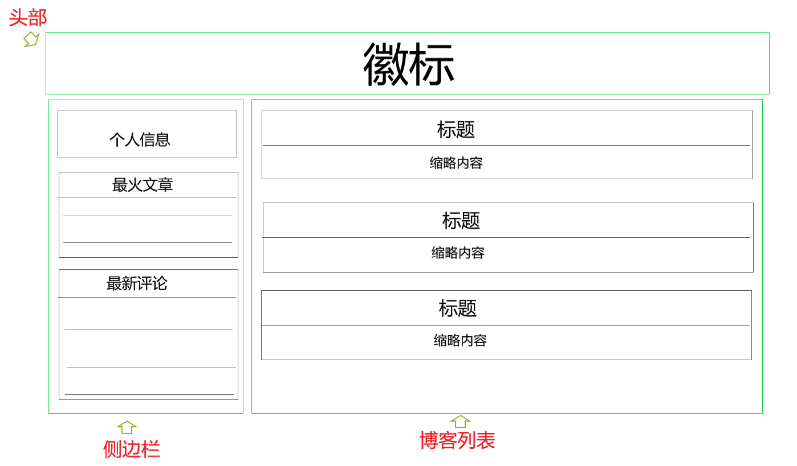
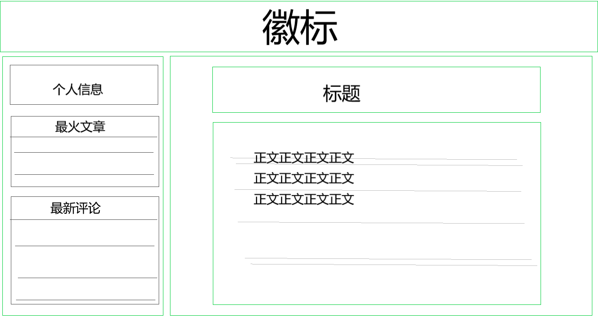
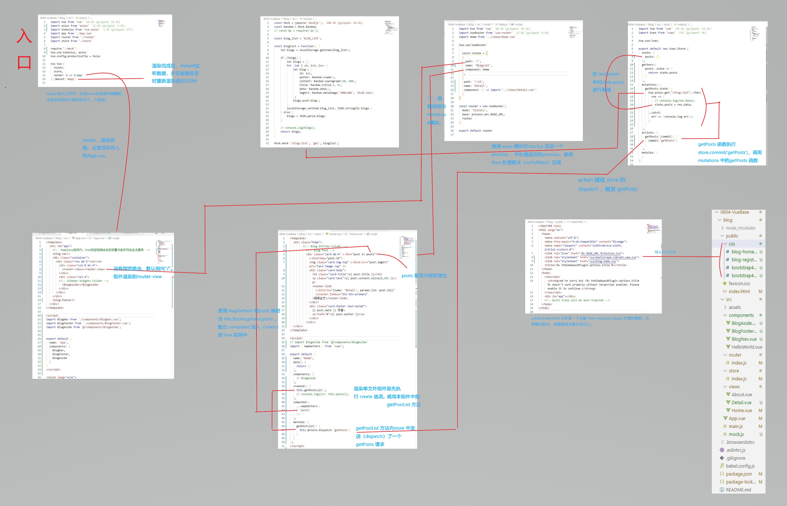

<!-- Vue项目新建 -->
<!-- author：fudamai -->

# Vue

项目全流程

## 分析需求

- 博客网站
- 列表页、详情页
- 侧边栏
  - 个人信息
  - 最火文章
  - 最新评论
- 使用mock生成文章
- 使用vuex进行数据交互
- 详情页使用ID导航

## 规划页面

列表页



详情页



## 划分组件

- 头部
- 侧边栏
- 博客列表
- 博客正文

## 搭建页面

使用CLI搭建脚手架，配置要有

```txt
node-sass, babel, router, vuex, eslint
```

安装 mock.js 。生成随机数据，拦截 Ajax 请求。

axios, vue-axios，用于生成 promise

```cmd
npm install --save-dev mockjs axios vue-axios
```

## 添加数据

## 整体调试

项目数据流动演示



# 坎坷

axios模块未安装，未导入，浪费了好长时间
