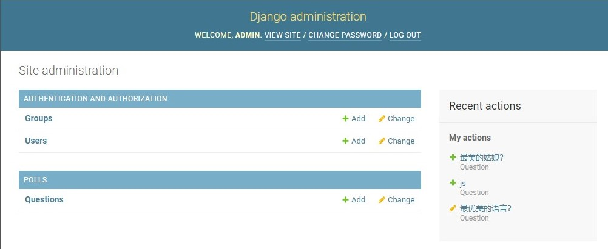

<!-- Django入门 -->
<!-- author：fudamai -->

# Django入门

[官网](https://www.djangoproject.com/)

## 介绍

Django让构建一个好的web应用更加简单，而且构建地更快、代码更少。

Django的发明是为了满足快速变化的新闻编辑室的最后期限，同时满足有经验的web 开发人员的严格要求。

## 为什么使用 Django?

在几个小时内从概念到启动 Web 应用。Django 负责处理 Web 开发的许多麻烦，因此您可以集中精力编写应用程序，而无需重新发明轮子。  
它是免费的，开源的。

- 极其的快
  - Django 被设计用来帮助开发者，快速的将应用从概念转化为成品。
- 全能
  - Django 包含许多额外的功能，可以使用它们来处理常见的 Web 开发任务。用户身份验证、内容管理等大量任务都是开箱即用的。
- 令人信赖的安全性
  - 非常重视安全性，并帮助开发人员避免许多常见的安全错误，例如SQL 注入、跨站点脚本、跨站点请求伪造和点击劫持。其用户认证系统提供了一种安全的方式来管理用户账户和密码。
- 高扩展性
  - 快速灵活的扩展满足大流量网站的变更需求
- 高通用性
  - 从内容管理系统到社交网络，再到科学计算平台，公司、组织和政府都使用Django 来构建各种各样的东西。

## 如何使用

Python虚拟环境与 Django 安装

安装 anaconda

创建虚拟环境  
```conda create -n up2u-bbs python=3.8 django```

课程演示的Django 为2.1版本。学习实际使用3.0版本

学习流程：

- 官方文档
- 文档演示项目，抄写并理解
- 代码抄写中做笔记

官方演示项目，第一部分：

- 要输入完整路径才能打开指定页面

# 第一部分

## 创建项目

打开命令行，cd 到一个你想放置你代码的目录，然后运行以下命令：
```django-admin startproject mysite```  
这行代码将会在当前目录下创建一个 mysite 目录。创建完成后的目录结构如下：

```path
mysite/
    manage.py
    mysite/
        __init__.py
        settings.py
        urls.py
        asgi.py
        wsgi.py
```

启动简易服务器

```cmd
python manage.py runserver
```

控制台输出会给出访问地址。默认端口为 8000

>如何消除未使用数据库迁移警告：  
运行命令：`python manage.py migrate` ，启动一个文本数据库 `sqlite`。  
下载软件DB Browser for SQLite 打开。

---

## 创建投票应用

在这个教程中，我们将在你的 manage.py 同级目录下创建投票应用。这样它就可以作为顶级模块导入，而不是 mysite 的子模块。

请确定你现在处于 manage.py 所在的目录下，然后运行这行命令来创建一个应用：

```cmd
python manage.py startapp polls
```

这将会创建一个 polls 目录，它的目录结构大致如下：

```path
polls/
    __init__.py
    admin.py
    apps.py
    migrations/
        __init__.py
    models.py
    tests.py
    views.py
```

这个目录结构包括了投票应用的全部内容。

### 编写第一个视图

- 视图
- URLconf
- 根URLconf

#### 视图

打开 polls/views.py，把下面这些 Python 代码输入进去：

```python
from django.http import HttpResponse


def index(request):
    return HttpResponse("Hello, world. You're at the polls index.")
```

这是 Django 中最简单的视图。如果想看见效果，我们需要将一个 URL 映射到它——这就是我们需要 URLconf 的原因了。

为了创建 URLconf，请在 polls 目录里新建一个 urls.py 文件。

#### URLconf

在 polls/urls.py 中，输入如下代码：

```python
from django.urls import path

from . import views

urlpatterns = [
    path('', views.index, name='index'),
]
```

此时的目录结构

```path
polls/
    __init__.py
    admin.py
    apps.py
    migrations/
        __init__.py
    models.py
    tests.py
    urls.py
    views.py
```

#### 根URLconf

在根 URLconf 文件中指定我们创建的 polls.urls 模块。在 mysite/urls.py 文件的 urlpatterns 列表里插入一个 include()， 如下：

```python
from django.contrib import admin
from django.urls import include, path

urlpatterns = [
    path('polls/', include('polls.urls')),
    path('admin/', admin.site.urls),
]
```

你现在把 index 视图添加进了 URLconf。通过以下命令验证是否正常工作：

```python manage.py runserver```

用你的浏览器访问 http://localhost:8000/polls/ ，你应该能够看见 "Hello, world. You're at the polls index." ，这是你在 index 视图中定义的。

---

# 第二部分：

**我们将建立数据库，创建您的第一个模型，并主要关注 Django 提供的自动生成的管理页面。**

## 数据库配置

现在，打开 mysite/settings.py 。这是个包含了 Django 项目设置的 Python 模块。

通常，这个配置文件 *使用 SQLite 作为默认数据库*。如果你不熟悉数据库，或者只是想尝试下 Django，这是最简单的选择。Python 内置 SQLite，所以你无需安装额外东西来使用它。

settings.py中设置：

- DATABASES  
  数据库
- INSTALLED_APPS  
  项目中启用的所有Django 应用

默认开启的某些应用需要至少一个数据表，所以，在使用他们之前需要在数据库中创建一些表。请执行以下命令：  
```python manage.py migrate```

这个 migrate 命令检查 INSTALLED_APPS 设置，为其中的每个应用创建需要的数据表。

---

## 创建模型

数据库模型

在 Django 里写一个数据库驱动的 Web 应用的第一步是定义模型 - 也就是数据库结构设计和附加的其它元数据。

在这个投票应用中，需要创建两个模型：问题 **Question** 和选项 **Choice**。**Question** 模型包括问题描述和发布时间。**Choice** 模型有两个字段，选项描述和当前得票数。每个选项属于一个问题。

这些概念可以通过一个 Python 类来描述。按照下面的例子来编辑 **polls/models.py** 文件：

```python
from django.db import models


class Question(models.Model):
    question_text = models.CharField(max_length=200)
    pub_date = models.DateTimeField('date published')


class Choice(models.Model):
    question = models.ForeignKey(Question, on_delete=models.CASCADE)
    choice_text = models.CharField(max_length=200)
    votes = models.IntegerField(default=0)
```

每个模型被表示为 **django.db.models.Model** 类的子类。每个模型有许多类变量，它们都表示 *模型里的一个数据库字段*。

每个字段都是 **Field** 类的实例 - 比如，字符字段被表示为 CharField ，日期时间字段被表示为 DateTimeField 。这将告诉 Django 每个字段要处理的 *数据类型*。

每个 **Field** 类实例变量的 *名字（例如 **question_text** 或 **pub_date** ）也是字段名*，所以最好使用对机器友好的格式。你将会在 Python 代码里使用它们，而 *数据库会将它们作为列名*。

注意在最后，我们使用 **ForeignKey** 定义了一个关系。这将告诉 Django，每个 **Choice** 对象都关联到一个 **Question** 对象。Django 支持所有常用的数据库关系：多对一、多对多和一对一。

---

## 激活模型

上面的一小段用于创建模型的代码给了 Django 很多信息，通过这些信息，Django 可以：

- 为这个应用创建数据库 schema（生成 CREATE TABLE 语句）。
- 创建可以与 Question 和 Choice 对象进行交互的 Python 数据库 API。

但是首先得 *把 polls 应用安装到我们的项目里*。

为了在我们的工程中包含这个应用，我们需要在配置类 **INSTALLED_APPS** 中添加设置。因为 **PollsConfig** 类写在文件 **polls/apps.py** 中，所以它的点式路径是 **'polls.apps.PollsConfig'**。在文件 **mysite/settings.py** 中 **INSTALLED_APPS** 子项添加点式路径后，它看起来像这样：

```py
INSTALLED_APPS = [
    'polls.apps.PollsConfig',
    'django.contrib.admin',
    'django.contrib.auth',
    'django.contrib.contenttypes',
    'django.contrib.sessions',
    'django.contrib.messages',
    'django.contrib.staticfiles',
]
```

现在你的 Django 项目会包含 polls 应用。接着运行下面的命令：

```cmd
python manage.py makemigrations polls
```

你将会看到类似于下面这样的输出：

```cmdout
Migrations for 'polls':
  polls/migrations/0001_initial.py
    - Create model Question
    - Create model Choice
```

通过运行 **makemigrations** 命令，Django 会检测你对模型文件的修改（在这种情况下，你已经取得了新的），并且把修改的部分储存为**一次 *迁移***。

迁移是 Django 对于模型定义（也就是你的数据库结构）的变化的储存形式 - 它们其实也只是一些你磁盘上的文件。

现在，再次运行 **migrate** 命令，在数据库里创建新定义的模型的数据表：

```cmd
$ python manage.py migrate

Operations to perform:
  Apply all migrations: admin, auth, contenttypes, polls, sessions
Running migrations:
  Rendering model states... DONE
  Applying polls.0001_initial... OK
```

这个 **migrate** 命令 *选中所有还 **没有执行** 过的 迁移* （Django 通过在数据库中创建一个特殊的表 django_migrations 来跟踪执行过哪些迁移）并应用在数据库上 - 也就是 *将你对模型的更改同步到数据库结构上*。

**迁移**是非常强大的功能，它能让你在开发过程中持续的改变数据库结构而不需要重新删除和创建表 - 它专注于使数据库平滑升级而不会丢失数据。我们会在后面的教程中更加深入的学习这部分内容，现在，你只需要记住，**改变模型需要这三步**：

- 编辑 **models.py** 文件，改变模型。
- 运行 **python manage.py makemigrations** 为模型的改变生成迁移文件。
- 运行 **python manage.py migrate** 来应用数据库迁移。

*数据库迁移被分解成**生成**和**应用**两个命令* 是为了让你能够在代码控制系统上提交迁移数据并使其能在多个应用里使用；这不仅仅会让开发更加简单，也给别的开发者和生产环境中的使用带来方便。

---

## 初试API

用双下划线替代点操作符

删除后是否需要保存

现在让我们进入交互式 Python 命令行，尝试一下 Django 为你创建的各种 API。通过以下命令打开Python 命令行：

```pyhton manage.py shell```

>原生python 命令界面不好用，建议先在虚拟环境安装 ipython

database API：

```python
# 导入我们刚编写的模型类
from polls.models import Choice, Question

# 创建一个新的Question
from django.utils import timezone
q = Question(question_text="what's new?", pub_date=timezone.now())

# 将对象保存到数据库中。必须显式调用save()
q.save()

# 可以直接访问 id
q.id

# 通过Python 属性访问模型字段值
q.question_text

q.pub_date

# 通过更改属性来更改值，然后调用 save()
q.question_text = "接下来呢？"
q.save()

# all()显示数据库中的所有 Question。
[in]:Question.objects.all()

[out]:<QuerySet [<Question: Question object (1)>]>
```

**<Question: Question object (1)>** 对于我们了解这个对象的细节没什么帮助。让我们通过编辑 **Question** 模型的代码（位于 **polls/models.py** 中）来修复这个问题。给 **Question** 和 **Choice** 增加 **__str__()** 方法。

```python
from django.db import models

class Question(models.Model):
    # ...
    def __str__(self):
        return self.question_text

class Choice(models.Model):
    # ...
    def __str__(self):
        return self.choice_text
```

定义__str__()，更改对象的说明文字。除此之外，还可在对象种添加自定义方法。

保存文件然后通过 python manage.py shell 命令再次打开 Python 交互式命令行：

```python
from polls.models import Choice, Question
from django.utils import timezone

current_year = timezone.now().year

[in]:Question.objects.all()
[out]:<QuerySet [<Question: 接下来呢？>]>

# Django提供了一个完全由关键字参数驱动的丰富数据库查找API
Question.objects.filter(id=1)

# 使用下划线表示分隔关系，相当于替代点操作符
Question.objects.filter(question_text__startswith='接')
Question.objects.get(pub_date__year=current_year)
# filter 返回集合
# get 返回单个对象

Question.objects.get(id=2)

# 下面例子与 Question.objects.get(id=1)相同，pk = primark key
Question.objects.get(pk=1)

q = Question.objects.get(pk=1)
# 显示相关对象集合中的所有 choices
q.choice_set.all()

# 创建几个 choices
q.choice_set.create(choice_text='not much', votes=0)

c = q.choice_set.create(choice_text='carcarcar', votes=1)

# Choice 对象拥有关联 Question 对象的 API。此 API是在模板里自定义的
c.question

q.choice_set.count()

# The API automatically follows relationships as far as you need.
# Use double underscores to separate relationships.
# This works as many levels deep as you want; there's no limit.
# Find all Choices for any question whose pub_date is in this year
Choice.objects.filter(question__pub_date__year=current_year)

# Let's delete one of the choices. Use delete() for that
# 使用 delete() 方法删除一个 choice
c = q.choice_set.filter(choice_text__startswith='Just hacking')
c.delete()
```

---

## 介绍 Django 管理界面

### 创建一个管理员账号

创建一个能登录管理页面的用户。请运行下面的命令：

```python manage.py createsuperuser```

依次输入用户名、邮箱（可选）、密码

### 启动开发服务器

Django 的管理界面默认就是启用。让我们启动开发服务器，看看它到底是什么样的。  
输入命令启动服务器：

```python manage.py runserver```

现在，打开浏览器，转到你本地域名的 "/admin/" 目录， -- 比如 "http://127.0.0.1:8000/admin/" 。你应该会看见管理员登录界面。


### 进入管理站点页面

现在，试着使用你在上一步中创建的超级用户来登录。然后你将会看到 Django 管理页面的索引页：


你将会看到几种可编辑的内容：*组和用户*。它们是由 **django.contrib.auth** 提供的，这是 Django 开发的认证框架。

### 向管理页面中加入投票页面

但是我们的投票应用在哪呢？它没在索引页面里显示。

只需要再做一件事：我们得告诉管理员，问题 **Question** 对象需要一个*后台接口*。打开 **polls/admin.py** 文件，把它编辑成下面这样：

polls/admin.py

```python
from django.contrib import admin

from .models import Question

admin.site.register(Question)
```

等待程序自动加载更改，如果加载失败，重启服务器：

```python manage.py runserver```

### 体验便捷的管理功能

现在我们向管理页面注册了问题 Question 类。Django 知道它应该被显示在索引页里：



---

# 第三部分：视图

**创建公用界面--也被称为“视图”**

## 概况

Django 中的视图的概念是 “一类具有相同功能和模板的网页的集合”。在我们的投票应用中，我们需要下列几个视图：

- 问题索引页--展示最近的几个投票问题
- 问题详情页--展示某个投票的问题和不带结果的选项列表
- 问题结果也--展示某个投票的结果
- 投票处理器--用于响应用户为某个问题的特定选项投票的操作

在 Django 中，网页和其它内容都是从 *视图* 派生而来。每一个视图表现为一个 Python 函数（或者说方法，如果是在基于类的视图里的话）。Django 将会根据用户请求的 URL 来选择使用哪个视图（更准确的说，是根据 URL 中域名之后的部分）。

URL 模式是 URL 的一般形式-例如：**`/newsarchive/<year>/<mouth>/`**

为了将 URL 和视图关联起来，Django 使用了 'URLconfs' 来配置。URLconf 将 URL 模式映射到视图。

---

## 编写更多视图

向 **polls/views.py** 中添加更多视图。这次添加的视图可以接收参数：

polls/views.py

```python
def detail(request, question_id):
    return HttpResponse("You're looking at question %s." % question_id)

def result(request, question_id):
    reponse = "You're looking at the results of question %s."
    return HttpResponse(response % question_id)

def vote(request, question_id):
    return HttpResponse("You're voting on question %s." % question_id)
```

将这些新视图添加进 **polls.urls** 模块里，只要添加几个 **url()** 函数调用就行：

polls/urls.py

```python
from django.urls import path

from . import views

urlpatterns = [
  # ex: /polls/
  path('', views.index, name='index'),
  # ex: /polls/5/
  path('<int:question_id>/', views.detail, name='detail'),
  # ex: /polls/5/result/
  path('<int:question_id>/result/', views.result, name='result'),
  # ex: /polls/5/vote/
  path('<int:question_id>/vote/', views.vote, name='vote'),
]
```

然后看看你的浏览器，如果你转到 "polls/34/"，Django 将会运行 **detail()** 方法并展示你在 URL 里提供的问题 ID。再试试 "polls/34/vote/" 和 "polls/34/result/"，你将会看到暂时用于占位的结果和投票页。

**question_id=34** 由 **`<int:question_id>`** 匹配生成。使用尖括号“捕获”这部分 URL，且以关键字参数的形式发送给视图函数。上述字符串的 **:question_id>** 部分定义了将被用于区分匹配模式的变量名，而 **int**: 则是一个转换器决定了应该以什么变量类型匹配这部分的 URL 路径。

---

## 写一个真正有用的视图

每个视图必须要做的只有两件事：返回一个包含被请求内容的 **HttpResponse** 对象，或者抛出一个异常，比如 **Http404**。其它自定义内容请随意。

使用 Django 自带的数据库API，往视图里插入数据库内容。我们在 **index()** 函数里插入一些新内容，让它能展示数据库里以发布日期排序的最近 5 个投票问题，以空格分隔：

polls.views.py

```python
from django.http import HttpResponse

from .models import Question

def index(request):
    latest_question_list =  Question.objects.order_by('-pub_date')[:5]
    output = ', '.join([q.question_text for q in latest_question_list])
    return HttpResponse(output)

```

使用 Django 的模板系统，只要创建一个视图，就可以将页面的设计从代码中分离出来。

首先，在你的 **polls** 目录里创建一个 **templates** 目录。Django 将会在这个目录里查找模板文件。

你项目的 **TEMPLATES** 配置项描述了 Django 如何载入和渲染模板，保存在 mysite/setting.py 文件中。

在你刚刚创建的 **templates** 目录里，再创建一个目录 **polls**，然后再其中新建一个文件 **index.html** 。完成后，路径应为：**polls/templates/polls/index.html**，这样 Django 就能引用到 **polls/index.html** 这一模板了。

polls/templates/polls/index.html

```html

    <ul>
    
        <li><a href="/polls/{{ question.id }}/">{{ question.question_text }}</a></li>
    
    <ul/>

    <p>No polls are available.</p>

```

然后，让我们更新一下 **polls/views.py** 里的 **index** 视图来使用模板：

polls/views.py

```python
from django.http import HttpResponse
from django.template import loader

from .models import Question

def index(request):
    # 负号表示按日期倒排
    latest_question_list = Question.objects.order_by('-pub_date')[:5]
    template = loader.get_template('polls/index.html')
    context = {'latest_question_list': latest_question_list,}
    return HttpResponse(template.render(context, request))
```

上述代码的作用是，载入 **polls/index.html** 模板文件，并且向它传递一个上下文(context)。这个上下文是一个字典，它将模板内的变量映射为 Python 对象。

用你的浏览器访问 "/polls/"，你将会看见一个无序列表。

**一个快捷函数：render()**

载入模板，填充上下文，再返回由它生成的 HttpResponse 对象，这一个操作流程，可以使用 **render()** 函数简化。

polls/views.py

```python
from django.shortcuts import render

from .models import Question

def index(request):
    latest_question_list = Question.objects.order_by('-pub_date')[:5]
    context = {'latest_question_list': latest_question_list}
    return render(request, 'polls/index.html', context)
```

---

## 抛出 404 错误

处理投票详情视图--让它显示指定待投票的问题的标题。

polls/views.py

```python
from django.http import Http404
from django.shortcuts import render

from .models import Question

# ...
def detail(request, question_id):
    try:
        question = Question.objects.get(pk=question_id)
    except Question.DodeNotExist:
        raise Http404("Question does not exist.")
    return render(request, 'polls/detail.html', {'question': question})
```

如果指定问题 ID 所对应的问题不存在，这个视图就会抛出一个 **Http404** 异常。

编写 **polls/detail.html**

polls/templates/polls/detail.html

```html
{{ question }}
```

**一个快捷函数： get_object_or_404()**

尝试用 **get()** 函数获取一个函数，如果不存在就抛出 **Http404** 错误也是一个普遍流程。Django 也提供了一个快捷函数，下面是修改后的详情 **detail()** 视图代码：

polls/views.py

```python
from django.shortcuts import get_object_or_404, render

from .models import Question
# ...
def detail(request, question_id):
    question = get_object_or_404(Question, pk=question_id)
    return render(request, 'polls/detail.html', {'question': question})
```

也有 **get_list_or_404()** 函数，工作原理和 **get_object_or_404()** 一样，除了 **get()** 函数被替换成了 **filter()** 函数。如果列表为空会抛出 **Http404** 异常。

---

## 使用模板系统

**detail()**，它向模板传递了上下文变量 **question**。下面是 **polls/detail.html** 模板里正式的代码：

polls/templates/polls/detail.html

```html
<h1>{{ question.question_text }}</h1>
<ul>

    <li>{{ choice.choice_text }}</li>

</ul>
```

>Django模板语言：jango的模板系统提供的标签, 其功能类似于一些编程结构 -- if 标签用于布尔值测试, for 标签用来做for循环, 等等.但这些都不是简单的执行相应的Python代码,模板系统不会执行任意的Python表达式. 

模板系统统一使用 点操作符 来访问变量的属性。

在  循环中发生的函数调用：question.choice_set.all 被解释为 Python 代码 question.choice_set.all() ，将会返回一个可迭代的 Choice 对象，这一对象可以在  标签内部使用。

---

## 去除模板中的硬编码 URL

使用 Django 模板语言，替换掉链接地址的硬编码

polls/index.html

- 旧

```html
<li><a href="/polls/{{ question.id }}/">{{ question.question_text }}</a></li>
```

- 新

```html
<li><a href="">{{ question.question_text }}</a></li>
```

因为你在 polls.urls 的 url() 函数中通过 name 参数为 URL 定义了名字，你可以使用  标签代替它。工作方式是在 polls.urls 模块的 URL 定义中寻具有指定名字的条目。

如果你想改变投票详情视图的 URL，直接在 **polls/urls.py** 里修改 path 的参数就行。

```path('example/<int:question_id>/', views.detail, name='detail')```

---

## 为 URL 名称添加命名空间

避免不同应用的 URLconf 中出现 path 的name 参数相同时，也就是视图名相同时，如何确定路由的问题。

在根 URLconf 中添加命名空间。在 **polls/urls.py** 文件中稍作修改，加上 **app_name** 设置命名空间：

polls/urls.py

```python
from django.urls import path

from . import views

app_name = 'polls'
urlpatterns = [
    path('', views.index, name='index'),
    path(...
    ),
]
```

编辑 **polls/index.html** 文件:

polls/templates/polls/index.html

```html
<li><a href="">{{ question.question_text }}</a></li>

```

修改为指向具有命名空间的详细视图：

```html
<li><a href="">{{ question.question_text }}</a></li>

```

---

# 第四部分

**表单处理、精简代码**

## 编写一个简单的表单

更新投票详细页面的模板 （"polls/detail.html"），让它包含一个 HTML `<form>` 元素：

polls/template/polls/detail.html

```html
<h1>{{ question.question_text }}</h1>

<p><strong>{{ error_message }}</strong></p>

<form action="" method="post">


    <input type="radio" name="choice" id="choice{{ forloop.counter }}" value="{{ choice.id }}">
    <label for="choice{{ forloop.counter }}">{{ choice.choice_text }}</label><br>

<input type="submit" value="Vote">
</form>
```

简要说明：

- 当有人选择一个单选按钮并提交表单提交时，它将发送一个 POST 数据 choice=# ，其中# 为选择的 Choice 的 ID。这是 HTML 表单的基本概念。
- method="post" （与其相对的是 `method="get"`）是非常重要的，因为这个提交表单的行为会改变服务器端的数据。
- **forloop.counter** 指示 **for** 标签已经循环多少次。
- Django 自带了一个非常有用的防御系统。 简而言之，所有针对内部 URL 的 POST 表单都应该使用 **** 模板标签。

更新视图中 **vote()** 函数实现：

**vote视图指向与results 视图指向一致**

polls/views.py

```python
from django.http import HttpResponse, HttpResponseRedirect
from django.shortcuts import get_object_or_404, render
from django.urls import reverse

from .models import Choice, Question
# ...
def vote(request, question_id):
    question = get_object_or_404(Question, pk=question_id)
    try:
        selected_choice = question.choice_set.get(pk=request.POST['choice'])
    except (KeyError, Choice.DoesNotExist):
        # Redisplay the question voting form.
        return render(request, 'polls/detail.html', {
            'question': question,
            'error_message': "You didn't select a choice.",
        })
    else:
        selected_choice.votes += 1
        selected_choice.save()
        # Always return an HttpResponseRedirect after successfully dealing
        # with POST data. This prevents data from being posted twice if a
        # user hits the Back button.
        return HttpResponseRedirect(reverse('polls:results', args=(question.id,)))
```

简要说明：

- **request.POST** 是一个类字典对象，让你可以通过关键字的名字获取提交的数据。 这个例子中， **request.POST['choice']** 以字符串形式返回选择的 Choice 的 ID，表单中的 value。 request.POST 的值永远是字符串。
- 如果在 **request.POST['choice']** 数据中没有提供 choice ， POST 将引发一个 **KeyError** 。上面的代码检查 KeyError ，如果没有给出 choice 将重新显示 Question 表单和一个错误信息。
- **HttpResponseRedirect** 只接收一个参数：用户将要被重定向的 URL
- 在这个例子中，我们在 HttpResponseRedirect 的构造函数中使用 reverse() 函数。这个函数避免了我们在视图函数中硬编码 URL。它需要我们给出我们想要跳转的视图的名字和该视图所对应的 URL 模式中需要给该视图提供的参数。 在本例中，使用在 教程第 3 部分 中设定的 URLconf， reverse() 调用将返回一个这样的字符串：

```str
'/polls/3/results/'
```

当有人对 Question 进行投票后， vote() 视图将请求重定向到 Question 的结果界面。让我们来编写这个视图：

**polls/views.py**

```python
from django.shortcuts import get_object_or_404, render


def results(request, question_id):
    question = get_object_or_404(Question, pk=question_id)
    return render(request, 'polls/results.html', {'question': question})
```

创建一个 **polls/results.html** 模板

polls/templates/polls/results.html

```html
<h1>{{ question.question_text }}</h1>

<ul>

    <li>{{ choice.choice_text }} -- {{ choice.votes }} vote{{ choice.votes|pluralize }}</li>

</ul>

<a href="">Vote again?</a>
```

简要说明：

- **{{ choice.votes|pluralize }}** 判断是否将单词使用复数

现在。你可以在你的浏览器中访问 **/polls/1/** 然后为 Question 投票。

## 使用 通用视图：代码还是少点好

基本的 Web 开发中的一个常见情况：根据 URL 中的参数从数据库中获取数据、载入模板文件然后返回渲染后的模板。 由于这种情况特别常见，Django 提供一种快捷方式，叫做“通用视图”系统。

让我们将我们的投票应用转换成使用通用视图系统，这样我们可以删除许多我们的代码。我们仅仅需要做以下几步来完成转换，我们将：

- 1.转换 URLconf。
- 2.删除一些旧的、不再需要的视图。
- 3.基于 Django 的通用视图引入新的视图。

### 改良 **URLconf**

打开 polls/urls.py 这个 URLconf 并将它修改成：

polls/urls.py

```python
from django.urls import path

from . import views

app_name = 'polls'
urlpatterns = [
    path('', views.IndexView.as_view(), name='index'),
    path('<int:pk>/', views.DetailView.as_view(), name='detail'),
    path('<int:pk>/results/', views.ResultsView.as_view(), name='results'),
    path('<int:question_id>/vote/', views.vote, name='vote'),
]
```

注意，第二个和第三个匹配准则中，路径字符串中匹配模式的名称已经由 **<question_id>** 改为 **<pk>**

### 改良视图

下一步，删除旧的 **index**、**detail** 和 **results** 视图，并用 Django 的通用视图代替。打开 **polls/views.py** 文件，并将它修改成：

polls/views.py

```python
from django.http import HttpResponseRedirect
from django.shortcuts import get_object_or_404, render
from django.urls import reverse
from django.views import generic

from .models import Choice, Question


class IndexView(generic.ListView):
    template_name = 'polls/index.html'
    context_object_name = 'latest_question_list'

    def get_queryset(self):
        """Return the last five published questions."""
        return Question.objects.order_by('-pub_date')[:5]


class DetailView(generic.DetailView):
    model = Question
    template_name = 'polls/detail.html'


class ResultsView(generic.DetailView):
    model = Question
    template_name = 'polls/results.html'


def vote(request, question_id):
    ... # same as above, no changes needed.
```

简要说明：

我们在这里使用两个通用视图： **ListView** 和 **DetailView** 。这两个视图分别抽象“显示一个对象列表”和“显示一个特定类型对象的详细信息页面”这两种概念。

- 每个通用视图需要知道它将作用于哪个模型。 这由 **model** 属性提供。
- DetailView 期望从 URL 中捕获名为 "pk" 的主键值，所以我们为通用视图把 question_id 改成 pk 。

**template_name** 属性是用来告诉 Django 使用一个指定的模板名字，而不是自动生成的默认名字。

**context_object_name** 属性用来告诉 Django 从模型（model）中取出数据后，数据的变量名（或者称为 **context** 的键（key）名）

---

### 使用的命令

操作命令时，需处于项目的根目录

- 创建项目  
  ```django-admin startproject (name)```
- 创建功能  
  ```python manage.py startapp (name)```
- 启动简易服务器  
  ```python manage.py runserver```
- 查看安装的版本  
  ```python -m django --version```
- 使用VScode打开项目  
  ```code (name)```
- 进入指定目录  
  ```cd (path)```

### 使用的API

django.http.HttpResponse

django.urls.include
--

函数 include() **允许引用其它 URLconfs**。每当 Django 遇到 include() 时，它会截断与此项匹配的 URL 的部分，并将剩余的字符串发送到 URLconf 以供进一步处理。

我们设计 include() 的理念是使其可以即插即用。因为投票应用有它自己的 URLconf( polls/urls.py )，他们能够被放在 "/polls/" ， "/fun_polls/" ，"/content/polls/"，或者其它任何路径下，这个应用都能够正常工作。

django.urls.path
--

函数 path() 具有四个参数，两个必须参数：route 和 view，两个可选参数：kwargs 和 name。现在，是时候来研究这些参数的含义了。

- path() 参数： route

  route 是一个匹配 URL 的**准则（类似正则表达式）**。当 Django 响应一个请求时，它会从 urlpatterns 的第一项开始，按顺序依次匹配列表中的项，直到找到匹配的项。

  这些准则不会匹配 GET 和 POST 参数或域名。例如，URLconf 在处理请求 https://www.example.com/myapp/ 时，它会尝试匹配 myapp/ 。处理请求 https://www.example.com/myapp/?page=3 时，也只会尝试匹配 myapp/。

- path() 参数： view

  当 Django 找到了一个匹配的准则，就会调用这个特定的视图函数，并传入一个 HttpRequest 对象作为第一个参数，被“捕获”的参数以关键字参数的形式传入。稍后，我们会给出一个例子。

- path() 参数： kwargs
  任意个关键字参数可以作为一个字典传递给目标视图函数。本教程中不会使用这一特性。

- path() 参数： name
  为你的 URL 取名能使你在 Django 的任意地方唯一地引用它，尤其是在模板中。这个有用的特性允许你只改一个文件就能全局地修改某个 URL 模式。
