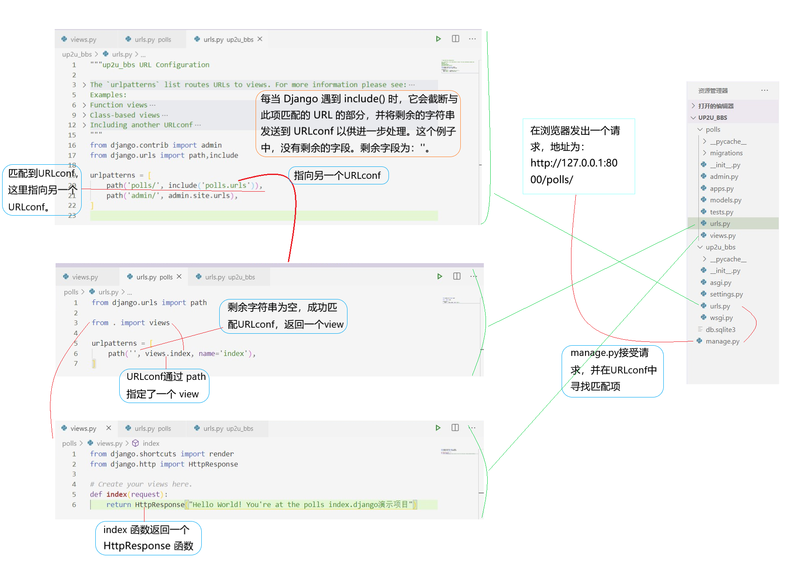
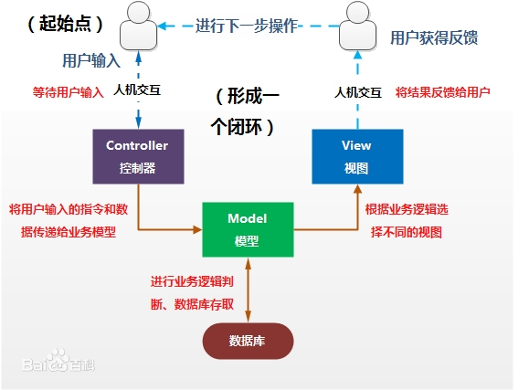
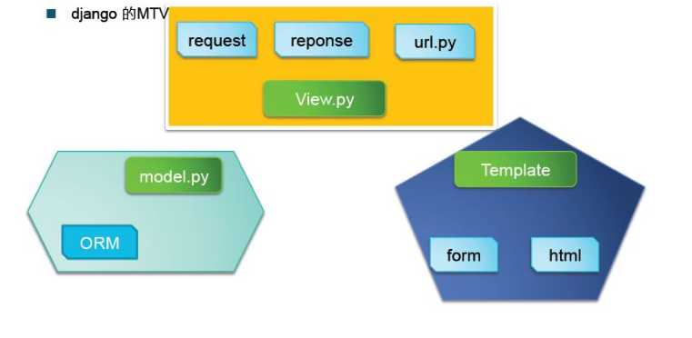

<!-- Django的MTV架构 -->
<!-- author: fudamai -->

# Django的MTV架构

一个简单的Django处理访问的流程

## MVC 架构

MVC全名是Model View Controller，是**模型(model)**－**视图(view)**－**控制器(controller)** 的缩写，一种软件设计典范，**用一种业务逻辑、数据、界面显示分离的方法组织代码**，将业务逻辑聚集到一个部件里面，在改进和个性化定制界面及用户交互的同时，不需要重新编写业务逻辑。MVC被独特的发展起来用于映射传统的输入、处理和输出功能在一个逻辑的图形化用户界面的结构中。

- Model（模型）是应用程序中用于处理应用程序数据逻辑的部分。  
通常模型对象负责在数据库中存取数据。
- View（视图）是应用程序中处理数据显示的部分。  
通常视图是依据模型数据创建的。
- Controller（控制器）是应用程序中处理用户交互的部分。  
通常控制器负责从视图读取数据，控制用户输入，并向模型发送数据。

>以上摘自百度百科

## MTV 架构

Django也是一个MTV架构。但在 Django中，控制器接受用户输入的部分由框架自行处理。Django里更关注的是模型（Model)、模板（Template）、视图（Views），称为MTV模式。

- Model（模型）
  - 即数据存取层，该层处理与数据相关的所有事务：如何存取、如何验证有效性，包含哪些行为以及数据之间的关系等。
- Template（模板）
  - 即表现层，该层处理与表现相关的决定：如何在页面或其它类型文档进行显示。
- Views（视图）
  - 即业务逻辑层，该层包含存取模型及调取恰当模板的相关逻辑，你可以把它看作模型与模板之间的桥梁。

这种设计模式关键的优势在于各种组件都是松耦合的。这样，每个由 Django驱动的Web应用都有着明确的目的，并且可独立更改而不影响到其它的部分。

比如，开发者更改一个应用程序中的 URL 而不用影响到这个程序底层的实现。设计师可以改变 HTML页面的样式而不用接触Python代码。

数据库管理员可以重新命名数据表并且只需更改模型，无需从一大堆文件中进行查找和替换。

Django的MTV模式相对应的python文件如下：

Django基本上使用MVC架构，网页服务器本身在派发工作的时候就隐含了控制的逻辑，网站框架中Template模块文件的套用又是最被使用的网页显示技巧，所以Django主要的架构形成了使用Model、Template和View三个部分搭配，这3个部分分别对应网站的数据存储model.py、网站的模版文件组（一般放在templates文件下的html文件）以及控制如何处理数据程序逻辑的views.py，其中许多控制逻辑也被放在整个Django框架中（如urls.py的设置等）。

### 资料来源

https://baike.baidu.com/item/MVC%E6%A1%86%E6%9E%B6/9241230?fr=aladdin  
http://www.mamicode.com/info-detail-1746671.html
