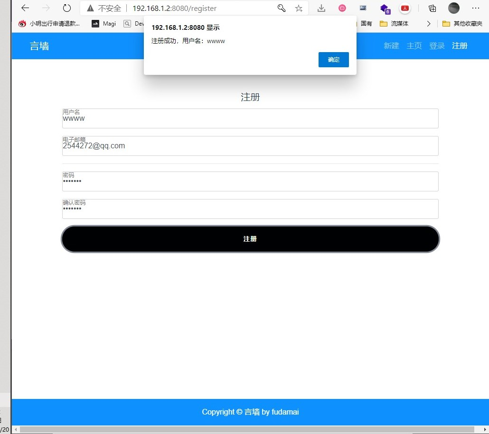

<!-- 代码测试 -->
<!-- author：fudamai -->

# 测试项目

- 获取博客
  - 获取全部博客，不用登录
  - 获取指定博客，不用登录
    - 显示评论
  - 关键词筛选
- 创建博客
  - 未登录状态，跳转到登录页面
  - 登录状态，进入创建博客
- 博客管理
  - 编辑
  - 删除
- 添加评论
  - 登录状态下，可直接提交评论
  - 未登录状态，点击提交按钮跳转到登录页
- 用户管理
  - 登录
  - 自动登录
  - 退出
  - 注册
  - 用户页
    - 此用户所有博客

# 获取博客

获取**全部博客**，不用登录

获取**指定博客**，不用登录。显示评论

根据**关键词筛选博客**

# 创建博客

**创建页**

# 博客管理

在用户页进行**博客管理**

## 编辑页

在用户页点击编辑进入编辑页

# 添加评论

登录状态才能**添加评论**

# 用户管理

**自动登录**：一次登录后，短期内再次进入无须输入密码登录

**登录页**

**退出**：推出后清除本地保存的token。手动执行退出后，无法进行自动登录

**注册页**

注册失败

注册成功

**用户页**

